***

# Cloud Container Deploy Assignment

## Overview
This assignment demonstrates running containerized web applications in the cloud, using Dockerized frontend and backend reference apps.

## Structure

- [`example-frontend/`](./example-frontend/): React app serving a static frontend (runs on port 5000)
- [`example-backend/`](./example-backend/): Go app providing backend API (runs on port 8080)  

Both applications are enhanced with custom Dockerfiles in their respective directories—these additions provide streamlined containerization, environment variable support, and straightforward interaction between the frontend and backend.  
- [`example-frontend/Dockerfile`](./example-frontend/Dockerfile)  
- [`example-backend/Dockerfile`](./example-backend/Dockerfile)  

> **Base apps sourced from:**
> - [docker-hy/material-applications: example-frontend](https://github.com/docker-hy/material-applications/tree/main/example-frontend)
> - [docker-hy/material-applications: example-backend](https://github.com/docker-hy/material-applications/tree/main/example-backend)

## Cloud Deployment
The containerized web applications are deployed on the [Render cloud platform](https://render.com/). Deployment consists of connecting the repository, creating a Web Service, selecting the Docker environment, and applying the necessary settings as detailed below. The platform builds, deploys, and serves each application over HTTPS and automatically redeploys on every repository push.

Render dashboard displays the status of both frontend and backend services.
  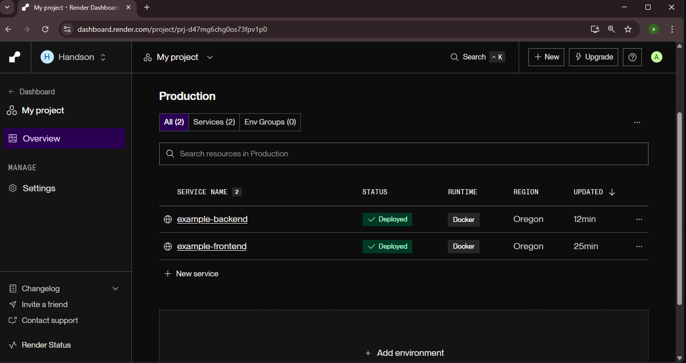

### Frontend Service Deployment

A dedicated Web Service is configured for the frontend React application. The Docker environment is used to build the code from the repository, allocate cloud resources, and expose the application via a public HTTPS URL. Logs, events, and configuration details are available in the Render dashboard.

- Frontend public web service URL as shown in the dashboard.
  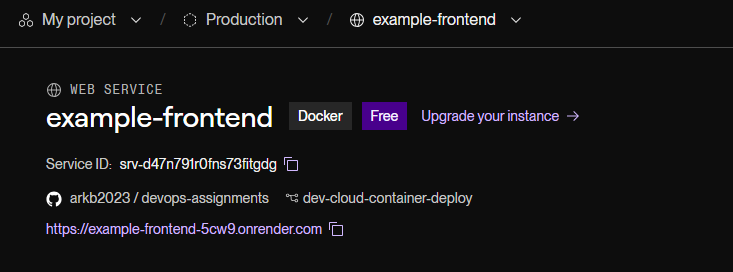
- Render frontend service general settings.
  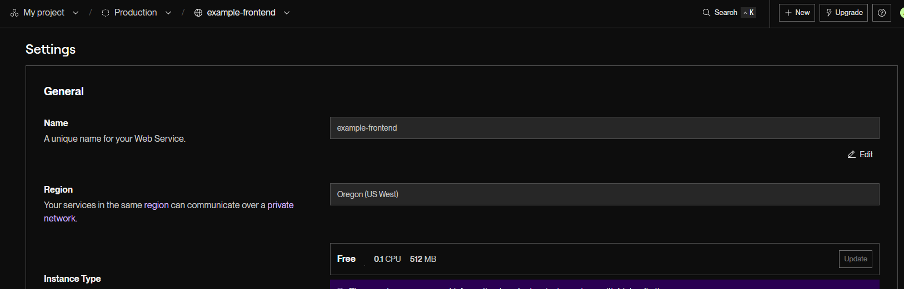
- Build and deployment configuration for the frontend service (part 1).
  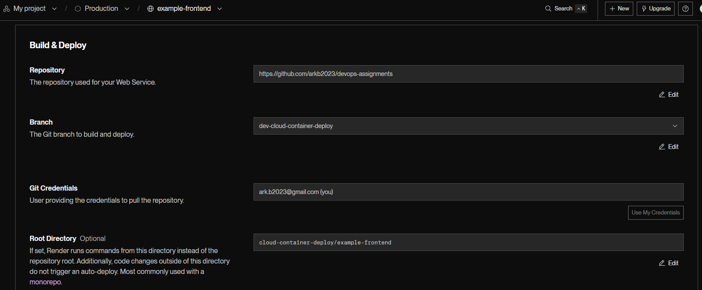
- Build and deployment configuration for the frontend service (part 2).
  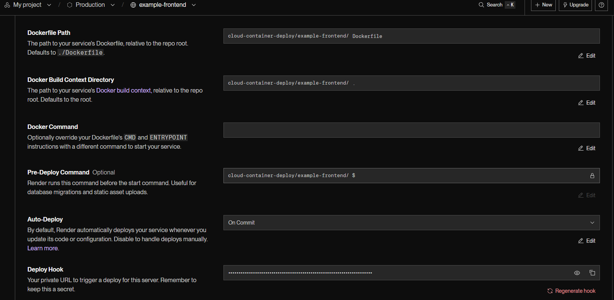
- Service deployment and event history for frontend.
  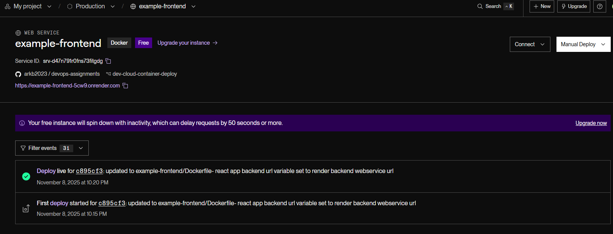
- Live logs from the frontend service on Render.
  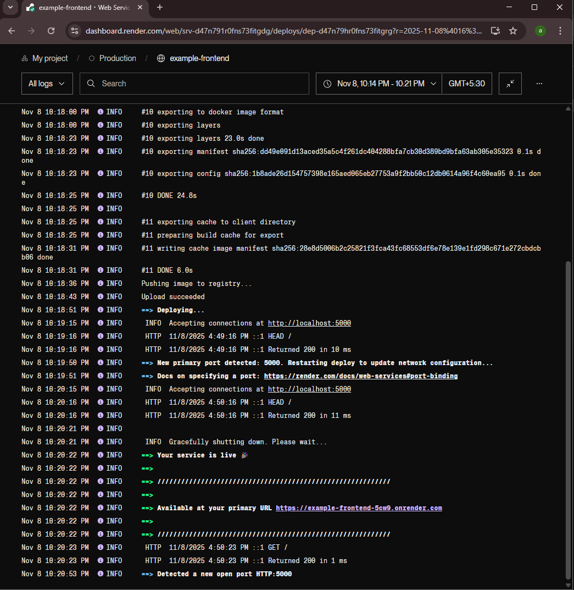

***

### Backend Service Deployment

A separate Web Service is configured for the backend Go application. The deployment process consists of connecting the repository, specifying the Docker environment, and setting required environment variables. The backend API endpoints (such as /ping) are accessible online over HTTPS, with integrated service logs and monitoring.

- Backend public web service URL as shown in the dashboard.
  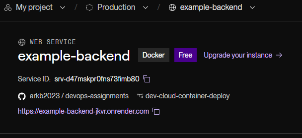
- Render backend service general settings.
  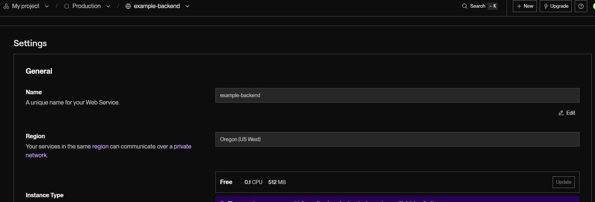
- Build and deployment configuration for the backend service (part 1).
  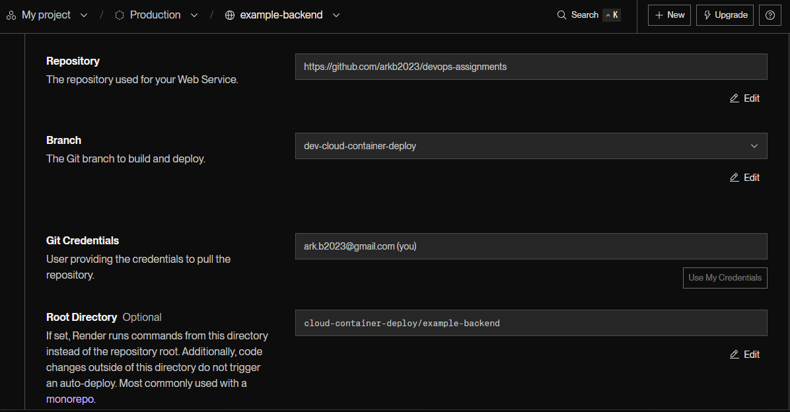
- Build and deployment configuration for the backend service (part 2).
  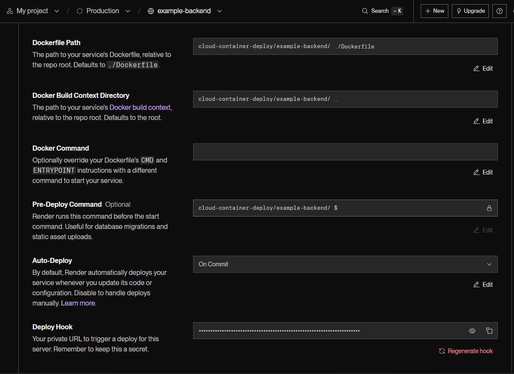
- Service deployment and event history for backend.
  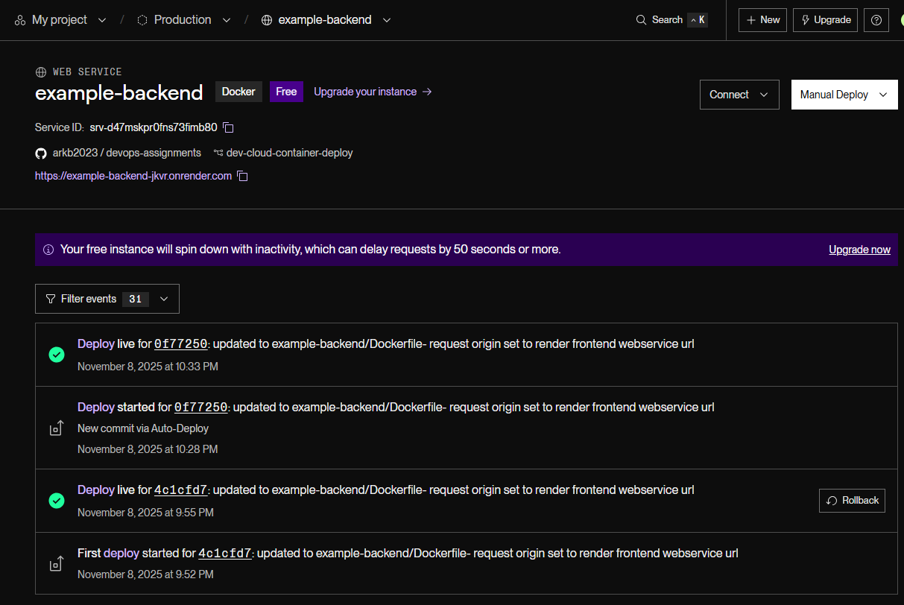
- Live logs from the backend service on Render.
  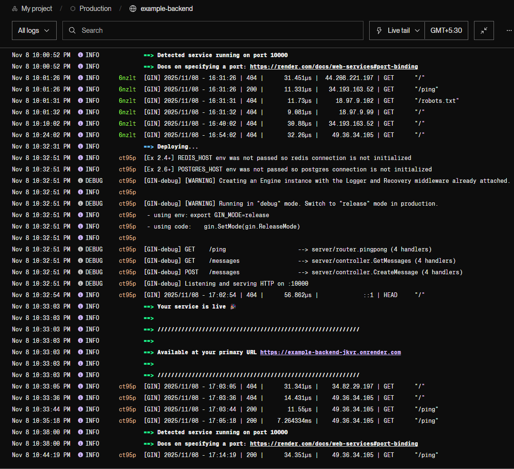

### Service URL Registration

After deployment, each service receives a unique cloud URL:
- Frontend: [https://example-frontend-5cw9.onrender.com/](https://example-frontend-5cw9.onrender.com/)
- Backend: [https://example-backend-jkvr.onrender.com/](https://example-backend-jkvr.onrender.com/)

These URLs are registered as environment variables in the Dockerfiles:
- Frontend uses `REACT_APP_BACKEND_URL` in [example-frontend/Dockerfile](./example-frontend/Dockerfile)
- Backend uses `REQUEST_ORIGIN` in [example-backend/Dockerfile](./example-backend/Dockerfile)

This ensures correct API routing and secure CORS configuration between the services.

### End to End Verification

1. The browser accesses the frontend web service at [https://example-frontend-5cw9.onrender.com/](https://example-frontend-5cw9.onrender.com/).
2. The frontend service loads, and the application displays the message:  
   *Exercise 1.12: Congratulations! You configured your ports correctly!*—confirming frontend webservice connectivity.
3. To verify backend integration, clicking the “Exercise 1.14: Press to Test!” button triggers an HTTP request to `/ping`, visible as the request URL in the browser’s network panel.
4. The backend service responds with `200 OK (pong)`. This is reflected visually by a green tick on the button, and confirmed in the browser image showing the full request and response headers.

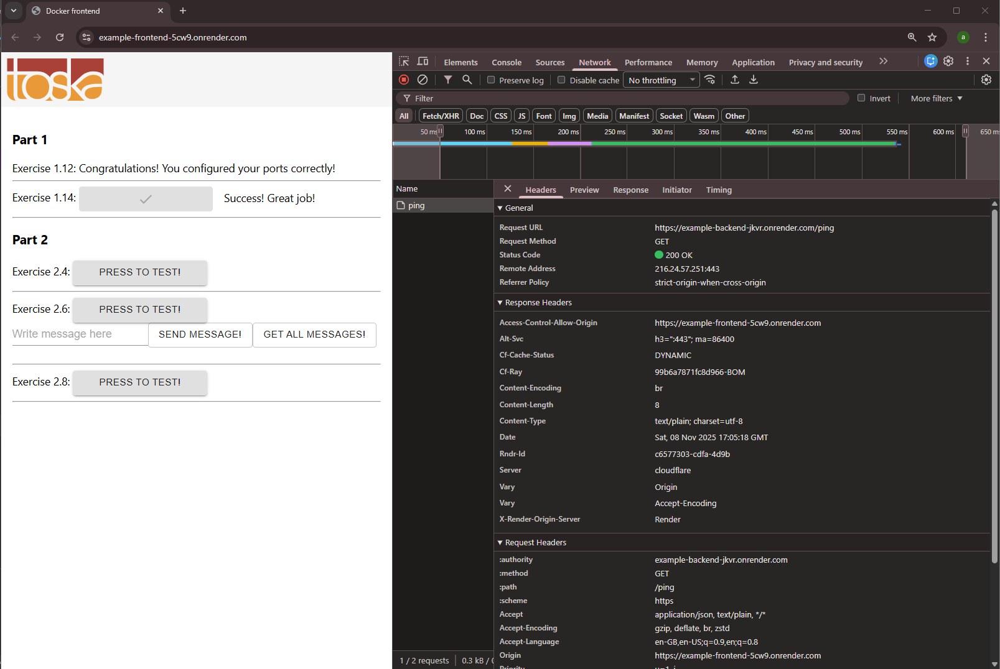 

***

