## CI/CD with GitHub Actions, Docker Hub, and Watchtower

### Overview

- **Goal:**  
    Demonstrate automated CI/CD for a simple Node.js/Express application using GitHub Actions, Docker Hub, and Watchtower, enabling seamless deployment and updates via container orchestration.
- **Exercise Reference:**  
  [Exercise: 3.1. Deployment pipeline](https://courses.mooc.fi/org/uh-cs/courses/devops-with-docker/chapter-4/deployment-pipelines)

***

### Workflow
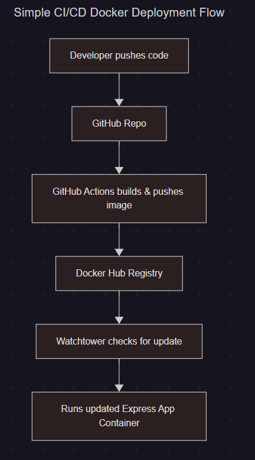

***

### Project Structure

<pre>
devops-assignments/                            # Repository root
├── .github/workflows/docker-push-e3.1.yaml    # GitHub Actions workflow script
└── e3.1-gha-pipeline/                         # Node.js/Express app directory
    ├── index.js                               # Application source code
    ├── Dockerfile                             # Dockerfile for the app
    ├── docker-compose.yaml                    # Docker Compose for app + Watchtower
    └── README.md                              # Project documentation

</pre>

***

**The report is organized as follows:**

**Part 1: Continuous Integration with GitHub Actions and Docker Hub**  
Demonstrates how GitHub Actions and Docker Hub work together to automatically build and publish Docker images on every code change. *(Steps 1–3)*

**Part 2: Continuous Deployment with Docker Compose and Watchtower**  
Shows how Docker Compose and Watchtower enable seamless, automated updates to running containers by detecting and deploying new application images. *(Steps 4–7)*

Refer to the following detailed steps for a step-by-step walkthrough of the entire workflow:

***

### 1. **Register Docker Authentication Credentials in GitHub Repository**

- **GitHub Repository:**  
  `https://github.com/arkb2023/devops-assignments.git`
- Navigate to: `Settings` → `Secrets and variables` → `Actions` → `Repository Secrets`
- Add the following secrets:
  - `DOCKER_USERNAME`
  - `DOCKER_PASSWORD`

These secrets allow GitHub Actions to authenticate with Docker Hub for pushing images during your CI/CD workflow.

### 2. Set Up GitHub Actions Workflow

**Key aspects of the workflow:**
- The workflow script [docker-push-e3.1.yaml](../.github/workflows/docker-push-e3.1.yaml) is located at the repository root in [.github/workflows/](../.github/workflows/).
- Workflow is triggered by push events to the `e3.1-gha-pipeline/**` directory and when the workflow file itself is updated.
- Monitors both the `main` and `dev-e3.1-gha-pipeline` branches for changes.
- Sets the build context to `./e3.1-gha-pipeline/` where the Dockerfile resides.
- Docker image is tagged as `${{ secrets.DOCKER_USERNAME }}/express-app:latest`.

**Workflow script:**

```yaml
name: Build and Push Docker Image

on:
  push:
    branches: [main, dev-e3.1-gha-pipeline]
    paths:
      - 'e3.1-gha-pipeline/**'
      - '.github/workflows/docker-push-e3.1.yaml'

jobs:
  build:
    runs-on: ubuntu-latest

    steps:
      - name: Checkout repository
        uses: actions/checkout@v5

      - name: Set up Docker Buildx
        uses: docker/setup-buildx-action@v1

      - name: Log in to Docker Hub
        uses: docker/login-action@v1
        with:
          username: ${{ secrets.DOCKER_USERNAME }}
          password: ${{ secrets.DOCKER_PASSWORD }}

      - name: Build and push Docker image
        uses: docker/build-push-action@v2
        with:
          context: ./e3.1-gha-pipeline/
          push: true
          tags: ${{ secrets.DOCKER_USERNAME }}/express-app:latest
```

This workflow automates building and pushing Docker images to Docker Hub whenever push updates the application code or update the workflow itself.

***

### 3. Trigger the Github Workflow to Create the Base Image in Docker Hub 

Make a code change, commit, and push the update to GitHub to trigger the workflow.

1. **Modify the app code:**  
   Change the message returned by the [app](./index.js).

   ```js
   app.get('/', (req, res) => {
     res.send('<h1>[Test-6] Hello World!</h1>')
   })
   ```

2. **Stage and commit the changes:**  
   Use the following Git commands to add and commit your changes, then push to the monitored branch.

   ```bash
   git add ./index.js ../.github/workflows/docker-push-e3.1.yaml
   git commit -m "[e3.1-gha-pipeline] workflow trigger test"
   git push origin dev-e3.1-gha-pipeline
   ```

3. **Workflow execution results:**  
   When the changes are pushed, the workflow triggers automatically.
   
    - Workflow executed successfully; all stages passed.  
      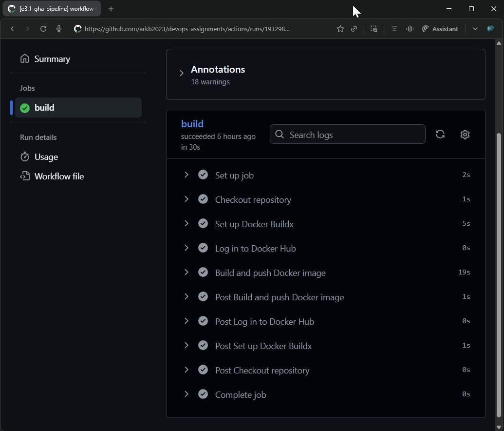  

    - Successfully logged into Docker Hub during workflow.  
      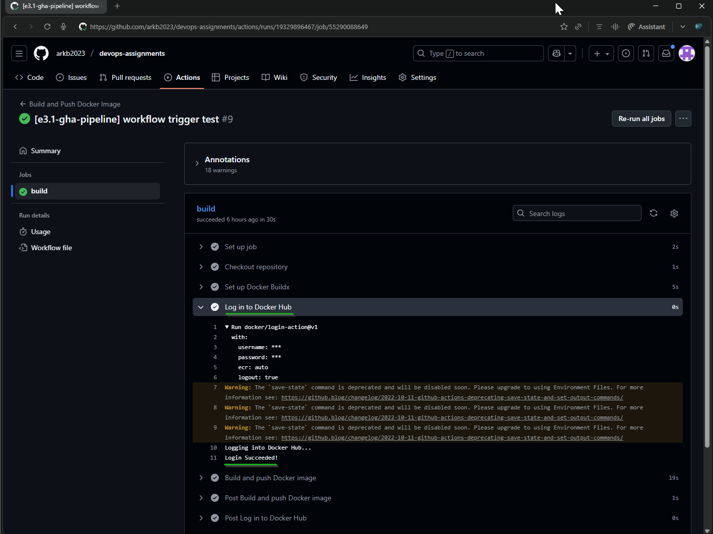  

    - Docker image built and pushed to Docker Hub.
      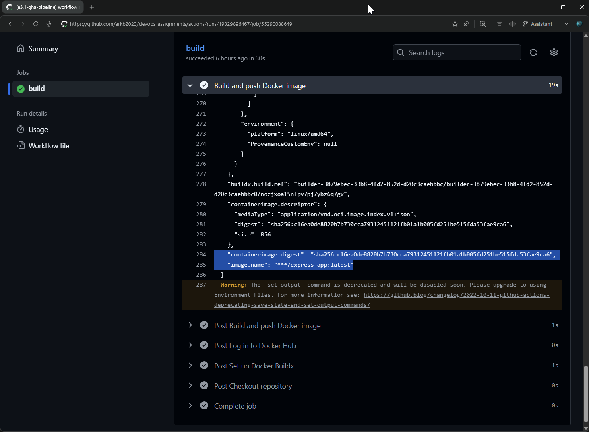
     
    - The new Docker image appears in the Docker Hub repository.
      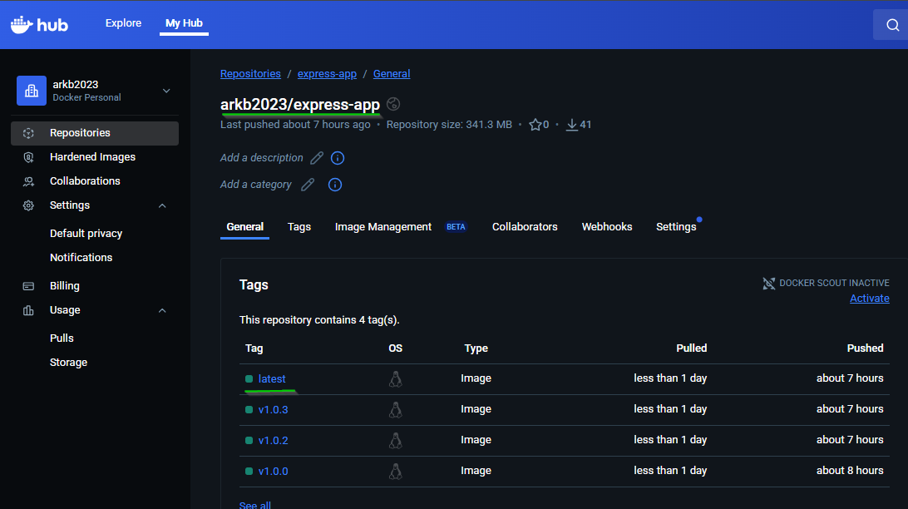

This process validates that any code change will automatically build and push a new Docker image as defined by workflow, streamlining CI/CD for Node.js/Express application.

***

### 4. Set Up the Docker Compose File

Refer to the [docker-compose.yaml](docker-compose.yaml) which configures both the Watchtower and Express app containers.

**Key aspects:**
- **image: arkb2023/express-app:latest** — Pulls the latest image from Docker Hub for the Express app.
- **label: com.centurylinklabs.watchtower.enable=true** — Signals Watchtower to automatically monitor and update this container when the image changes.

**docker-compose.yaml:**
```yaml
services:
  express-app:
    image: arkb2023/express-app:latest
    ports:
      - 8080:8080
    labels:
      - "com.centurylinklabs.watchtower.enable=true"

  watchtower:
    image: containrrr/watchtower
    environment:
      - WATCHTOWER_POLL_INTERVAL=60
    volumes:
      - /var/run/docker.sock:/var/run/docker.sock
    container_name: watchtower
```

This setup ensures your Express app runs as a container and that Watchtower monitors it, automatically pulling updates when new Docker images are pushed to Docker Hub.

***

### 5. Start Watchtower and App Container

  Run the following command to start both the Express app and Watchtower containers in detached mode:

  ```bash
  docker compose -f docker-compose.yaml up --build -d
  ```

  - Docker Compose launches both containers:  

  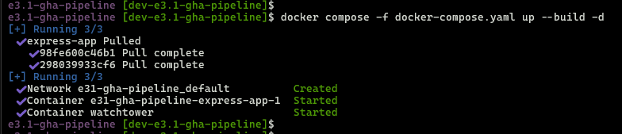

  - Verify that both containers (express-app and watchtower) are running:

  ```bash
  docker compose -f docker-compose.yaml ps
  ```

  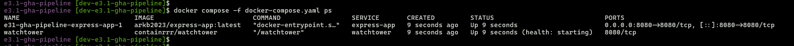

  - Confirm the app is running successfully with an HTTP request to localhost:8080:  

  ```bash
  http GET :8080
  ```
  
  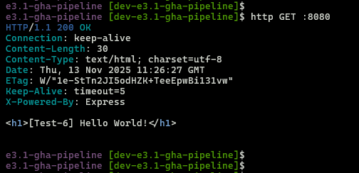

  - Alternatively, check the app endpoint in browser:  

  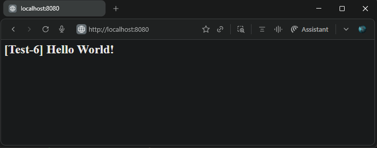

These steps verify both Watchtower and your app are running locally, with the Express app accessible on `http://localhost:8080`.

***

### 6. Trigger the Workflow Again to Create the Updated Image

Make another code change, then commit and push to GitHub—follow the same process as in **Step 3**.

> Use a new message in your app (such as `"Test-7 Hello World!"`) to confirm the container auto-update after redeployment.

```js
app.get('/', (req, res) => {
  res.send('<h1>[Test-7] Hello World!</h1>')
})
```

- GitHub workflow shows the updated commit and message.  

  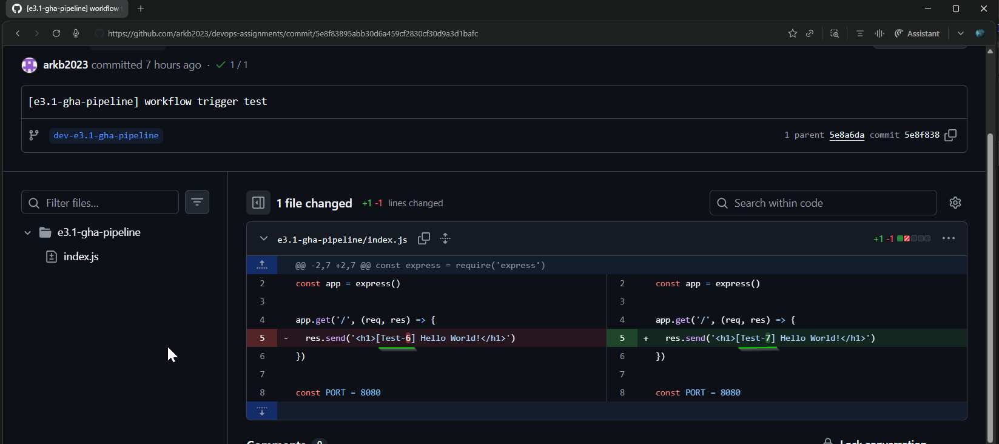

- GitHub Action confirms image uploaded with digest value:

  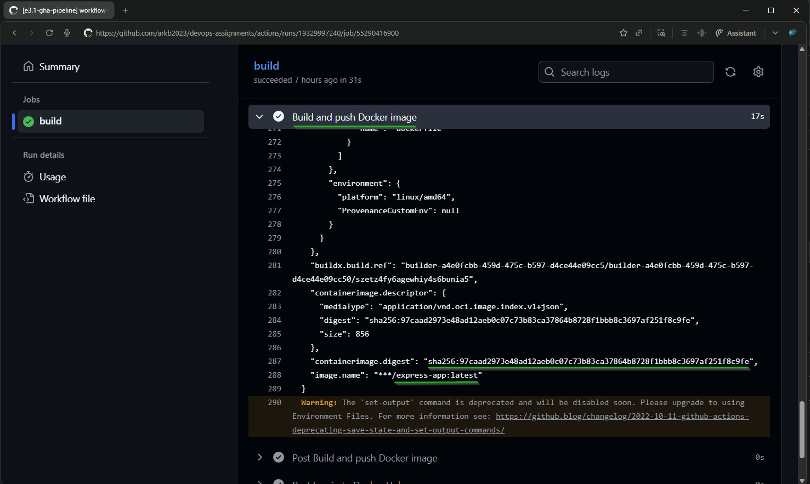
  
- Docker Hub shows the new image with matching digest, verifying correlation with workflow job:  
  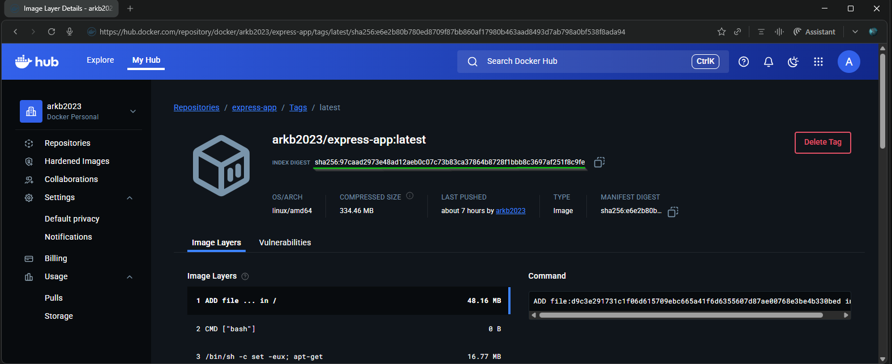 
  
> Image digest allows tracking sync between build and registry.

***

### 7. Verify Watchtower in Action

Watchtower ensures that your application container stays up to date by automatically detecting new images on Docker Hub, pulling them, and restarting the app container with the updated version.

  - **Monitor Watchtower and App Logs Live:**

  ```bash
  docker compose -f docker-compose.yaml logs -f
  ```
  
  - Watchtower container logs show a clear sequence: it detects the new image on Docker Hub, stops the running app container, and starts the updated container seamlessly.

  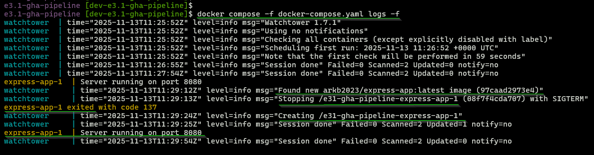

  - **Image digest verification:**  
  Running the docker images command confirms that the image digest of the newly downloaded image matches the digest from Docker Hub and the GitHub workflow:

  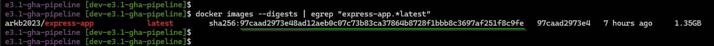

  - **HTTP GET request:**  
  A GET request to `localhost:8080` confirms the app is running the latest image and message.

  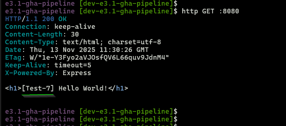

Watchtower efficiently automates the pull and redeployment process, ensuring application always runs the latest Docker image after every CI/CD workflow execution.

***

### References

- [Deployment Pipelines — DevOps with Docker Course](https://courses.mooc.fi/org/uh-cs/courses/devops-with-docker/chapter-4/deployment-pipelines)
- [Watchtower Documentation](https://containrrr.dev/watchtower/)
- [GitHub Actions Documentation](https://docs.github.com/en/actions)
- [Docker Hub](https://hub.docker.com/)

***