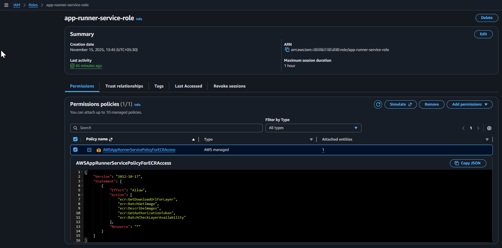
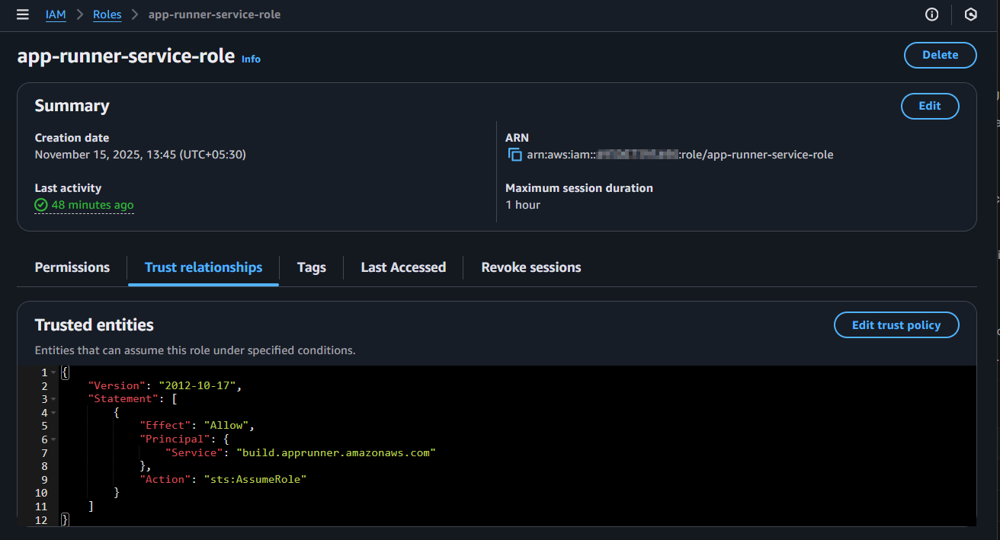
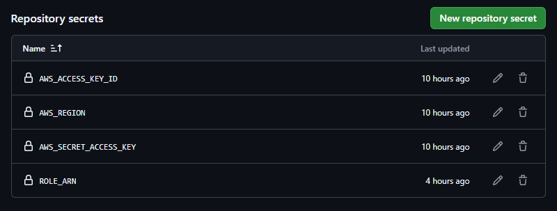
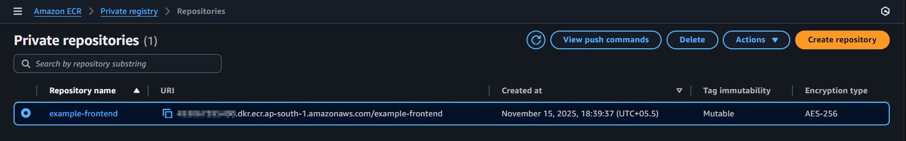
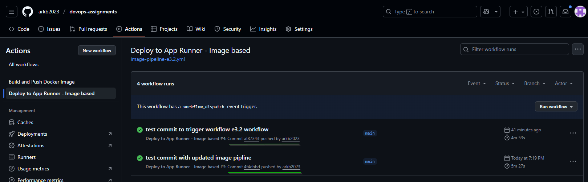
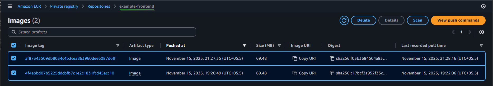
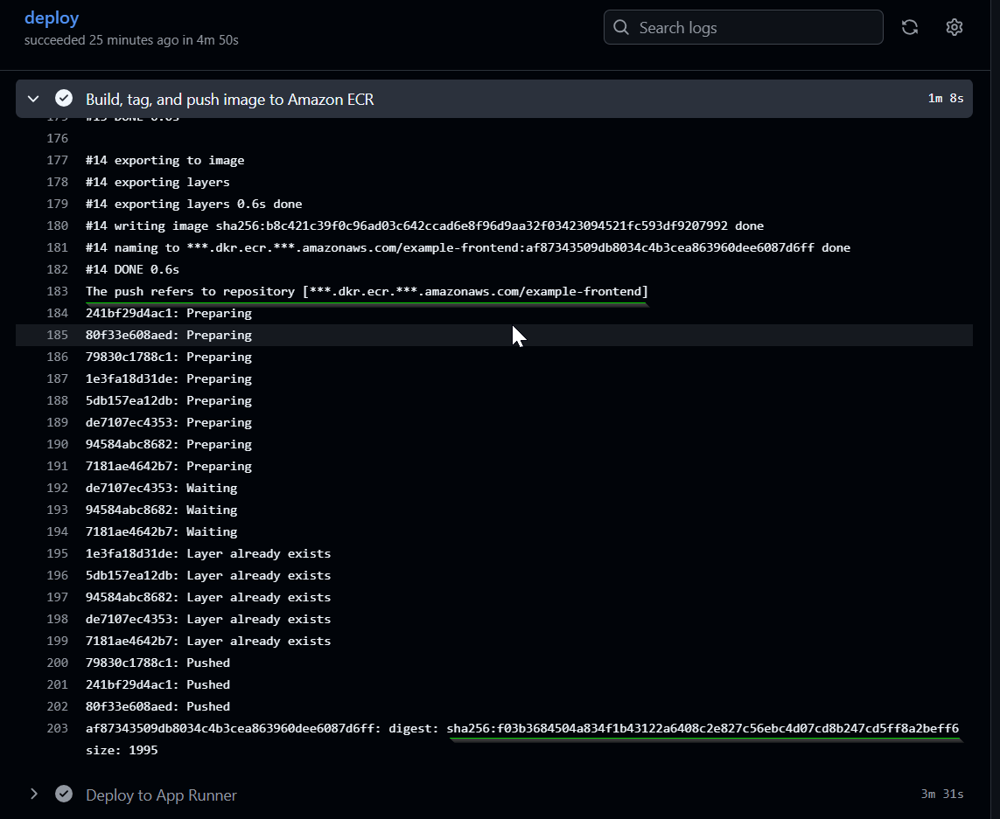
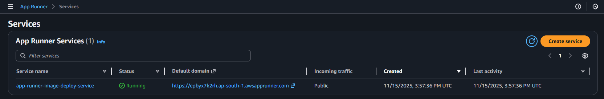
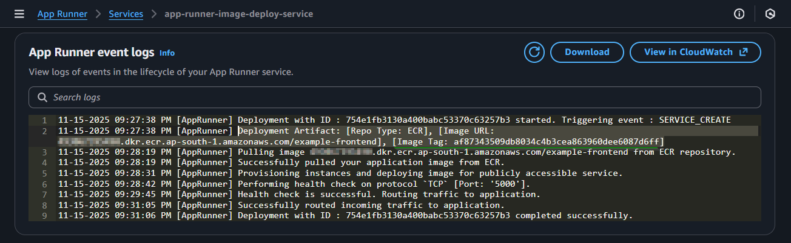
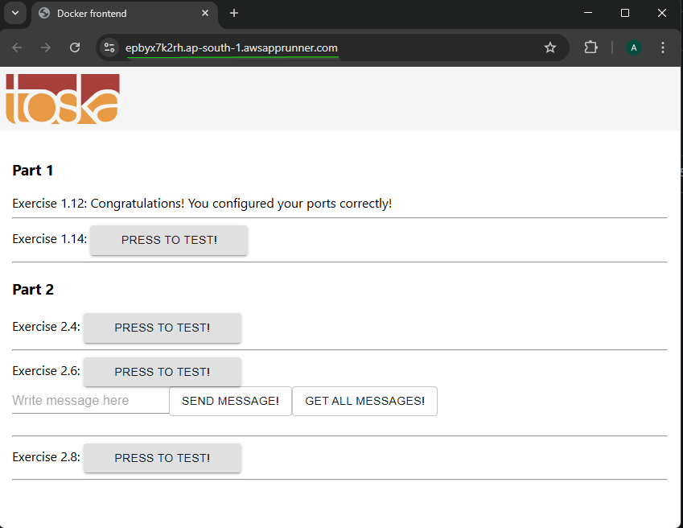

***

## Automated Deployment of Containerized Web Apps to AWS Cloud via GitHub Actions Pipelines

### Overview

This project demonstrates automated deployment of Dockerized applications from a GitHub repository to AWS App Runner, using GitHub Actions and AWS Elastic Container Registry.

**Key workflow steps:**
- **Source:** The app’s source code including a Dockerfile resides in the [GitHub repository](https://github.com/arkb2023/devops-assignments/tree/main/e3.2-gha-aws-integration)
- **CI/CD Trigger:** A [GitHub Actions workflow](https://github.com/arkb2023/devops-assignments/blob/main/.github/workflows/image-pipeline-e3.2.yml) is configured to be triggered on every push to the repository
- **Build:** The workflow uses the [Dockerfile](https://github.com/arkb2023/devops-assignments/blob/main/e3.2-gha-aws-integration/example-frontend/Dockerfile) in the repo to build a new container image for the app.
- **Container Registry:** The container image is pushed to an AWS Elastic Container Registry (ECR) repository.
- **Deployment:** After a successful image push, the workflow deploys the image to AWS App Runner, a fully managed service for running containerized web apps.
- **Result:** Each push to GitHub results in an up-to-date deployment of the latest app version to AWS, accessible with a live, public URL.

**Core automation tools and cloud services:**
- **GitHub Actions:** For CI/CD orchestration
- **Docker:** For containerization of the app
- **Amazon ECR:** For secure container image storage
- **AWS App Runner:** For managed containerized web app hosting with HTTPS


### 1. Create a role `app-runner-service-role` with [trust-policy.json](https://github.com/arkb2023/devops-assignments/blob/main/e3.2-gha-aws-integration/trust-policy.json)
```bash
aws iam create-role --role-name app-runner-service-role --assume-role-policy-document file://trust-policy.json
```
- AWS IAM App Runner Service Role Permissions Policy  
  

### 2. Attach `AWSAppRunnerServicePolicyForECRAccess` IAM policy to `app-runner-service-role` IAM role.
```bash
aws iam attach-role-policy --policy-arn arn:aws:iam::aws:policy/service-role/AWSAppRunnerServicePolicyForECRAccess \
    --role-name app-runner-service-role
```
- AWS IAM App Runner Service Role Trust Relationship
  

### 3. Register AWS secrets `AWS_ACCESS_KEY_ID` `AWS_SECRET_ACCESS_KEY` `AWS_REGION` and `ROLE_ARN` in GitHub repoitory

  

### 4) Prepare github repository project [folder](https://github.com/arkb2023/devops-assignments/tree/main/e3.2-gha-aws-integration)
- Download sample applicaiton [example-frontend](https://github.com/docker-hy/material-applications/tree/main/example-frontend)  
- Add [Dockerfile](https://github.com/arkb2023/devops-assignments/blob/main/e3.2-gha-aws-integration/example-frontend/Dockerfile) script to the project folder
- Create Github Actions [workflow](https://github.com/arkb2023/devops-assignments/blob/main/.github/workflows/image-pipeline-e3.2.yml) script

### 5. Create Amazon ECR repository
```bash
aws ecr create-repository --repository-name example-frontend
```
- AWS ECR Dashboard With Example Frontend Repo  
  

### 6. Test the integration

- Add the local project files into git repository, commit and push to GitHub.
  ```bash
  git add .
  git commit -am "Initial commit with image pipline"
  git push
  ```
- GitHub Actions Tab Showing Recent Runs Triggered By Push  
  

- List of images pushed into AWS ECR  
  

- GitHub Actions Successful Workflow Run  
  

- GitHub Actions Stage: Build, Tag, and Push Image to ECR Successful
  

- AWS App Runner Dashboard Showing Deployed Service
  

- AWS App Runner Image Deploy Service Event Logs
  

- Browser Frontend App Live With AWS App Runner Public URL  
  


***

### References
- [Deploy applications in AWS App Runner with GitHub Actions](https://aws.amazon.com/blogs/containers/deploy-applications-in-aws-app-runner-with-github-actions/)
- [example-frontend](https://github.com/docker-hy/material-applications/tree/main/example-frontend)
- [Exercise: 3.2. Deployment pipeline to a cloud service](https://courses.mooc.fi/org/uh-cs/courses/devops-with-docker/chapter-4/deployment-pipelines)