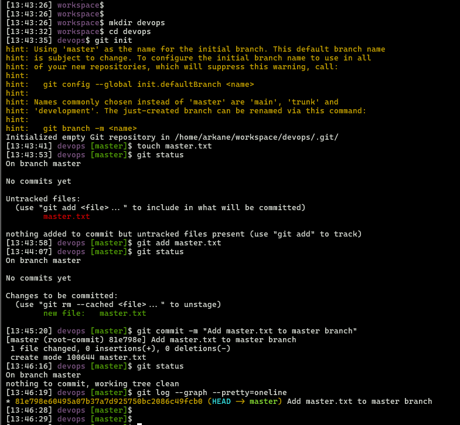
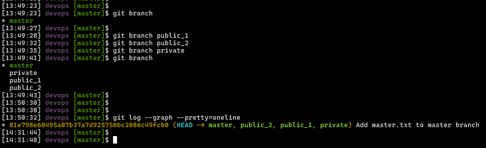
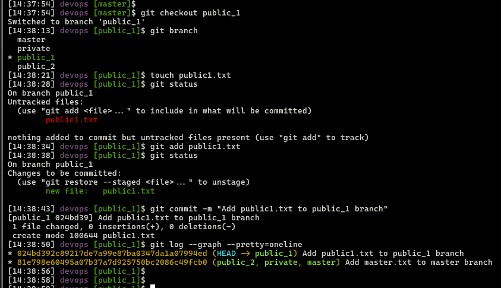
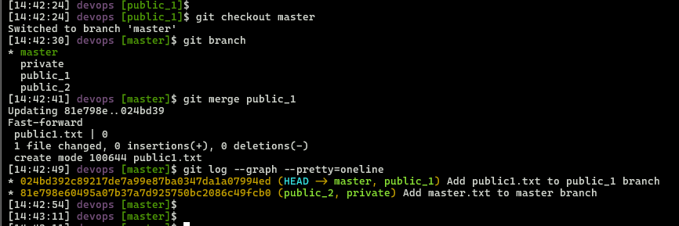
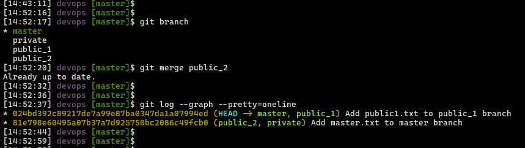
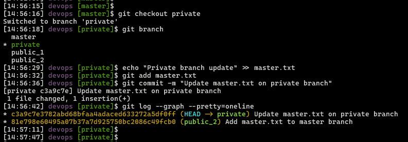
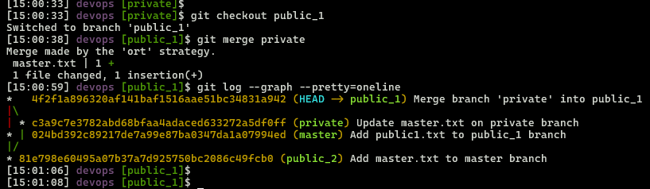
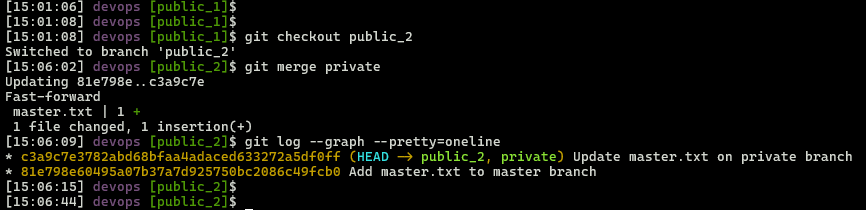
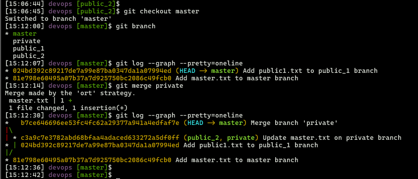
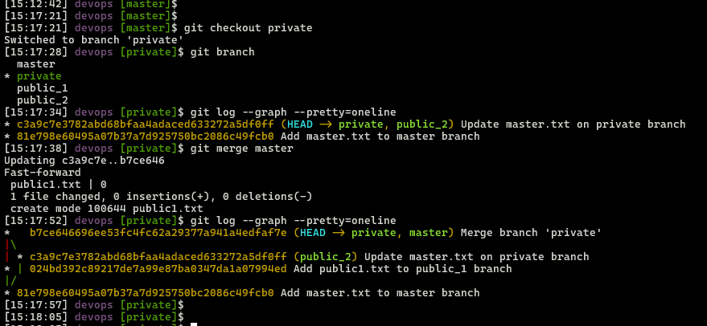

## Module 2: Git Assignment - 4

1. Put **master.txt** on **master** branch, stage and commit  
2. Create 3 branches: **public 1**, **public 2**, and **private**  
3. Put **public1.txt** on **public 1** branch, stage and commit  
4. Merge **public 1** on **master** branch  
5. Merge **public 2** on **master** branch  
6. Edit **master.txt** on **private** branch, stage and commit  
7. Now update branches **public 1** and **public 2** with new **master** code in **private**  
8. Also update new **master** code on **master**  
9. Finally update all the code on the **private** branch

---


## 1. Put master.txt on master branch, stage and commit
```bash
# Create a working directory
mkdir devops
cd devops
# Initilize git in working directory
git init
# Create file
touch master.txt
# check git status before stage
git status
# Stage & commit
git add master.txt
# check git status before after stage before commit
git status
git commit -m "Add master.txt to master branch"
# check git status before after commit
git status
git log --graph --pretty=oneline
```

*Terminal view shows master.txt on master branch, staged and committed*



### 2. Create 3 branches: `public_1`, `public_2`, and `private`
```bash
git branch public_1
git branch public_2
git branch private
git branch
# Verify all four branch labels point to the same commit
git log --graph --pretty=oneline
```

*Terminal view shows three branches created: public_1, public_2, and private*



### 3. Put `public1.txt` on `public_1` branch, stage and commit
```bash
git checkout public_1
git branch
touch public1.txt
git status
git add public1.txt
git status
git commit -m "Add public1.txt to public_1 branch"
git log --graph --pretty=onelin
```

*Terminal view shows public1.txt file added, staged, and committed on public_1 branch*



### 4. Merge `public_1` into `master` branch
```bash
git checkout master
git branch
git merge public_1
git log --graph --pretty=oneline
```

*Terminal view shows public_1 branch merged into master branch*



### 5. Merge `public_2` into `master` branch
```bash
# Since no new commits on public_2, merging it into master does nothing new.
git merge public_2
git log --graph --pretty=oneline
```

*Terminal view shows public_2 branch merged into master branch with no new commits (Already up to date)*




### 6. Edit `master.txt` on `private` branch, stage and commit
```bash
git checkout private
# Edit master.txt
echo "Private branch update" >> master.txt
git add master.txt
git commit -m "Update master.txt on private branch"
git log --graph --pretty=oneline
```

*Terminal view shows master.txt updated, staged, and committed on private branch*




### 7. Update branches `public_1` and `public_2` with new master code from `private`
```bash
# Merge latest changes from private into public_1
git checkout public_1
git merge private      
git log --graph --pretty=oneline
```

*Terminal view shows public_1 branch merged with private branch*



```bash
# Merge latest changes from private into public_2
git checkout public_2
git merge private
git log --graph --pretty=oneline
```

*Terminal view shows public_2 branch merged with private branch via fast-forward merge*



### 8. Update new master code on `master`
```bash
# Merge latest changes from private into master
git checkout master
git branch
git log --graph --pretty=oneline # before merge
git merge private
git log --graph --pretty=oneline # after merge
```

*Terminal view shows master branch merged with private branch, creating a merge commit*



### 9. Finally, update all the code on the `private` branch
```bash
# Merge latest changes in from master into private branch
git checkout private
git branch
git log --graph --pretty=oneline # before merge
git merge master
git log --graph --pretty=oneline # after merge
```

*Terminal view shows private branch fast-forward merged with master branch, fully synchronized*



---