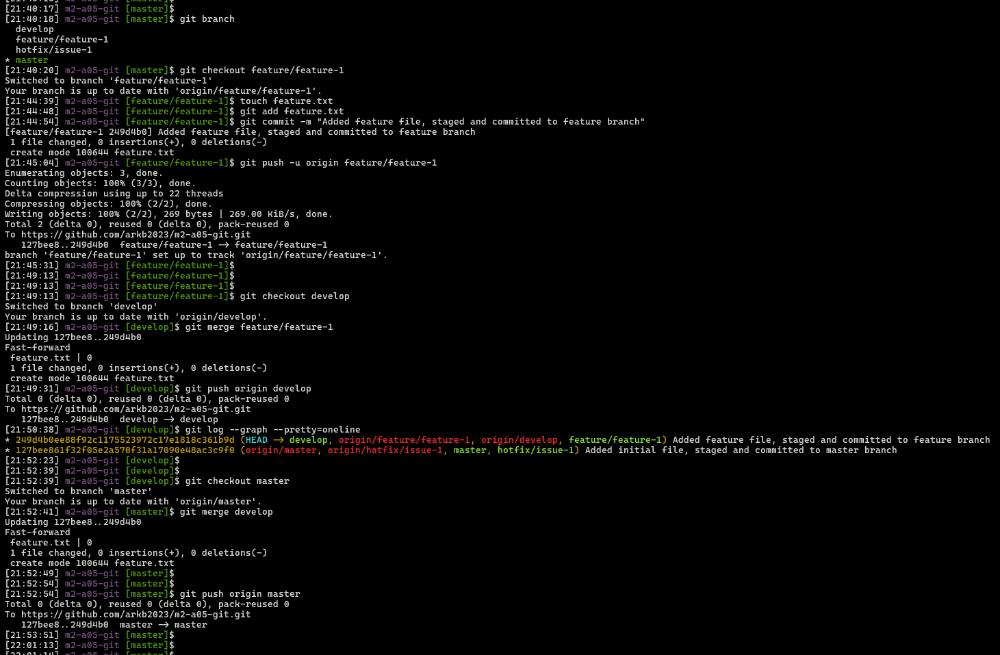
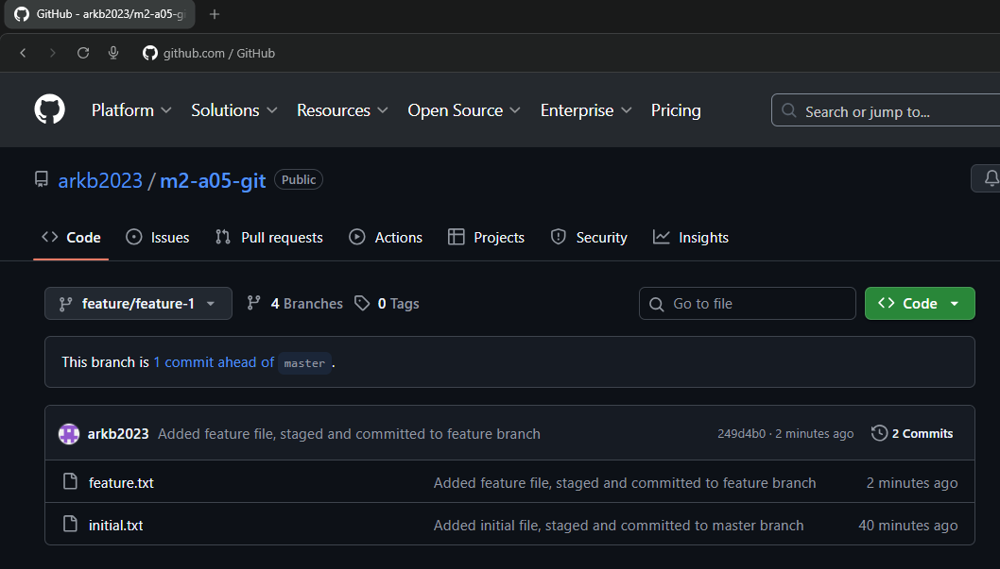
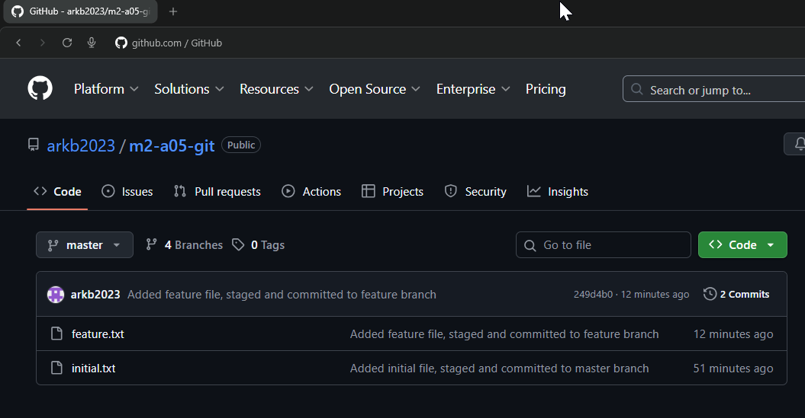

## Module 2: Git Assignment - 5

Tasks To Be Performed:  
1. Create a Git Flow workflow architecture on Git  
2. Create all the required branches  
3. Starting from the feature branch, push the branch to the master, following the architecture  
4. Push a urgent.txt on master using hotfix  
---

### Git Flow Workflow Architecture

(Ref: [Atlassian Gitflow Workflow](https://www.atlassian.com/git/tutorials/comparing-workflows/gitflow-workflow))

The **Git Flow** model structures branches to support continuous development, controlled releases, and isolated hotfixes. It defines clear roles for each branch type:

- `master/main` – production branch containing stable, release-ready code.
- `develop` – branch enables continuous integration of multiple features.
- `release` – branch stabilizes code before deployment to production.
- `hotfix` – branch enables urgent production fixes without disrupting ongoing development.

The standard workflow sequence:

1. A **`develop`** branch is created from **`master/main`**.  
2. A **`release`** branch is created from **`develop`**.  
3. **`feature/*`** branches are created from **`develop`**.  
4. When a feature is complete, it is merged back into **`develop`**.  
5. When the release branch is finalized, it is merged into both **`develop`** and **`master/main`**, and the release is typically **tagged** (e.g., `v1.0`).  
6. If an issue in **`master/main`** is detected, a **`hotfix/*`** branch is created from **`master/main`**.  
7. Once the hotfix is complete, it is merged back into both **`develop`** and **`master/main`**.

This branching structure keeps production stable while enabling parallel feature development, structured releases, and rapid emergency fixes.


### 1. Initialize the git working repository
```bash
mkdir m2-a05-git       # Create project directory
cd m2-a05-git          # Navigate inside
git init               # Initialize local repository
touch initial.txt      # Create first file
git add initial.txt    # Stage file
git commit -m "Added initial file, staged and committed to master branch"
git remote add origin https://github.com/arkb2023/m2-a05-git.git   # Link remote GitHub repo
git branch -M master   # Rename branch to 'master'
git push -u origin master   # Push changes to remote and set upstream

```


*Terminal view shows Git repository initialized and linked to remote.*


### 2. Create all the required branches

A total of four branches were created: `master` `develop` `feature/feature-1` and `hotfix/issue-1`

```bash
git checkout master

# Create 'develop' branch from master for integrating new features
git checkout -b develop

# Create 'feature/feature-1' branch from develop for new feature development
git checkout -b feature/feature-1

# Create 'hotfix/issue-1' branch from master for urgent production fix
git checkout master
git checkout -b hotfix/issue-1

# Push and set upstream tracking for each branch
git push -u origin develop
git push -u origin feature/feature-1
git push -u origin hotfix/issue-1
```


*Terminal view shows created Git Flow branches: develop, feature, and hotfix.*


*GitHub view shows the same branches reflected on the remote repository.*


### 3. Starting from the feature branch, push the branch to the master, following the architecture
```bash
# Check current branches and switch to feature branch
git branch
git checkout feature/feature-1

# Develop feature: create and commit feature.txt
touch feature.txt
git add feature.txt
git commit -m "Added feature file, staged and committed to feature branch"

# Push feature branch to remote with upstream tracking
git push -u origin feature/feature-1

# Switch to develop, merge feature branch, then push
git checkout develop
git merge feature/feature-1
git push origin develop
# Visualize commit graph
git log --graph --pretty=oneline

# Switch to master, merge develop branch, then push
git checkout master
git merge develop
git push origin master

# Cleanup: Delete the feature branch [Optional]
git branch -d feature/feature-1
```

*Terminal view showing the lifecycle of the feature branch `feature/feature-1` as per Git Flow: creation, development, commit, and push.*  

  

*GitHub interface showing `feature/feature-1` branch with newly committed feature file.*  

  

*GitHub showing `develop` branch updated after merging the feature branch and push.*  

  

*GitHub interface displaying updated `master` branch after merging from `develop` and pushing.*  

  


### 4. Push a urgent.txt on master using hotfix
```bash
git branch
# Switch to hotfix branch for urgent changes
git checkout hotfix/issue-1
# Create and commit urgent fix file
touch urgent.txt
git add urgent.txt
git commit -m "Added urgent file, staged and committed to hotfix branch"

# Verify commit history
git log --graph --pretty=oneline

# Push hotfix branch to remote with upstream tracking
git push -u origin hotfix/issue-1

# Merge hotfix into master and push
git checkout master
git merge hotfix/issue-1
git push -u origin master
git log --graph --pretty=oneline

# Merge hotfix into develop and push
git checkout develop
git merge hotfix/issue-1
git push -u origin develop
git log --graph --pretty=oneline

# Cleanup: Delete the hotfix branch [Optional]
git branch -D hotfix/issue-1
```

*Terminal view showing the complete Git Flow hotfix branch lifecycle: commit, push, merge into master and develop.*


*GitHub view showing `urgent.txt` file committed and pushed to hotfix/issue-1 branch.*


*GitHub view showing the master branch after merging hotfix branch, now containing `urgent.txt`.*


*GitHub view showing the develop branch updated after hotfix merge, containing `urgent.txt`.*


