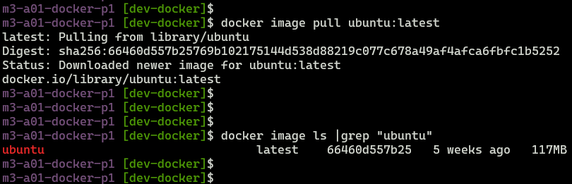
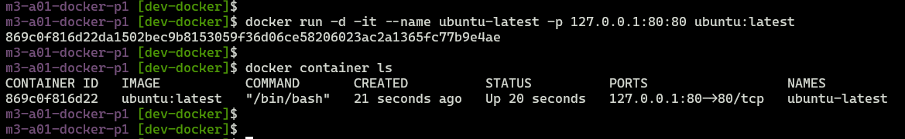
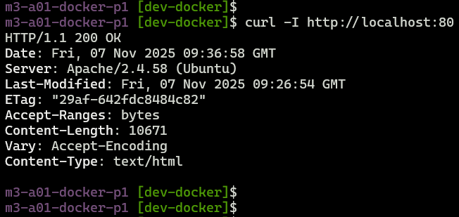
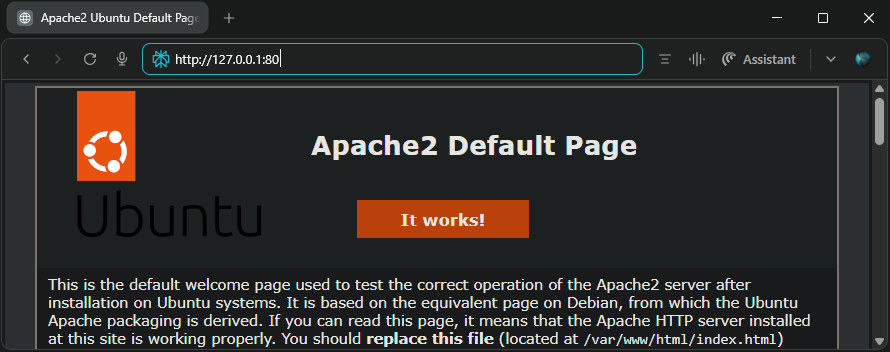

## Module 3: Docker Part 1 Assignment - 1

Tasks To Be Performed:
1. Pull Ubuntu container
2. Run this container and map port 80 on the local
3. Install Apache2 on this container
4. Check if you are able to access the Apache page on your browser

---

### Pull Ubuntu container
```bash
docker image pull ubuntu:latest
```



---

### Run the container and map port 80 on the local host
```bash
docker run -d -it --name ubuntu-latest -p 127.0.0.1:80:80 ubuntu:latest 
# Check running container 
docker container ls
```



---

### Install Apache2
```bash
# Access the shell in the container
docker container exec -it ubuntu-latest /bin/bash

# Install Apache2
apt update &>/dev/null
apt install -y apache2 &>/dev/null
echo "ServerName localhost" >> /etc/apache2/apache2.conf

# Start service
service apache2 start

# Make sure service is running
service apache2 status
```


---

### Curl access to apache2 server container from the host

```bash
curl -I http://localhost:80
```



### Web browser access `http://127.0.0.1:80`



---