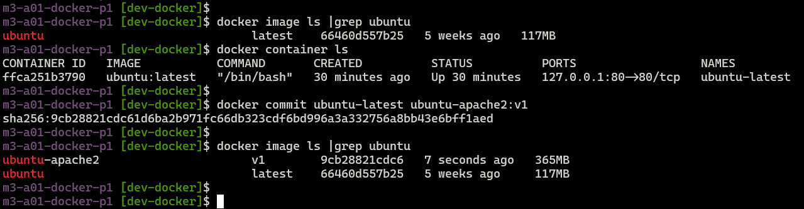
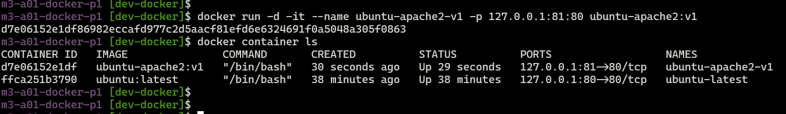
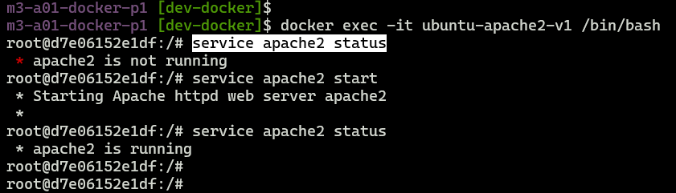
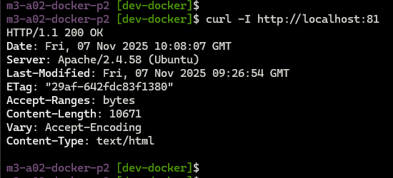
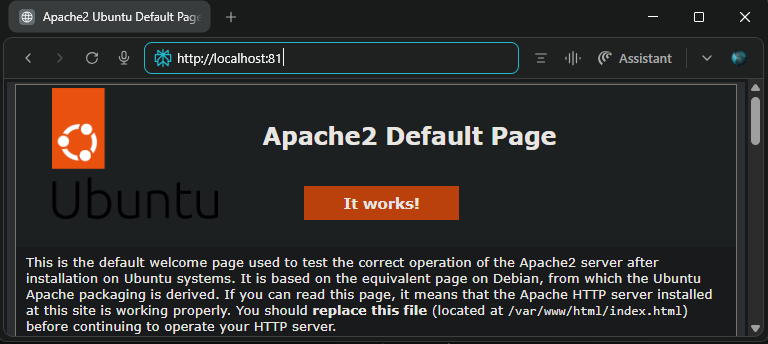

## Module 3: Docker Part 1 Assignment - 2

Tasks To Be Performed:
1. Save the image created in assignment 1 as a Docker image
2. Launch container from this new image and map the port to 81
3. Go inside the container and start the Apache2 service
4. Check if you are able to access it on the browser

***

**1. Save the running container as a new Docker image**

```bash
# Prerequisite: 
# Ubuntu latest image exists
# ubuntu latest container is running
docker image ls |grep ubuntu
docker container ls

# Save the container image
docker commit ubuntu-latest ubuntu-apache2:v1

# Verify the existing and the new image
docker image ls |grep ubuntu
```
- `ubuntu-latest` is the container name from Assignment 1.
- `ubuntu-apache2:v1` is the new image.




***

**2. Launch a container from this new image, mapping port 81 on the host to port 80 in the container**

```bash
docker run -d -it --name ubuntu-apache2-v1 -p 127.0.0.1:81:80 ubuntu-apache2:v1
```
Terminal shows two containers,
- `ubuntu-apache2:v1` - the saved container image mapped to host port 81
- `ubuntu-latest` - the original container image (from Assignment 1) mapped to host port 80



***

**3. Go inside the container and start the Apache2 service**

```bash
# Access the shell in the container
docker exec -it ubuntu-apache2-v1 /bin/bash

# Check service status (expected: default not running)
service apache2 status

# Start the service
service apache2 start

# Verify the running status
service apache2 status
```


***

**4. Check from your host if the Apache default page is accessible on port 81**

- **From command line:**

```bash
curl -I http://localhost:81
```



- **From browser at:** `http://localhost:81`



***
