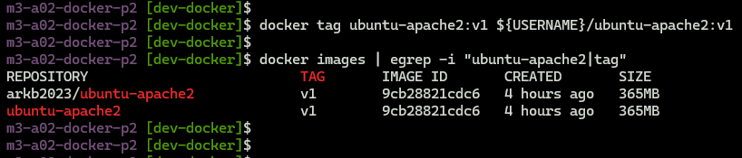
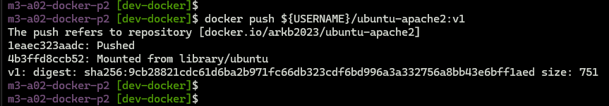
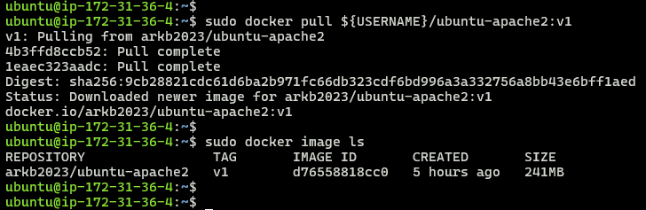
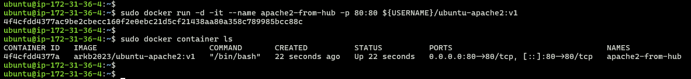
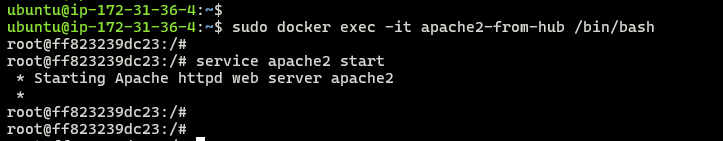
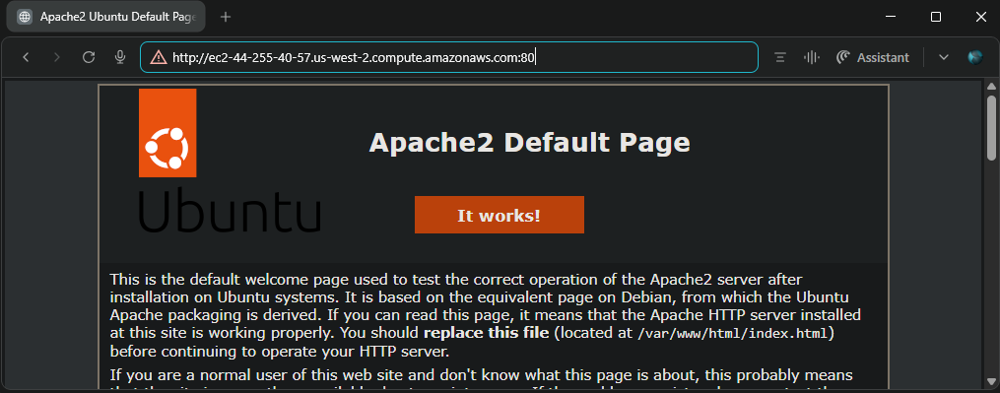

## Module 3: Docker Part 1 Assignment - 3

Tasks To Be Performed:  
1. Use the saved image in the previous assignment  
2. Upload this image on Docker Hub  
3. On a separate machine pull this Docker Hub image and launch it on port 80  
4. Start the Apache2 service  
5. Verify if you are able to see the Apache2 service  

***

### **1. Tag the saved image**

```bash
# Tag the image
docker tag ubuntu-apache2:v1 ${USERNAME}/ubuntu-apache2:v1

# Check the tag got created
docker images | egrep -i "ubuntu-apache2|tag" 

```


### **2. Push the image to docker hub**
```bash
docker push ${USERNAME}/ubuntu-apache2:v1
```



***

### **3. On a separate machine, pull the image from Docker Hub**

```bash
docker pull ${USERNAME}/ubuntu-apache2:v1
```



***

### **4. Launch a container from this image, mapping port 80**

```bash
docker run -d -it --name apache2-from-hub -p 80:80 ${USERNAME}/ubuntu-apache2:v1

docker container ls
```



***

### **5. Start Apache2 service in the container**

```bash
docker exec -it apache2-from-hub /bin/bash
service apache2 start
```



***

### **6. Verify Apache2 service access**

- **With curl:**


- **With browser:**  



***
