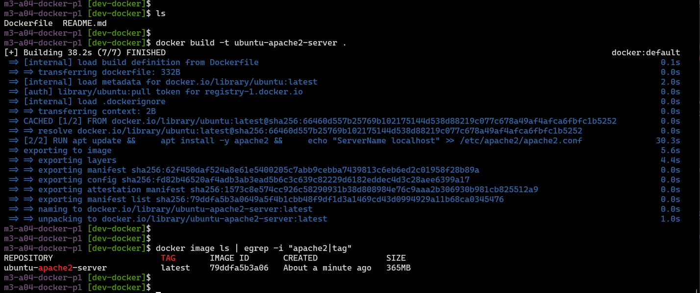
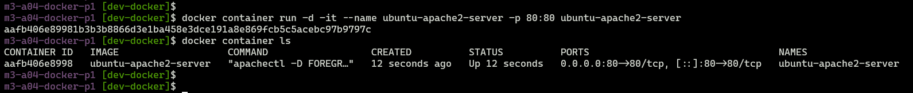

## Module 3: Docker Part 1 Assignment - 4

Tasks To Be Performed:  
1. Create a Dockerfile with the following specs:  
    - Ubuntu container  
    - Apache2 installed  
    - Apache2 should automatically run once the container starts  
2. Submit the Dockerfile for assignment completion  

---

### Dockerfile

```Dockerfile
# Start from the ubuntu image
FROM ubuntu:latest

# Install Apache2
RUN apt update && \
    apt install -y apache2 && \
    echo "ServerName localhost" >> /etc/apache2/apache2.conf

# When container starts, always run apache2 service in foreground
ENTRYPOINT ["apachectl", "-D", "FOREGROUND"]
```

---

### Build the docker image
```bash
docker build -t ubuntu-apache2-server .
docker image ls
```



---

### Run the container and map port 80 on the local host
```bash
docker run -d -it --name ubuntu-apache2-server -p 80:80 ubuntu-apache2-server
```


### Curl access to apache2 server container from the host

```bash
curl -I http://localhost:80
```


---