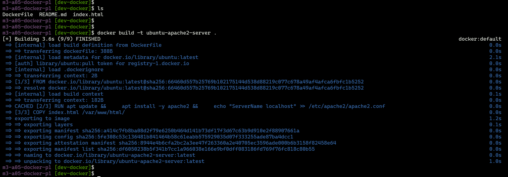
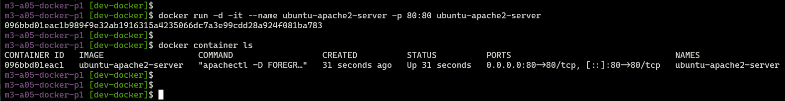
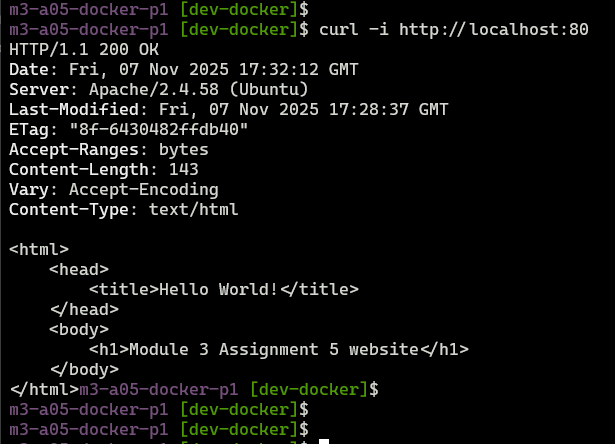
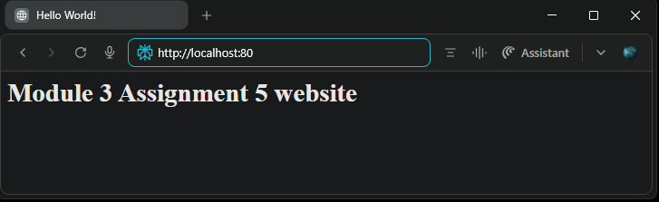

## Module 3: Docker Part 1 Assignment - 5

Tasks To Be Performed:  
1. Create a sample HTML file  
2. Use the Dockerfile from the previous task  
3. Replace this sample HTML file inside the Docker container with the default page  

---
### Dockerfile
The [Dockerfile](./Dockerfile) is included in the local repository directory. It defines the steps to build the custom Apache2 web server container.

```Dockerfile
# Start from the ubuntu image
FROM ubuntu:latest

# Install Apache2
RUN apt update && \
    apt install -y apache2 && \
    echo "ServerName localhost" >> /etc/apache2/apache2.conf

# Copy custom HTML page
COPY index.html /var/www/html/

# When container starts, always run apache2 service in foreground
ENTRYPOINT ["apachectl", "-D", "FOREGROUND"]
```

**Sample Website HTML**  

The file [index.html](./index.html) is included in the local repository directory. This file provides the custom homepage content that will be served by Apache2 in the container.

---

### Build the docker image
```bash
docker build -t ubuntu-apache2-server .
docker image ls
```



---

### Run the container and map port 80 on the local host
```bash
docker run -d -it --name ubuntu-apache2-server -p 80:80 ubuntu-apache2-server
```


### Verify website access

- **With curl:**
```bash
curl -I http://localhost:80
```


- **With browser:**  



---