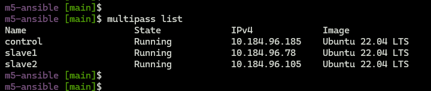
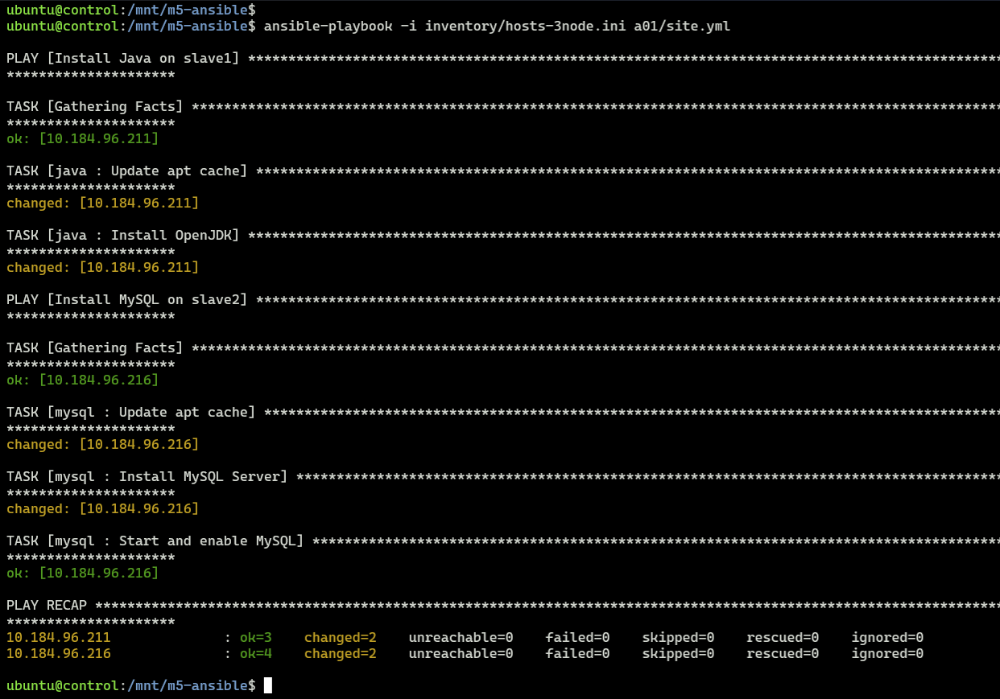
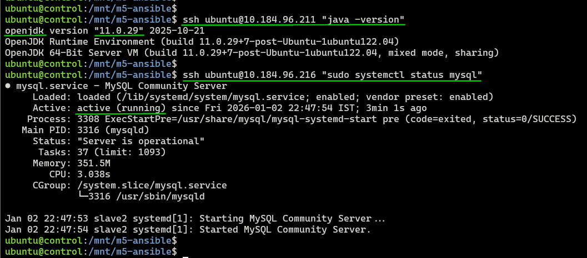

## Module 5: Ansible Assignment - 1  

Tasks To Be Performed:  
1. Setup Ansible cluster with 3 nodes  
2. On slave 1 install Java  
3. On slave 2 install MySQL server  
Do the above tasks using Ansible Playbooks  

---

### 1. 3-Node Cluster  
- Follow [`setup`](../setup-3-nodes/README.md)  

  

---

### 2. Roles Implementation
- **Slave1 node: Java** [roles/java/tasks/main.yml](../roles/java/tasks/main.yml)  
  ```bash
  cat ../roles/java/tasks/main.yml

  # Output  
  ---
  - name: Update apt cache
    apt:
      update_cache: yes

  - name: Install OpenJDK
    apt:
      name: openjdk-11-jdk
      state: present
  ```

---

- **Slave2 node: mysql** [roles/mysql/tasks/main.yml](../roles/mysql/tasks/main.yml)  
  ```bash
  cat ../roles/mysql/tasks/main.yml

  # Output  
  ---
  - name: Update apt cache
    apt:
      update_cache: yes

  - name: Install MySQL Server
    apt:
      name: mysql-server
      state: present

  # Starts service + auto-starts on boot (enabled=yes).
  - name: Start and enable MySQL
    systemd:
      name: mysql
      state: started
      enabled: yes
  ```

---

### 3. [Playbook](./site.yml) Deployment
  ```bash
  cat site.yml

  # Output
  ---
  - name: Install Java on slave1
    hosts: slave1
    become: yes
    roles:
      - java

  - name: Install MySQL on slave2
    hosts: slave2
    become: yes
    roles:
      - mysql
  ```

---

### 4. Execution
- SSH into control node
  ```bash
  multipass shell control
  ```
- Deploy to slave nodes
  ```bash
  cd /mnt/m5-ansible/
  ansible-playbook -i inventory/hosts-3node.ini a01/site.yml 
  ```

  

---

### 5. Verification
- Confirmation on successful installation  

  

---
