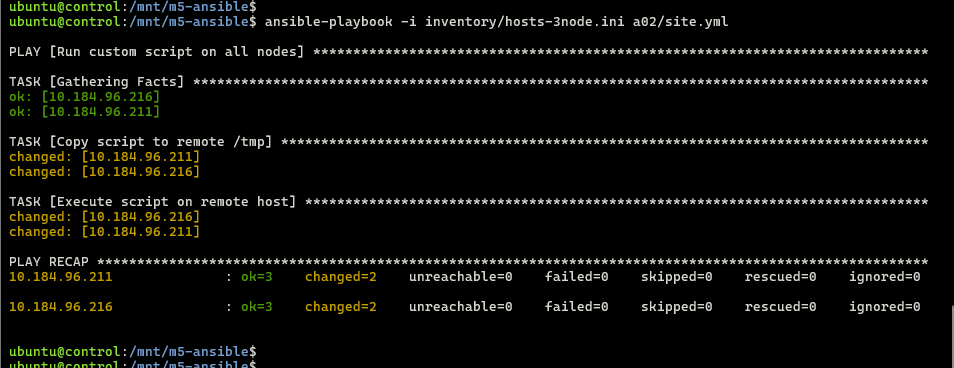
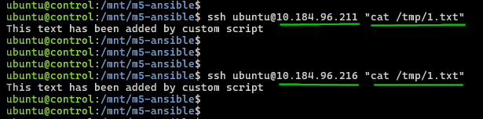

## Module 5: Ansible Assignment - 2  

Tasks To Be Performed:  
1. Create a script which can add text “This text has been added by custom script” to /tmp.1.txt  
2. Run this script using Ansible on all the hosts  

---

### 1. 3-Node Cluster
- Follow [`setup`](../setup/README.md)    

  

### 2. [Script](./files/add-text.sh)
  ```bash
  cat ./files/add-text.sh

  # Output  
  #!/usr/bin/env bash
  set -euo pipefail

  echo "This text has been added by custom script" >> /tmp/1.txt
  ```

---

### 3. [Playbook](./site.yml)
  ```bash
  cat site.yml

  # Output
  ---
  - name: Run custom script on all nodes
    hosts: all
    become: yes

    tasks:
      - name: Copy script to remote /tmp
        copy:
          src: files/add-text.sh
          dest: /tmp/add-text.sh
          mode: '0755'

      - name: Execute script on remote host
        command: /tmp/add-text.sh
  ```

---

### 4. Execution
- SSH into control node
  ```bash
  multipass shell control
  ```
- Deploy to slave nodes
  ```bash
  cd /mnt/m5-ansible/
  ansible-playbook -i inventory/hosts-3node.ini a02/site.yml 
  ```
  

---

### 5. Verification
- Check the file and contents on Slave1 and Slave2 nodes
  ```bash
  ssh ubuntu@10.184.96.211 "cat /tmp/1.txt" # slave1
  ssh ubuntu@10.184.96.216 "cat /tmp/1.txt" # slave2
  ```
- Confirmation of file and contents  

  

---
