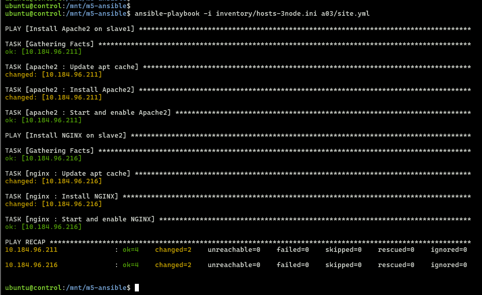
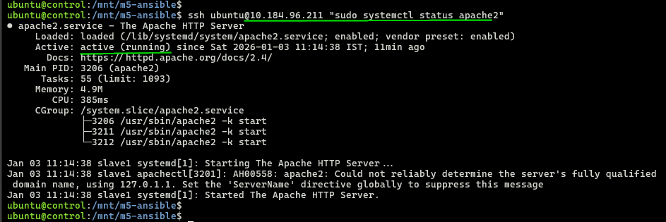

## Module 5: Ansible Assignment - 3  

Tasks To Be Performed:  
1. Create 2 Ansible roles  
2. Install Apache2 on slave1 using one role and NGINX on slave2 using the other role  
3. Above should be implemented using different Ansible roles  

---

### 1. 3-Node Cluster  
- Follow [`setup`](../setup/README.md)  

  

---

### 2. Roles Implementation
- **Slave1 node: apache2** [roles/apache2/tasks/main.yml](../roles/apache2/tasks/main.yml)  
  ```bash
  cat ../roles/apache2/tasks/main.yml

  # Output  
  ---
  - name: Update apt cache
    apt:
      update_cache: yes

  - name: Install Apache2
    apt:
      name: apache2
      state: present

  - name: Start and enable Apache2
    systemd:
      name: apache2
      state: started
      enabled: yes
---

- **Slave2 node: nginx** [roles/nginx/tasks/main.yml](../roles/nginx/tasks/main.yml)  
  ```bash
  cat ../roles/nginx/tasks/main.yml

  # Output  
  ---
  - name: Update apt cache
    apt:
      update_cache: yes

  - name: Install NGINX
    apt:
      name: nginx
      state: present

  - name: Start and enable NGINX
    systemd:
      name: nginx
      state: started
      enabled: yes

  ```

---

### 3. [Playbook](./site.yml)
  ```bash
  cat site.yml

  # Output
  ---
  - name: Install Apache2 on slave1
    hosts: slave1
    become: yes
    roles:
      - apache2

  - name: Install NGINX on slave2
    hosts: slave2
    become: yes
    roles:
      - nginx

  ```
---

### 4. Execution
- SSH into control node
  ```bash
  multipass shell control
  ```
- Deploy to slave nodes
  ```bash
  cd /mnt/m5-ansible/
  ansible-playbook -i inventory/hosts-3node.ini a03/site.yml 
  ```

  

---

### 5. Verification
- Apache2 installed on Slave1 node  

  

- Nginx installed on Slave2 node  

  

- Apache2 webserver response
  ```bash
  curl -I http://10.184.96.211  # Apache "200 OK"
  ```
  
- Nginx response
  ```bash
  curl -I http://10.184.96.216 
  ```
  

---
