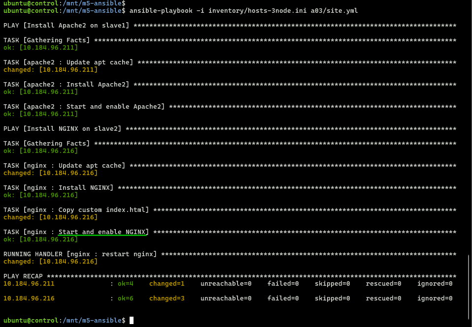
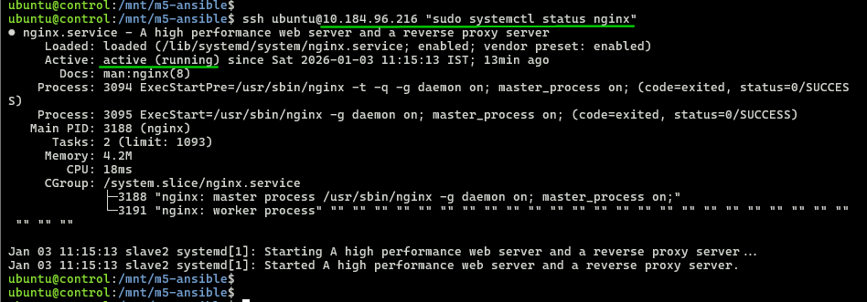
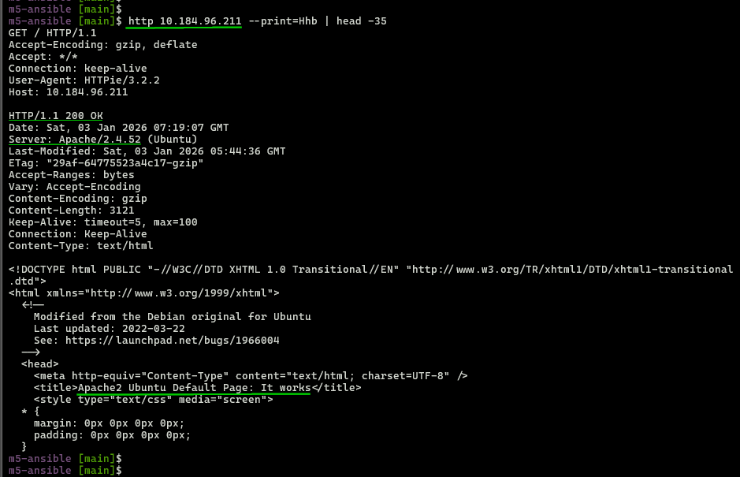
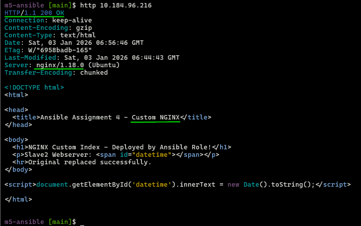

## Module 5: Ansible Assignment - 4  

Tasks To Be Performed:  
1. Use the previous deployment of Ansible cluster  
2. Configure the files folder in the role with index.html which should be replaced with the original index.html  
All of the above should only happen on the slave which has NGINX installed using the role.  

---

### 1. 3-Node Cluster  
- Follow [`setup-3-nodes`](../setup-3-nodes/README.md)  

  

---

### 2. Roles - custom index.html implementation
- **Slave2 node: nginx** [roles/nginx/files/index.yml](../roles/nginx/files/index.html)
  ```bash
  cat ../roles/nginx/files/index.yml

  # Output  
  <!DOCTYPE html>
  <html>
    <head>
      <title>Ansible Assignment 4 - Custom NGINX</title>
    </head>
    <body>
      <h1>NGINX Custom Index - Deployed by Ansible Role!</h1>
      <p>Slave2 Webserver: <span id="datetime"></span></p>
      <hr>Original replaced successfully.
    </body>
    <script>document.getElementById('datetime').innerText = new Date().toString();</script>
  </html>
  ```

---

### 3. [Playbook](../a03/site.yml) *(Reuse assignment-3 deployment)* 
  ```bash
  cat ../a03/site.yml

  # Output
  ---
  - name: Install Apache2 on slave1
    hosts: slave1
    become: yes
    roles:
      - apache2

  - name: Install NGINX on slave2
    hosts: slave2
    become: yes
    roles:
      - nginx

  ```
---

### 4. Execution
- SSH into control node
  ```bash
  multipass shell control
  ```
- Deploy to slave nodes
  ```bash
  cd /mnt/m5-ansible/
  ansible-playbook -i inventory/hosts-3node.ini a03/site.yml 
  ```

  

---

### 5. Verification
- Apache2 installed on Slave1 node  

  

- Nginx installed on Slave2 node  

  

- Apache2 webserver response *(unchanged slave1)*
  ```bash
  http 10.184.96.211 --print=Hhb | head -35 # Apache "200 OK"
  ```
  
- Nginx response *(Custom HTML on slave2 only)*
  ```bash
  http 10.184.96.216 
  ```
  

---
