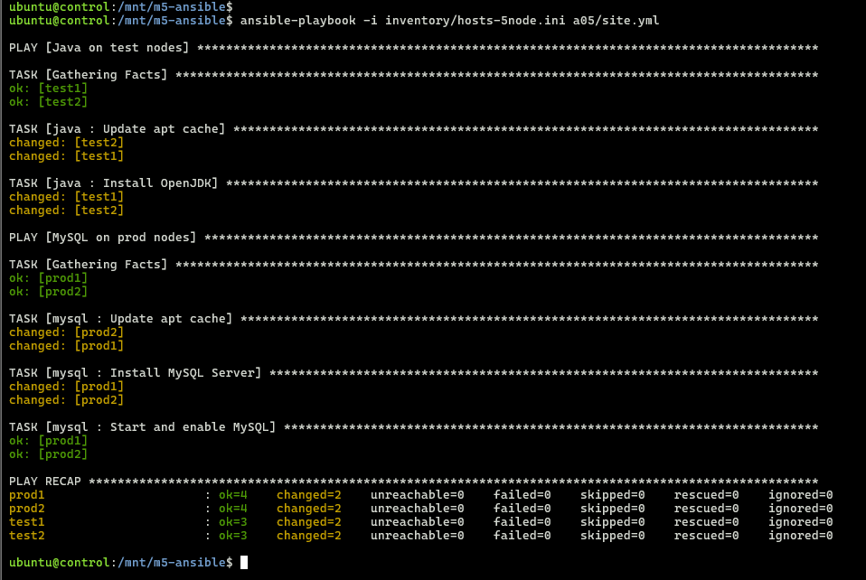
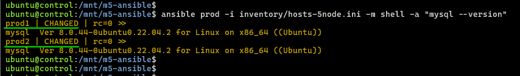

## Module 5: Ansible Assignment - 5  

Tasks To Be Performed:  
1. Create a new deployment of Ansible cluster of 5 nodes  
2. Label 2 nodes as test and other 2 as prod  
3. Install Java on test nodes  
4. Install MySQL server on prod nodes  

Use Ansible roles for the above and group the hosts under test and prod.  

---

### 1. 5-Node Cluster  
- Follow [`setup-5-nodes`](../setup-5-nodes/README.md)  

  
  > 2 test nodes + 2 prod nodes + 1 control node
---

### 2. Roles Implementation
- **test1,2 nodes: java** [roles/java/tasks/main.yml](../roles/java/tasks/main.yml)  
  ```bash
  cat ../roles/java/tasks/main.yml

  # Output  
  ---
  - name: Update apt cache
    apt:
      update_cache: yes

  - name: Install OpenJDK
    apt:
      name: openjdk-11-jdk
      state: present
---

- **prod1,2 nodes: mysql** [roles/mysql/tasks/main.yml](../roles/mysql/tasks/main.yml)  
  ```bash
  cat ../roles/mysql/tasks/main.yml

  # Output  
  ---
  - name: Update apt cache  
    apt:
      # Refreshes package index (idempotent).
      update_cache: yes

  - name: Install MySQL Server
    apt:
      name: mysql-server
      state: present

  # Starts service + auto-starts on boot (enabled=yes).
  - name: Start and enable MySQL
    systemd:
      name: mysql
      state: started
      enabled: yes
  ```
---

### 3. [Playbook](./site.yml)
  ```bash
  cat site.yml

  # Output
  ---
  - name: Java on test nodes
    hosts: test
    become: yes
    roles:
      - java

  - name: MySQL on prod nodes
    hosts: prod
    become: yes
    roles:
      - mysql
  ```
---

### 4. Execution
- SSH into control node
  ```bash
  multipass shell control
  ```
- Deploy
  ```bash
  cd /mnt/m5-ansible/
  ansible-playbook -i inventory/hosts-5node.ini a05/site.yml 
  ```

  

---

### 5. Verification
- Java test nodes  

  

- MySQL prod nodes  

  

- Ansible inventry graph  
  

---
