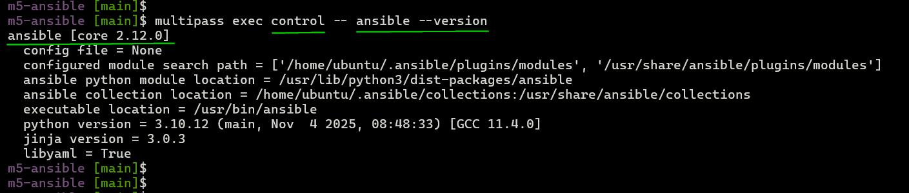
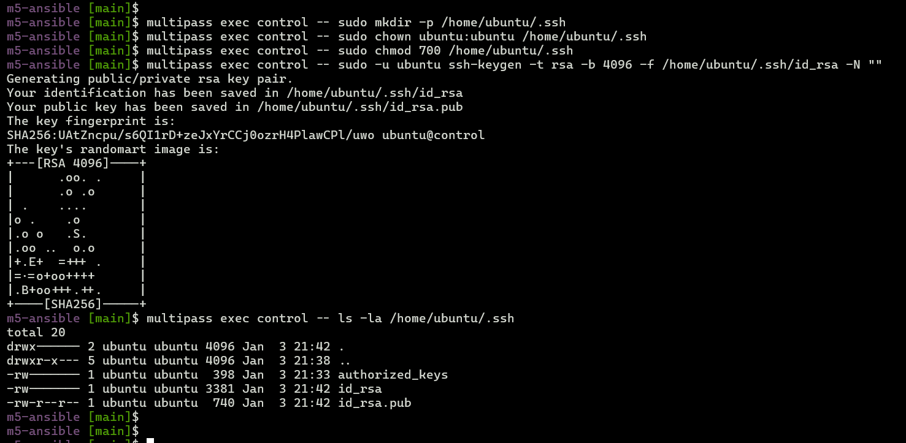
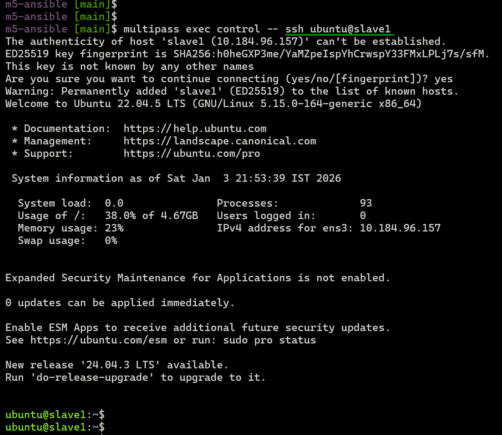
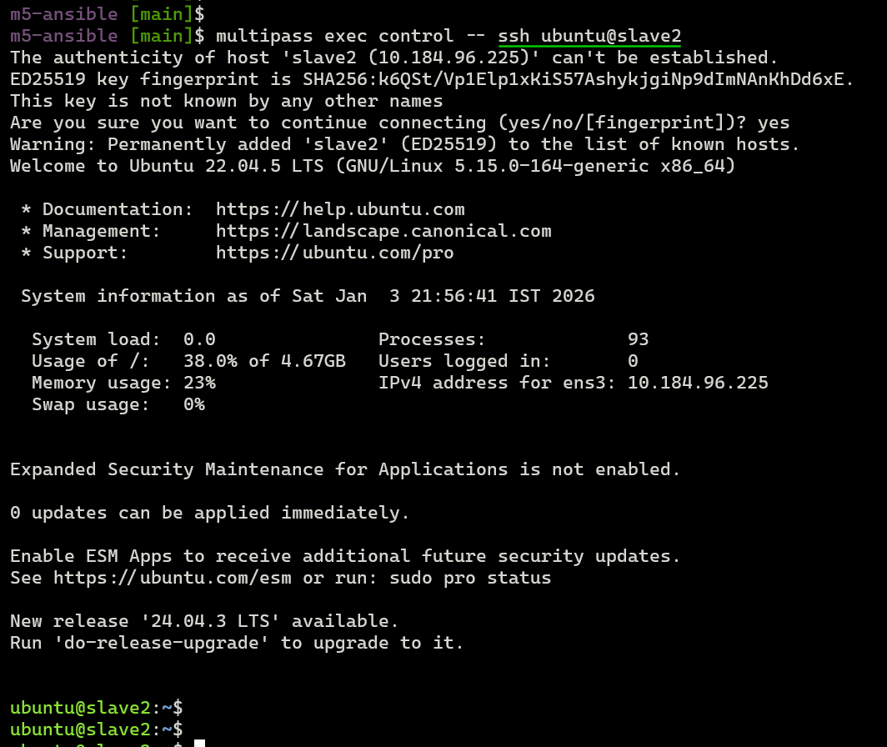
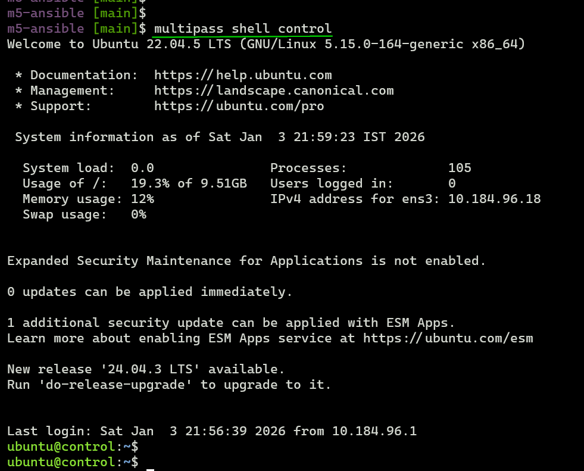
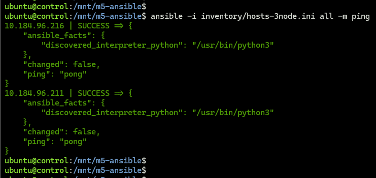

## 3-Node Ansible Cluster Setup for Assignments 1 to 4

**Purpose:** Complete provisioning guide for 3-node Multipass cluster (1 control + 2 slave) with passwordless SSH, Ansible, and inventory — ready for **Module 5 Assignment 1 to 4**.

> **[Multipass](https://documentation.ubuntu.com/multipass/latest/)** creates local Ubuntu VM mini-clouds.  
> **Host:** WSL2/Ubuntu 24.04.3 LTS  
> **Nodes:** Ubuntu 22.04.5 LTS


### 1. Prerequisites

- Install multipass  

  ```bash
  sudo snap install multipass
  
  Output:
  multipass 1.16.1 from Canonical✓ installed
  ```

### 2. Launch 3 nodes (control+slave1+slave2)
- Spin up control node (virtual machine)
  ```bash
  multipass launch --name control --cpus 2 --memory 2G --disk 10G jammy

  # Output
  Launched: control
  ```

- Spin up two slave nodes (two virtual machines)
  ```bash
  multipass launch --name slave1 --cpus 1 --memory 1G --disk 5G jammy
  # Output:
  Launched: slave1

  multipass launch --name slave2 --cpus 1 --memory 1G --disk 5G jammy
  # Output
  Launched: slave2
  ```

- Cluster with 3 `Ubuntu 22.04.5 LTS` nodes up and running    
  ```bash
  multipass list
  ```
  

### 3. Ansible on control  

  ```bash
  multipass exec control -- sudo apt update 
  multipass exec control -- sudo apt install ansible-core -y
  multipass exec control -- ansible --version
  ```
  

### 4. SSH setup (keys + passwordless)  
- Create SSH dir and generate SSH public key (control node) 
  ```bash
  # SSH directory
  multipass exec control -- sudo mkdir -p /home/ubuntu/.ssh
  # Set Ownership
  multipass exec control -- sudo chown ubuntu:ubuntu /home/ubuntu/.ssh
  # Permissions
  multipass exec control -- sudo chmod 700 /home/ubuntu/.ssh
  # Generate key (ubuntu user)
  multipass exec control -- sudo -u ubuntu ssh-keygen -t rsa -b 4096 -f /home/ubuntu/.ssh/id_rsa -N ""
  ```
- Verify id_rsa, id_rsa.pub  

  

- Get control node public key  

  ```bash
  CONTROL_PUBKEY=$(multipass exec control -- cat /home/ubuntu/.ssh/id_rsa.pub)
  ```

- Copy to slave1 node  
  ```bash  
  echo "$CONTROL_PUBKEY" | multipass exec slave1 -- sudo tee -a /home/ubuntu/.ssh/authorized_keys
  ```

  

- Copy to slave2 node  
  ```bash
  echo "$CONTROL_PUBKEY" | multipass exec slave2 -- sudo tee -a /home/ubuntu/.ssh/authorized_keys
  ```

  

- Test passwordless ssh from `control` node to `slave1` node  

  ```bash
  multipass exec control -- ssh ubuntu@slave1
  ```
  
  

- Test passwordless ssh from `control` node to `slave2` node
  ```bash
  multipass exec control -- ssh ubuntu@slave2
  ```
  
  

### 5. Mount codebase

- Mount Project folder from WSL2 host to `control` node
  ```bash
  multipass mount ../m5-ansible control:/mnt/m5-ansible
  ```

  

### 6. Baseline ansible configuration settings  
- Setup  [`ansible.cfg`](../ansible.cfg)  

  ```bash
  cat ansible.cfg
  
  # Output
  [defaults]
  # Search path for roles
  roles_path = roles

  # inventory
  inventory = inventory

  # Skips SSH host verification
  host_key_checking = False
  ```
  
### 7. Verification
- SSH to control node  
  ```bash
  multipass shell control
  ```
  

- ping inventory nodes  

  ```bash
  cd /mnt/m5-ansible
  ansible -i inventory/hosts-3node.ini all -m ping
  ```
  

---
**3-node cluster ready!**  

**Next:**  
- [a01/README.md](../a01/README.md) for Assignment #1  
- [a02/README.md](../a02/README.md) for Assignment #2  
- [a03/README.md](../a03/README.md) for Assignment #3
- [a04/README.md](../a04/README.md) for Assignment #4
---

### Cleanup *(Optional)*
```bash
# Umount
multipass umount control:/mnt/m5-ansible

# Stop all nodes
multipass stop control slave1 slave2

# Delete + purge (complete removal)
multipass delete control slave1 slave2 --purge
```
---