## 5-Node Ansible Cluster Setup for Assignment 5

**Purpose:** Complete provisioning guide for 5-node Multipass cluster (1 control + 2 test + 2 prod) with passwordless SSH, Ansible, and inventory — ready for **Module 5 Assignment 5** (Java on test, MySQL on prod).

> **[Multipass](https://documentation.ubuntu.com/multipass/latest/)** creates local Ubuntu VM mini-clouds.  
> **Host:** WSL2/Ubuntu 24.04.3 LTS  
> **Nodes:** Ubuntu 22.04.5 LTS


### 1. Prerequisites

- Install multipass  

  ```bash
  sudo snap install multipass
  
  Output:
  multipass 1.16.1 from Canonical✓ installed
  ```
### 2. Launch 5 nodes (control+test+prod)
- Spin up control node (virtual machine)  

  ```bash
  multipass launch --name control --cpus 2 --memory 2G --disk 10G jammy

  # Output
  Launched: control
  ```

- Spin up two test nodes (two virtual machines)  
  ```bash
  multipass launch --name test1 --cpus 1 --memory 1G --disk 5G jammy
  # Output:
  Launched: test1

  multipass launch --name test2 --cpus 1 --memory 1G --disk 5G jammy
  # Output
  Launched: test2
  ```

- Spin up two prod nodes (two virtual machine)  

  ```bash
  multipass launch --name prod1 --cpus 1 --memory 1G --disk 5G jammy
  # Output:
  Launched: prod1

  multipass launch --name prod2 --cpus 1 --memory 1G --disk 5G jammy
  # Output
  Launched: prod3
  ```

- Cluster with 5 `Ubuntu 22.04.5 LTS` nodes up and running  

  ```bash
  multipass list
  ```
  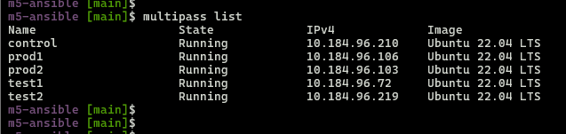

### 3. Ansible on control  

  ```bash
  multipass exec control -- sudo apt update 
  multipass exec control -- sudo apt install ansible-core -y
  multipass exec control -- ansible --version
  ```
  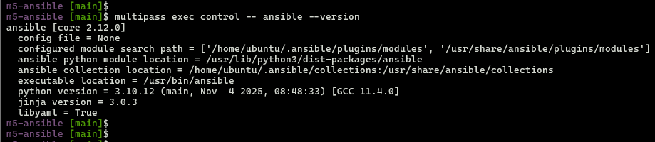

### 4. SSH setup (keys + passwordless)
- Create SSH dir and generate SSH public key (control node)  

  ```bash
  # SSH directory
  multipass exec control -- sudo mkdir -p /home/ubuntu/.ssh
  # Set Ownership
  multipass exec control -- sudo chown ubuntu:ubuntu /home/ubuntu/.ssh
  # Permissions
  multipass exec control -- sudo chmod 700 /home/ubuntu/.ssh
  # Generate key (ubuntu user)
  multipass exec control -- sudo -u ubuntu ssh-keygen -t rsa -b 4096 -f /home/ubuntu/.ssh/id_rsa -N ""
  ```
- Verify id_rsa, id_rsa.pub  

  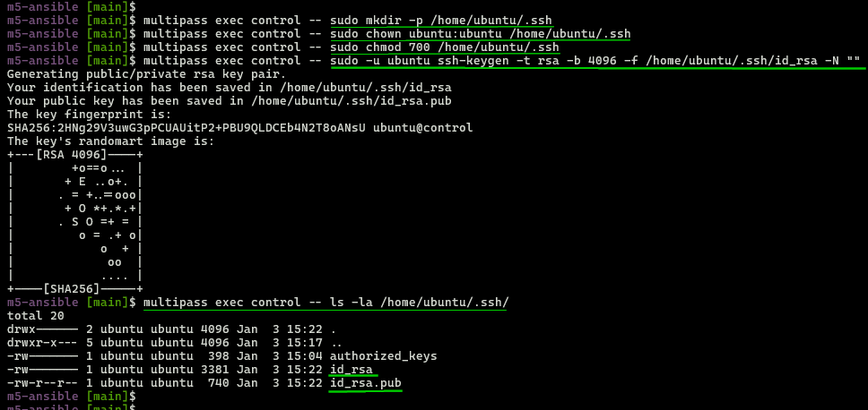

- Get control node public key  

  ```bash
  CONTROL_PUBKEY=$(multipass exec control -- cat /home/ubuntu/.ssh/id_rsa.pub)
  ```

- Copy to test1 & test2 nodes  

  ```bash  
  echo "$CONTROL_PUBKEY" | multipass exec test1 -- sudo tee -a /home/ubuntu/.ssh/authorized_keys
  echo "$CONTROL_PUBKEY" | multipass exec test2 -- sudo tee -a /home/ubuntu/.ssh/authorized_keys
  ```
  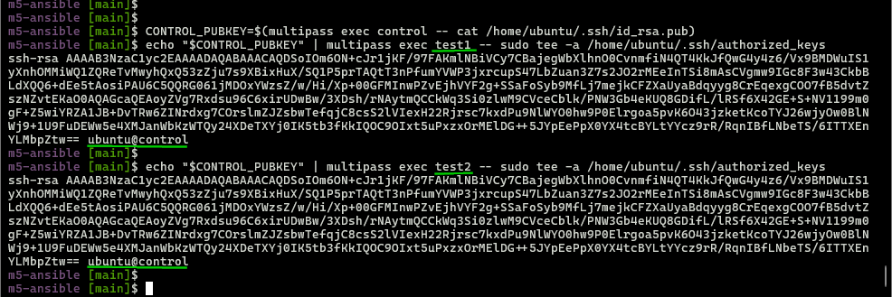

- Copy to prod1 & prod2 nodes  

  ```bash
  echo "$CONTROL_PUBKEY" | multipass exec prod1 -- sudo tee -a /home/ubuntu/.ssh/authorized_keys
  echo "$CONTROL_PUBKEY" | multipass exec prod2 -- sudo tee -a /home/ubuntu/.ssh/authorized_keys
  ```
  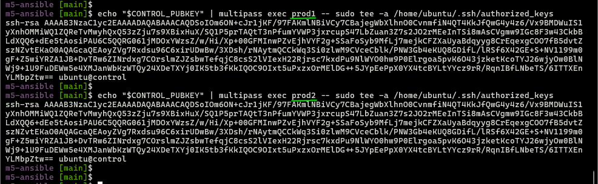

- Test passwordless ssh from `control` node:  
  - To `test1` node  
    ```bash
    multipass exec control -- ssh ubuntu@test1
    ```
    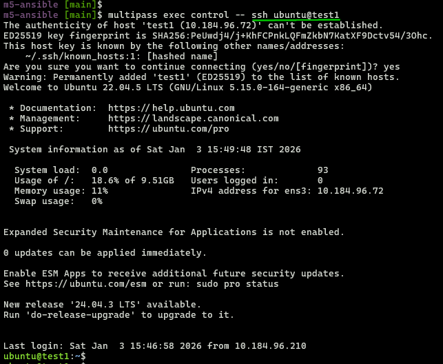

  - To `test2` node  
    ```bash
    multipass exec control -- ssh ubuntu@test2
    ```
    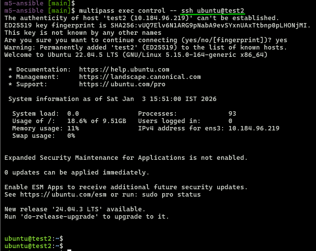

  - To `prod1` node  
    ```bash
    multipass exec control -- ssh ubuntu@prod1
    ```
    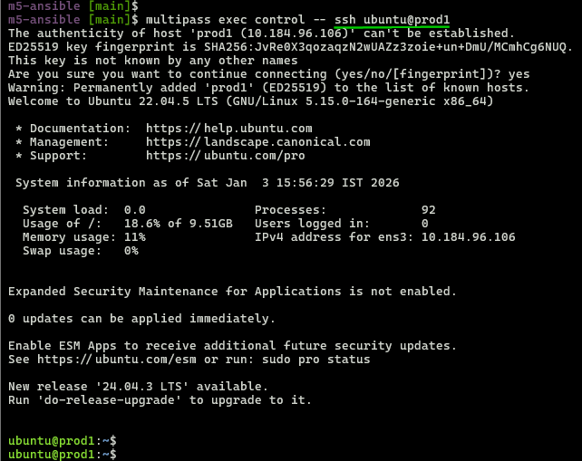

  - To `prod2` node  
    ```bash
    multipass exec control -- ssh ubuntu@prod2
    ```
    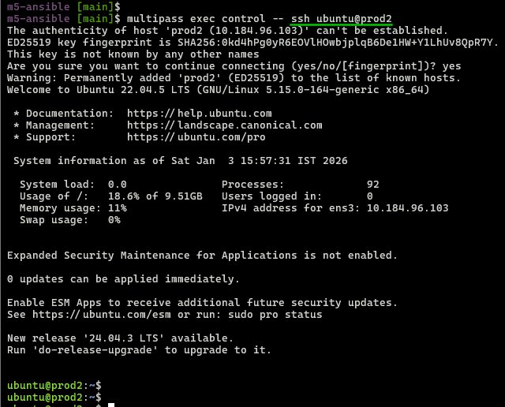

### 5. Mount codebase
- Mount Project folder from WSL2 host to `control` node  
  ```bash
  multipass mount ../m5-ansible control:/mnt/m5-ansible
  ```
  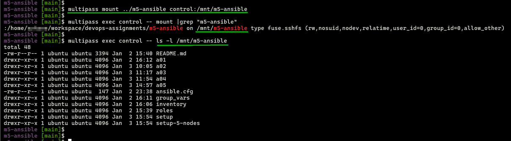

### 6. Baseline ansible configuration settings  
- Setup  [`ansible.cfg`](../ansible.cfg)  

  ```bash
  cat ansible.cfg
  
  # Output
  [defaults]
  # Search path for roles
  roles_path = roles

  # inventory
  inventory = inventory

  # Skips SSH host verification
  host_key_checking = False
  ```

### 7. Verification

- SSH to control node  
  ```bash
  multipass shell control
  ```
  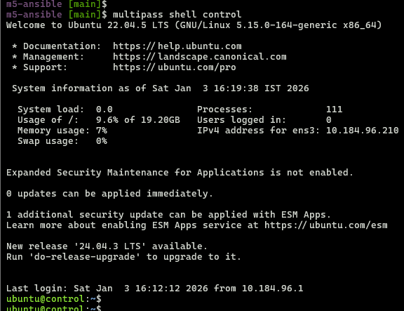

- ping inventory nodes  

  ```bash
  cd /mnt/m5-ansible
  ansible -i inventory/hosts-5node.ini all -m ping
  ```
  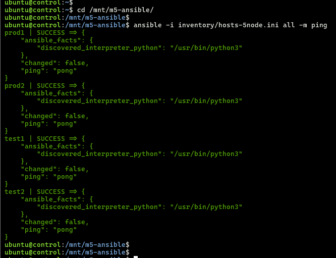

- Ansible inventory Graph  

  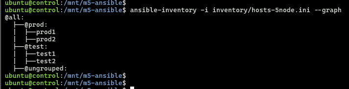

---

**5-node cluster ready!**  

**Next:**  
- [a05/README.md](../a05/README.md) for Assignment #5  

---

### Cleanup *(Optional)*
```bash
# Umount
multipass umount control:/mnt/m5-ansible

# Stop all nodes
multipass stop control test1 test2 prod1 prod2

# Delete + purge (complete removal)
multipass delete control test1 test2 prod1 prod2 --purge
```
---
