## Module 6: Jenkins Assignment - 1

Tasks To Be Performed:  
1. Trigger a pipeline using Git when push on develop branch  
2. Pipeline should pull Git content to a folder  

### Prerequisites

- Jenkins lab environment set up as detailed in the [`Lab-Setup-Jenkins-Master-Agent`](../m6-jenkins-lab-setup/README.md)  
- Ensure public access to the Jenkins UI via the `ngrok` tool
- A publicly accessible GitHub repository named [`m6-a01-jenkins`](https://github.com/arkb2023/m6-a01-jenkins.git) was created specifically for testing purposes, featuring both `main` and `develop` branches configured to support webhook-triggered pipeline builds.

### Step 1: Set Up a Jenkins Pipeline Job
Create a new Freestyle Jenkins job configured to build GitHub repository.

*Jenkins view shows Freestyle Project general configuration settings where the job name, description, and build options are defined.*

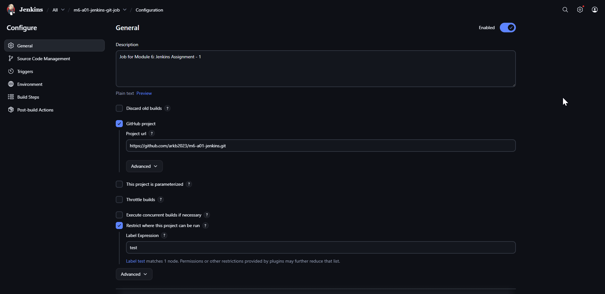

*Jenkins view shows Source Code Management (SCM) configuration where the Git repository URL is defined and the `Branches to build` field is set to `*/develop`, to trigger builds on the `develop` branch.*

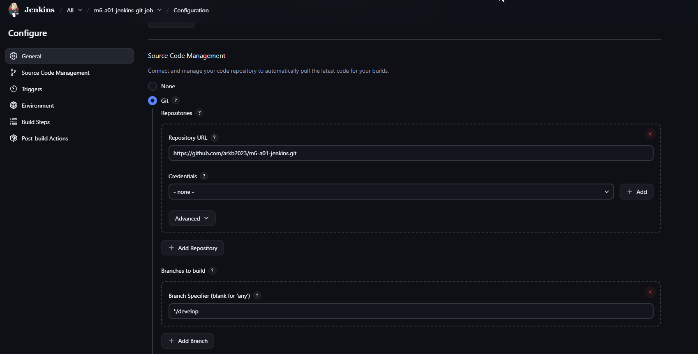

*Jenkins view shows trigger configuration `GitHub hook trigger for GITScm polling` to automatically start a build when code is pushed to GitHub*

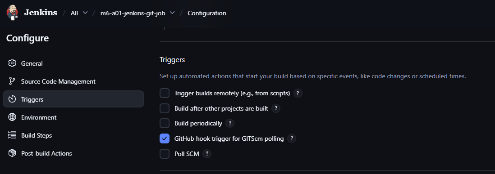

### Step 2: Configure GitHub Webhook
Set up a webhook in your GitHub repository settings pointing to Jenkins URL to trigger builds on `push` to the `develop` branch.

*Browser view shows GitHub repository webhook configuration settings with ngrok public URL (reverse proxy mapped to the local Docker-based Jenkins instance) as the Payload URL for triggering Jenkins on push events.*

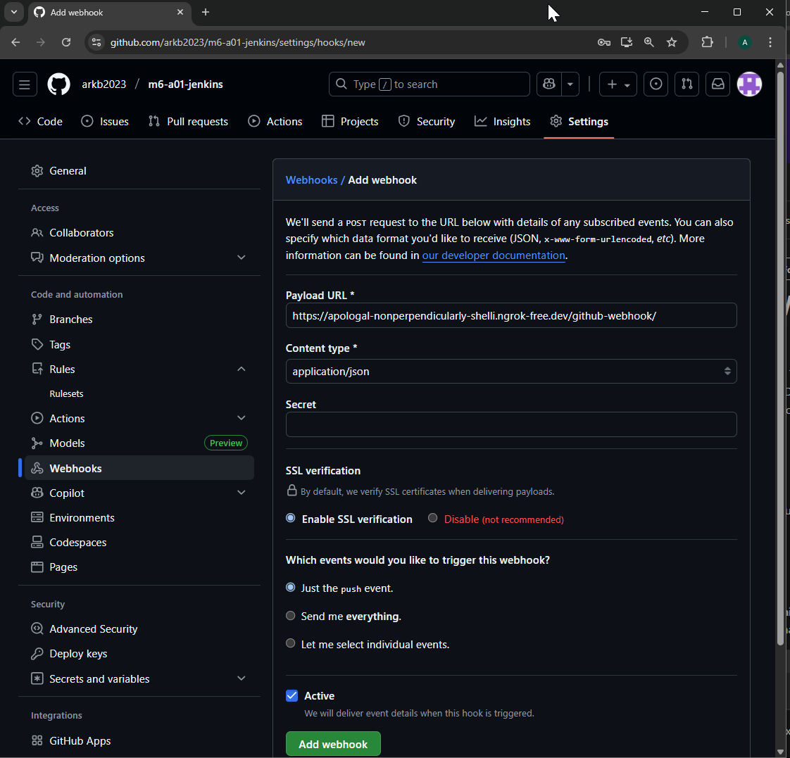

### Step 3: Push Code to the Develop Branch
Make a code change and push to the develop branch in GitHub to initiate the webhook trigger.

*Terminal view shows Git push command execution to the develop branch triggering the Jenkins webhook.*

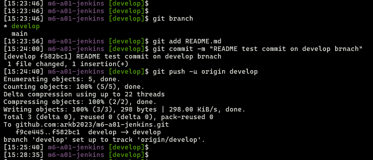

### Step 4: Verify Build Trigger
Jenkins auto-starts the build, triggered by the GitHub webhook push event.

*Jenkins `dashboard` view shows the job entry created for the Freestyle Project through the Jenkins UI.*
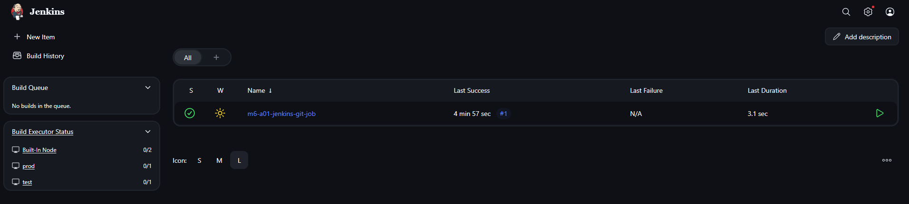

*Jenkins `Build History` view shows a new build automatically triggered*  
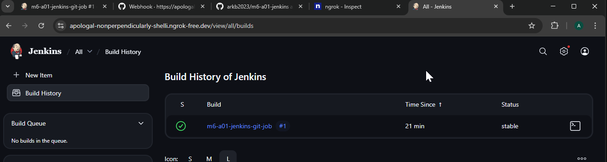  

*Jenkins job `status` view shows key details such as the build being `started by push` the `Repository URL` the specific Git `Revision` and the `branch` built.*  
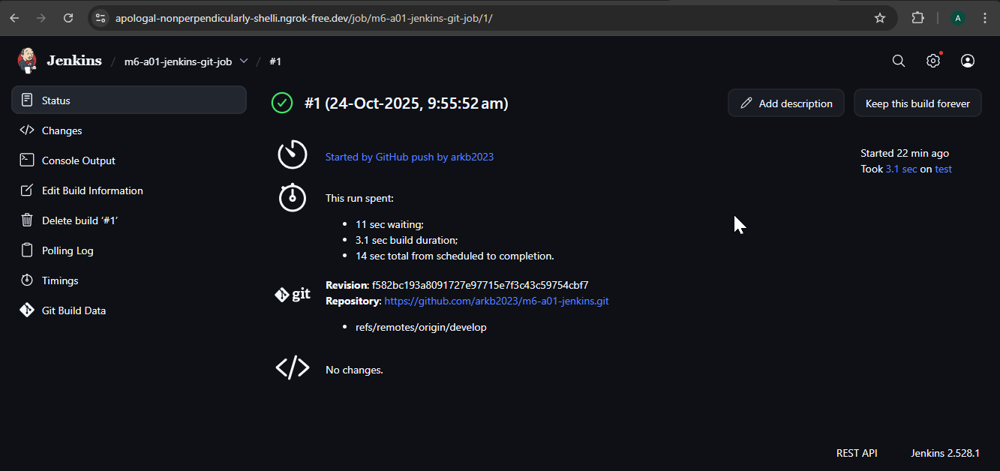  

*Jenkins job `Git Build Data` view confirms the `repository URL` `branch` and `revision` information for the triggered build.*  
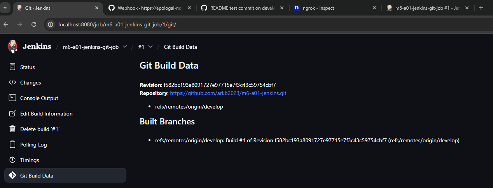

*GitHub `Webhook Deliveries` view shows the `push event triggered request` sent to the Jenkins endpoint via ngrok.*
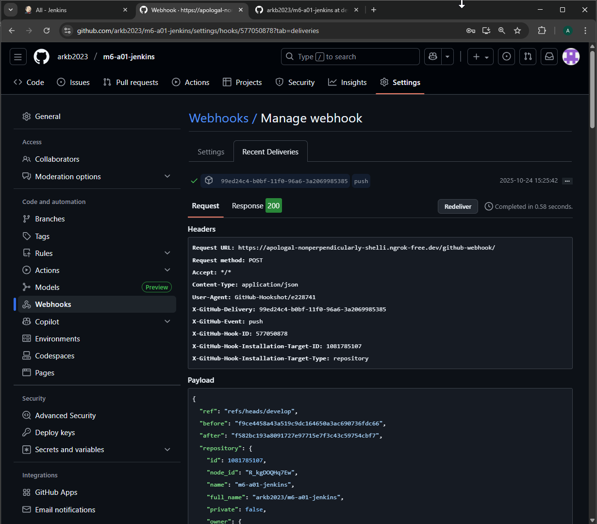

*Jenkins job `GitHub hook log` view shows confirms incoming webhook notification received successfully.*
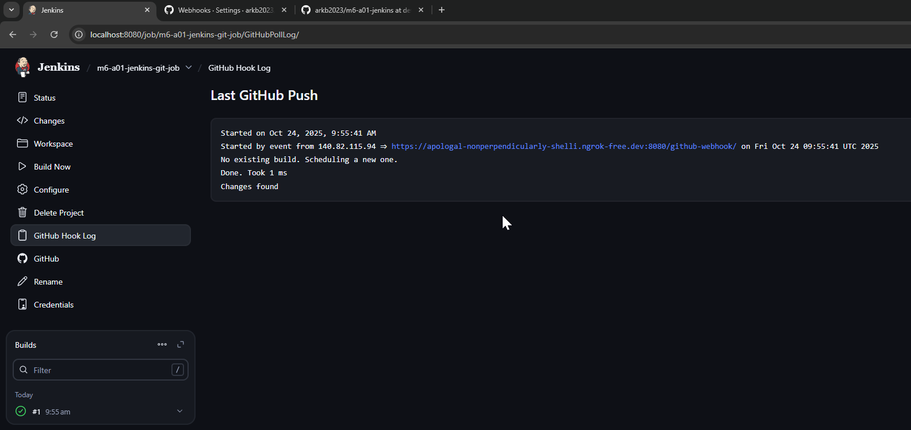

*GitHub `Webhook Deliveries` view shows the `200 Response` received from Jenkins endpoint via ngrok.*
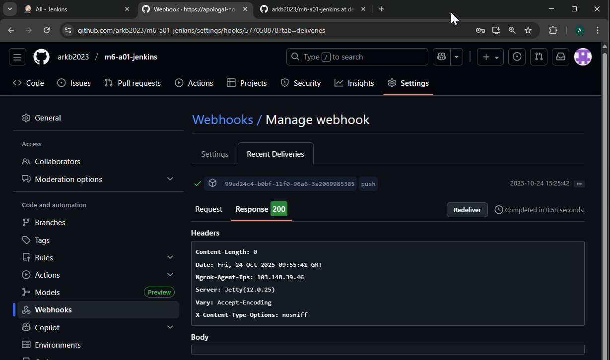

### Step 5: Verify Pipeline Pulls Git Content
Confirm that Jenkins successfully cloned the Git contents, by checking `console output` and the Jenkins `test` agent container workspace.

*Jenkins job `console output`  view shows complete build logs* -- These logs collectively confirm that the repository was cloned successfully into the workspace directory at
`/home/jenkins/agent/workspace/m6-a01-jenkins-git-job` on the `test` agent.

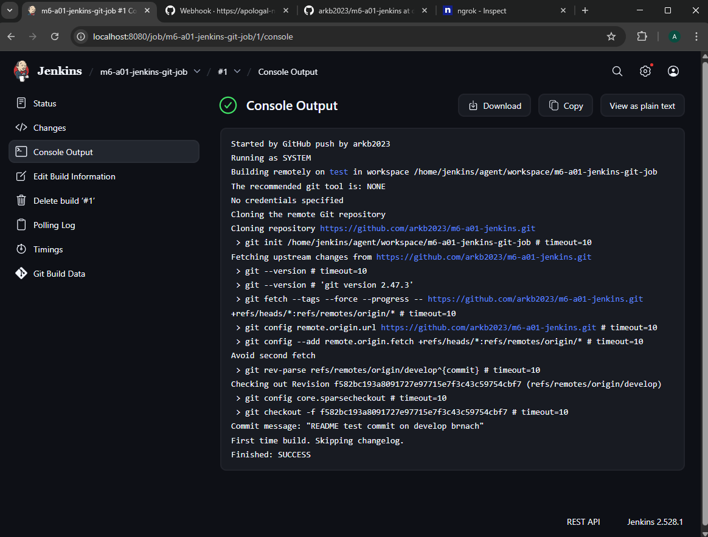

*Terminal view shows Jenkins test agent container workspace `/home/jenkins/agent/workspace/m6-a01-jenkins-git-job` containing cloned repository content.*

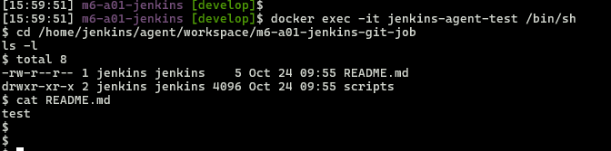

---