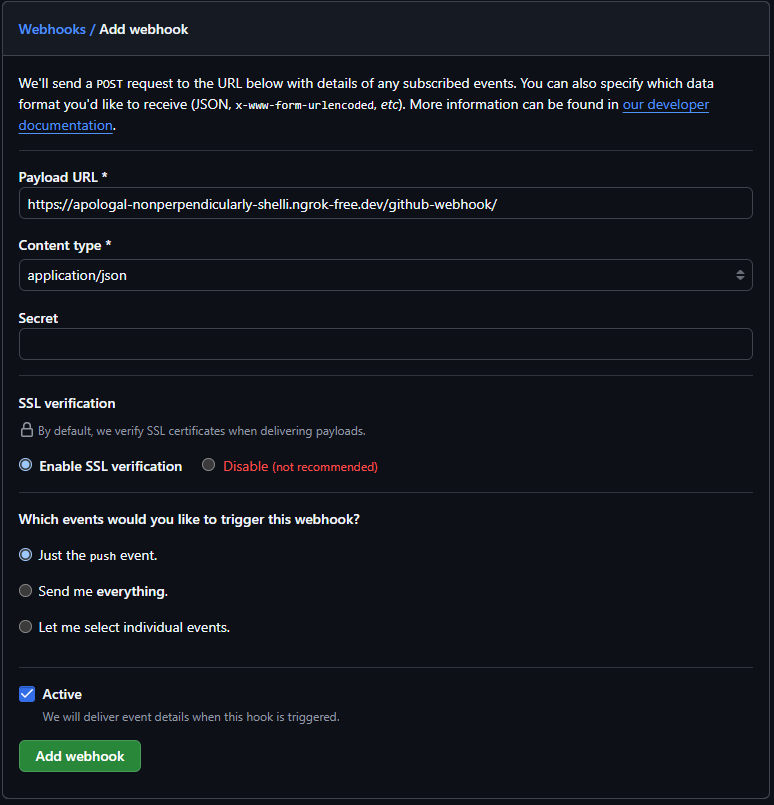
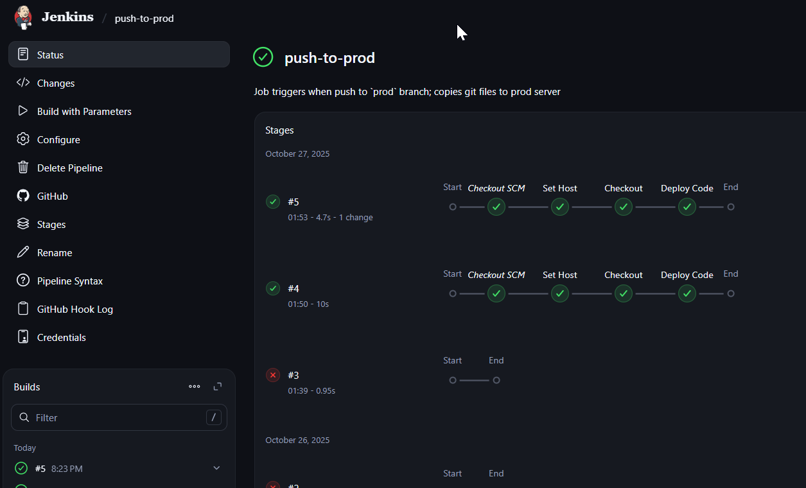
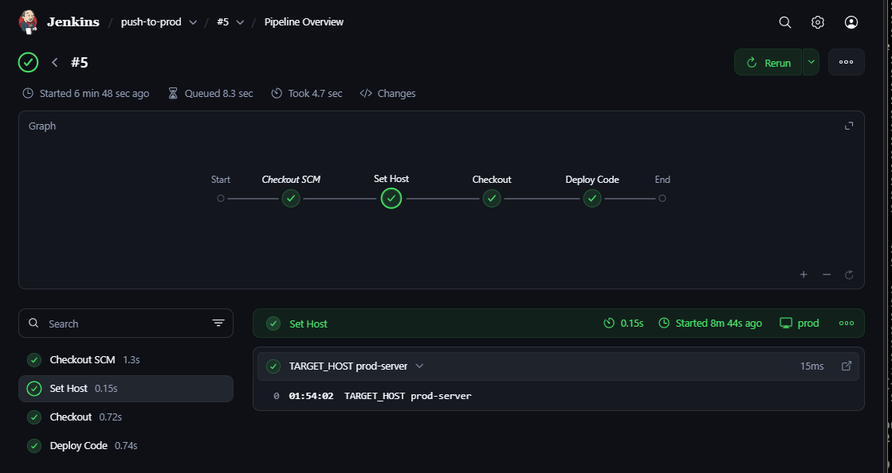
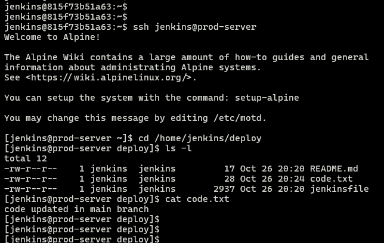

## Module 6: Jenkins Assignment - 2

Tasks To Be Performed:  
1. Add `2 nodes` to `Jenkins master`  
2. Create `2 jobs` with the following jobs:  
   - Push to `test`  
   - Push to `prod`  
3. Once a push is made to `test` branch, copy Git files to `test server`  
4. Once a push is made to `master` branch, copy Git files to `prod server`  


### Prerequisites

- Jenkins lab environment set up as detailed in [`Lab-Setup-Jenkins-Master-Agent`](../m6-jenkins-lab-setup/README.md)  
- Ensure public access to the Jenkins UI via the `ngrok` tool
- A publicly accessible GitHub repository named [`m6-a02-jenkins`](https://github.com/arkb2023/m6-a02-jenkins.git) was created specifically for testing purposes, featuring both `test` and `main` branches configured to support webhook-triggered pipeline builds.

### Step 1: Set Up Jenkins Pipeline Jobs

Create **two Jenkins pipeline jobs** with the following settings:

#### **Job #1: push-to-test**

- **Name**: `push-to-test`
- **Description**: Job triggers on push to `test` branch; copies Git files to `test server`.
- **Type**: Pipeline

**Configuration:**

- **General**
  - Check `GitHub project`
  - *Project URL*: `https://github.com/arkb2023/m6-a02-jenkins.git`
- **Build Triggers**
  - Check `GitHub hook trigger for GITScm polling`
- **Pipeline Definition**
  - Select `Pipeline script from SCM`
  - *SCM*: `Git`
    - *Repository URL*: `https://github.com/arkb2023/m6-a02-jenkins.git`
    - *Branches to build*: `*/test`
    - *Script Path*: [`jenkinsfile`](./jenkinsfile)

**Screenshots:**

*Jenkins view shows settings for the `General configuration` section for the `push-to-test` job.*


*Jenkins view shows the settings for the `GitHub project repository` and `parameters` in the General section.*


*Jenkins view shows the `Triggers` section for the `push-to-test` job, with `GitHub hook trigger for GITScm polling` enabled to allow `GitHub webhooks` to automatically trigger builds on `push events`*


*Jenkins view shows the `Pipeline` section with `Pipeline script from SCM` selected, `SCM` set to `Git`, the `repository URL` provided, and the `branch specifier` set to `*/test` along with the `script path` for the [`jenkinsfile`](./jenkinsfile)*


***

#### **Job #2: push-to-prod**

- **Name**: `push-to-prod`
- **Description**: Job triggers on push to `main` branch; copies Git files to `prod server`.
- **Type**: Pipeline

**Configuration:**

- **General**
  - Check `GitHub project`
  - *Project URL*: `https://github.com/arkb2023/m6-a02-jenkins.git`
- **Build Triggers**
  - Check `GitHub hook trigger for GITScm polling`
- **Pipeline Definition**
  - Select `Pipeline script from SCM`
  - *SCM*: `Git`
    - *Repository URL*: `https://github.com/arkb2023/m6-a02-jenkins.git`
    - *Branches to build*: `*/main`
    - *Script Path*: [`jenkinsfile`](./jenkinsfile)


**Screenshots:**

*Jenkins view shows settings for the `General configuration` section for the `push-to-prod` job.*


*Jenkins view shows the settings for the `GitHub project repository` and `parameters` in the General section.*


*Jenkins view shows the `Triggers` section for the `push-to-prod` job, with `GitHub hook trigger for GITScm polling` enabled to allow `GitHub webhooks` to automatically trigger builds on `push events`*


*Jenkins view shows the `Pipeline` section with `Pipeline script from SCM` selected, `SCM` set to `Git`, the `repository URL` provided, and the `branch specifier` set to `*/main` along with the `script path` for the [`jenkinsfile`](./jenkinsfile)*


***

> *Both jobs use the same [`jenkinsfile`](./jenkinsfile), parameterized by branch, and trigger automatically via GitHub webhooks upon push events to their respective branches.*  


### Step 2: Configure GitHub Webhook

Set up a webhook in GitHub repository settings, pointing to the Jenkins URL to trigger builds on any push event. Jenkins will filter and build only the configured branch for each job.

- **Payload URL**:  `https://apologal-nonperpendicularly-shelli.ngrok-free.dev/github-webhook`  
  *In this setup, the Payload URL is provided by `ngrok` as a `public reverse proxy`. It relays incoming GitHub webhook traffic to the internal Jenkins server at `http://localhost:8080/` acting as a bridge to enable public webhook delivery to a local Jenkins instance.*
- **Content type**: `application/json`
- **Event**:  Just the `push` event

*GitHub view shows the repository settings with the webhook configuration.*




### Step 3: Verify `push-to-test` End-to-End Workflow

#### 1. Push Code to the `test` Branch  
   Make a code change and push to the `test` branch in GitHub to initiate the webhook trigger.  
   ```bash
   # 1. Ensure you are on the test branch
   git checkout test

   # 2. Make your code changes
   touch code.txt && echo "code updated in test branch" > code.txt

   # 3. Add & Commit changes
   git add code.txt
   git commit -m "Updated code in test branch"

   # 4. Push the test branch to GitHub
   git push origin test
   ```

   *Terminal view shows code pushed to the `test` branch.*

   

---

#### 2. Verify GitHub Triggered Webhook

   *GitHub webhook request view triggered by push to the test branch. (Note the commit ID `1078210` in the payload's `after` attribute; this is to correlate with the corresponding Jenkins job logs.)*

   
   
   *GitHub webhook successfully received 200 response from Jenkins server.*

   

---

#### 3. Verify Build Triggered

Jenkins automatically starts the `push-to-test` job, triggered by the GitHub webhook push event to the `test` branch.

*Jenkins view shows the job successfully triggered (see job #13 among other entries in the screenshot).*


*Jenkins view shows job successfully triggered—the commit ID `1078210` matches the earlier webhook request.*


---

#### 4. Verify Pipeline Execution

Use the Jenkins UI to examine the `push-to-test` job’s `status` `console output` `polling logs` and `pipeline overview` sections, confirming the pipeline ran successfully in response to the `test` branch push.

*Jenkins `push-to-test` job #13 `status` view displays details essential for confirming correlation with the earlier Git push and webhook:*
- `Started by GitHub push ...`
- `Revision:` 1078210dda73e7b3b838402fc8edde0b92d8cf28
- `Repository:` https://github.com/arkb2023/m6-a02-jenkins.git
- `Branch:` refs/remotes/origin/test
- `Commit ID:` 1078210


*Jenkins `push-to-test` job #13 `console output` confirms usage of the [`jenkinsfile`](./jenkinsfile) from the script path and that execution occurred on the `test` node:*
- `Obtained jenkinsfile from ...`
- `Running on test in /home/jenkins/agent/workspace/push-to-test`


*Jenkins `push-to-test` job #13 `polling log` shows the webhook URL, confirming successful use of the ngrok reverse proxy:*
- `Started by event from 140.82.115.39 ⇒ https://apologal-nonperpendicularly-shelli.ngrok-free.dev:8080/github-webhook/ ...`


*Jenkins `push-to-test` job #13 `pipeline overview` confirms successful completion of each pipeline stage:*

- **Checkout SCM**
  
  
  
  **Set Host**  
  *(maps target host to `test-server`)*
  
  
  
  **Checkout**  
  *(stage successful on `test` agent)*
  
  
  
  **Deploy**  
  *(stage successful—code deployed to `test-server` at `/home/jenkins/deploy` via rsync)*
  
  

---

#### 5. Verify on jenkins test agent node: `jenkins-agent-test`

Review the `jenkins-agent-test` container workspace at `/home/jenkins/agent/workspace/push-to-test` and verify the `m6-a02-jenkins` cloned Git repository and its contents.

```bash
# From the Jenkins agent container, check out the workspace contents
docker exec -it --user jenkins jenkins-agent-test /bin/bash
cd /home/jenkins/agent/workspace/push-to-test
ls -l
cat code.txt
```
*Terminal view shows the `Jenkins test agent` workspace with Git files checked out in `/home/jenkins/agent/workspace/push-to-test`.*


---

#### 6. Verify on `test-server`

SSH into the `test-server` container and check the deployed contents in `/home/jenkins/deploy`.

```bash
# From jenkins-agent-test, SSH to test-server and check deployed files
docker exec -it --user jenkins jenkins-agent-test /bin/bash
ssh jenkins@test-server
cd /home/jenkins/deploy
ls -l
cat code.txt
```
*Terminal view shows Git files copied to `test-server` in the `/home/jenkins/deploy` folder.*


---


### Step 4: Verify `push-to-prod` End-to-End Workflow

#### 1. Push Code to the `main` Branch  
   Make a code change and push to the `main` branch in GitHub to initiate the webhook trigger.  
   ```bash
   # 1. Ensure you are on the test branch
   git checkout main

   # 2. Make your code changes
   touch code.txt && echo "code updated in main branch" > code.txt

   # 3. Add & Commit changes
   git add code.txt
   git commit -m "Updated code in main branch"

   # 4. Push the test branch to GitHub
   git push origin main
   ```

   *Terminal view shows code pushed to the `main` branch.*

   

---

#### 2. Verify GitHub Triggered Webhook

   *GitHub webhook request view triggered by push to the main branch. (Note the commit ID `d1a1516` in the payload's `after` attribute; this is to correlate with the corresponding Jenkins job logs.)*

   
   
   *GitHub webhook successfully received 200 response from Jenkins server.*

   

---

#### 3. Verify Build Triggered

Jenkins automatically starts the `push-to-prod` job, triggered by the GitHub webhook push event to the `main` branch.

*Jenkins view shows the job successfully triggered (see job #5 among other entries in the screenshot).*




*Jenkins view shows job successfully triggered—the commit ID `d1a1516` matches the earlier webhook request.*


---

#### 4. Verify Pipeline Execution

Use the Jenkins UI to examine the `push-to-prod` job’s `status` `console output` `polling logs` and `pipeline overview` sections, confirming the pipeline ran successfully in response to the `main` branch push.

*Jenkins `push-to-prod` job #5 `status` view displays details essential for confirming correlation with the earlier Git push and webhook:*
- `Started by GitHub push ...`
- `Revision:` d1a1516c59eabc82ca062bad3c793f185e994d07
- `Repository:` https://github.com/arkb2023/m6-a02-jenkins.git
- `Branch:` refs/remotes/origin/main
- `Commit ID:` d1a1516


*Jenkins `push-to-prod` job #5 `console output` confirms usage of the [`jenkinsfile`](./jenkinsfile) from the script path and that execution occurred on the `main` node:*
- `Obtained jenkinsfile from ...`
- `Running on prod in /home/jenkins/agent/workspace/push-to-prod`


*Jenkins `push-to-prod` job #5 `polling log` shows the webhook URL, confirming successful use of the ngrok reverse proxy:*
- `Started by event from 140.82.115.82 ⇒ https://apologal-nonperpendicularly-shelli.ngrok-free.dev:8080/github-webhook/ ...`


*Jenkins `push-to-prod` job #5 `pipeline overview` confirms successful completion of each pipeline stage:*

- **Checkout SCM**
  
  
  
  **Set Host**  
  *(maps target host to `prod-server`)*
  
  
  
  **Checkout**  
  *(stage successful on `prod` agent)*
  
  
  
  **Deploy**  
  *(stage successful—code deployed to `prod-server` at `/home/jenkins/deploy` via rsync)*
  
  

---

#### 5. Verify on jenkins test agent node: `jenkins-agent-prod`

Review the `jenkins-agent-prod` container workspace at `/home/jenkins/agent/workspace/push-to-prod` and verify the `m6-a02-jenkins` cloned Git repository and its contents.

```bash
# From the Jenkins agent container, check out the workspace contents
docker exec -it --user jenkins jenkins-agent-prod /bin/bash
cd /home/jenkins/agent/workspace/push-to-prod
ls -l
cat code.txt
```
*Terminal view shows the `Jenkins prod agent` workspace with Git files checked out in `/home/jenkins/agent/workspace/push-to-prod`.*


---

#### 6. Verify on `prod-server`

SSH into the `prod-server` container and check the deployed contents in `/home/jenkins/deploy`.

```bash
# From jenkins-agent-prod, SSH to prod-server and check deployed files
docker exec -it --user jenkins jenkins-agent-prod /bin/bash
ssh jenkins@prod-server
cd /home/jenkins/deploy
ls -l
cat code.txt
```
*Terminal view shows Git files copied to `prod-server` in the `/home/jenkins/deploy` folder.*



---
