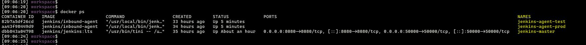
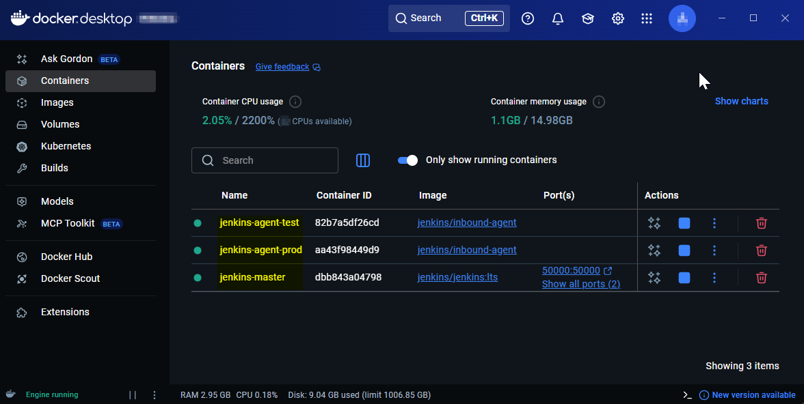
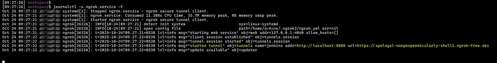

## Jenkins setup

### Introduction
This document explains how to set up `Jenkins` with `Docker` on `Windows` using `WSL 2` with `Ubuntu 24.04`. It covers installation, configuration, and exposing Jenkins externally using `ngrok`.


### Prerequisites
- [Install WSL on Windows - Microsoft Documentation](https://learn.microsoft.com/en-us/windows/wsl/install)

- [Install Ubuntu on WSL 2 - Ubuntu Documentation](https://documentation.ubuntu.com/wsl/latest/howto/install-ubuntu-wsl2/)

- [Install Docker Desktop on Windows with WSL 2 integration](https://docs.docker.com/desktop/setup/install/windows-install/)

### Setup Jenkins Master as a Docker Container

Pull and run the Jenkins LTS Docker image, exposing the required ports and mounting a Docker volume for persistence:  

```bash
docker run -d --name jenkins-master \
  -p 8080:8080 -p 50000:50000 \
  -v jenkins_home:/var/jenkins_home \
  jenkins/jenkins:lts
```
- Port `8080` for Jenkins web UI  
- Port `50000` for Agent communication  
- `jenkins_home` Volume to persist Jenkins configuration and data between container restarts  

*Terminal view shows Jenkins Master Docker container pulled and running:*


*Terminal view showing contents of the Jenkins persistent volume `/var/jenkins_home` inside the `Jenkins master container`*


*Web browser view shows Jenkins UI accessible through [http://localhost:8080](http://localhost:8080)*


Run this command to get the initial unlock password:

```bash
docker exec jenkins-master cat /var/jenkins_home/secrets/initialAdminPassword
```

*Terminal output showing retrieved initial admin password:*


Install suggested plugins, and create admin user account.


### Configure Jenkins Agents: `test` and `prod` Nodes

*Jenkins UI: Creating `test` node detailed settings:*


*Jenkins UI: Creating `prod` node detailed settings:*


*Jenkins UI: Secret Keys*

Make a note of the agent secret keys shown in Jenkins UI for each node; these authenticate the agent containers with the master.

*Test node secret key:*

 

*Prod node secret key:*


### Launch Jenkins `Prod` Agent Container

```bash
docker run -d --name jenkins-agent-prod \
  -e JENKINS_URL=http://host.docker.internal:8080 \
  -e JENKINS_AGENT_NAME=prod \
  -e JENKINS_SECRET=<prod-node-secret-key> \
  jenkins/inbound-agent
```

*Prod node container pulled and running:*


### Launch Jenkins `Test` Agent Container

```bash
docker run -d --name jenkins-agent-test \
  -e JENKINS_URL=http://host.docker.internal:8080 \
  -e JENKINS_AGENT_NAME=test \
  -e JENKINS_SECRET=<test-node-secret-key> \
  jenkins/inbound-agent
```

*Test node container pulled and running:*  


**Confirm Running Containers**

*Terminal view showing Jenkins master, test, and prod containers running:*



*Docker Desktop UI showing Jenkins containers running:*



*Jenkins UI: `test` and `prod` nodes in-sync*


### Expose `Jenkins Master` to the Internet Using `ngrok`

To enable GitHub webhook integration and external access, expose local Jenkins through a public URL using `ngrok`.

- Follow [ngrok Linux installation](https://ngrok.com/download/linux?tab=install) 
- Sign up at [ngrok.com](https://ngrok.com) and get authtoken.


**Create ngrok Configuration**

```bash
mkdir -p ~/.ngrok2
nano ~/.ngrok2/ngrok.yml
```

Write the following YAML content (replace `<<AUTHTOKEN>>` with actual authtoken):

```yaml
version: "2"
authtoken: <<AUTHTOKEN>>
tunnels:
  jenkins:
    addr: 8080
    proto: http
```

**Install and Run ngrok Service**

```bash
sudo ngrok service install --config ~/.ngrok2/ngrok.yml
sudo systemctl start ngrok
```

Check status and follow logs to find the public URL:

```bash
sudo systemctl status ngrok
journalctl -u ngrok.service -f
```

*Example terminal output showing `ngrok` service running:*


*Terminal view shows public forwarding URL:*




**Access Jenkins via Public ngrok URL**  
Open the forwarding URL in a browser to access local Jenkins instance remotely.

 

Use the ngrok public URL as the webhook endpoint when configuring GitHub to trigger Jenkins jobs automatically on pushes to your repository branches.

Here’s a simpler, report-friendly rewrite of your earlier complex line about GitHub and ngrok:

***

**GitHub Webhook Setup**

Use the **ngrok public URL** as the **Webhook URL** in GitHub repository settings. This allows GitHub to notify  local Jenkins server whenever code is pushed to the repository, triggering an automatic build.

---