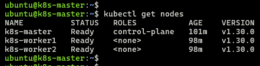
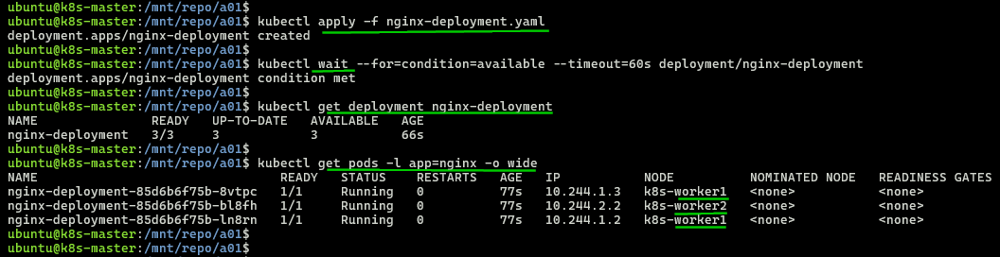
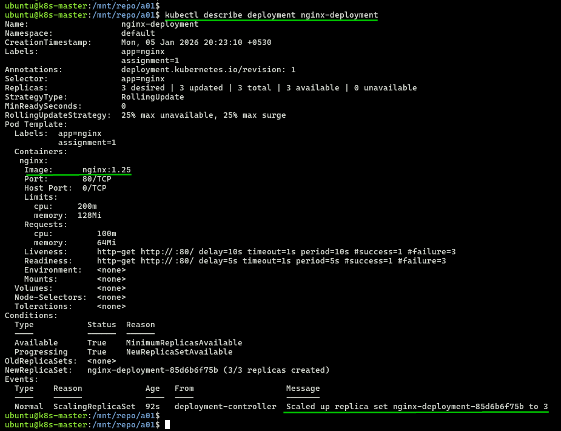

## Module 7: Kubernetes Assignment - 1

Tasks To Be Performed:  
1. Deploy a Kubernetes cluster for 3 nodes  
2. Create a NGINX deployment of 3 replicas  

---

### Prerequisites
- Follow [cluster/README](../cluster/README.md) to bring up 3-node cluster (1 master + 2 workers)
- kubectl configured
- All nodes in Ready state

---

### Files
- [`nginx-deployment.yaml`](./nginx-deployment.yaml) - NGINX deployment manifest

---

### 1. Verify Cluster
```bash
kubectl get nodes
```
  
> Cluster with 3 nodes in Ready state
---
### 2. Apply Deployment
```bash
kubectl apply -f nginx-deployment.yaml
```
---
### 3. Verify Deployment
```bash
kubectl get deployment nginx-deployment
kubectl get pods -l app=nginx -o wide
kubectl describe deployment nginx-deployment
```

> Deployment with 3 pods are running  
> Pods distributed across worker nodes  
> All pods in Ready state  
---

> Container image pulled successfully

---