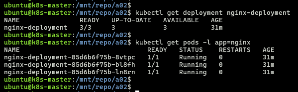
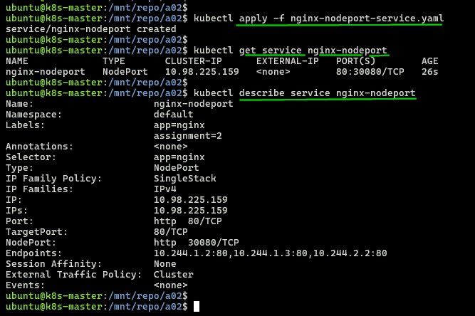
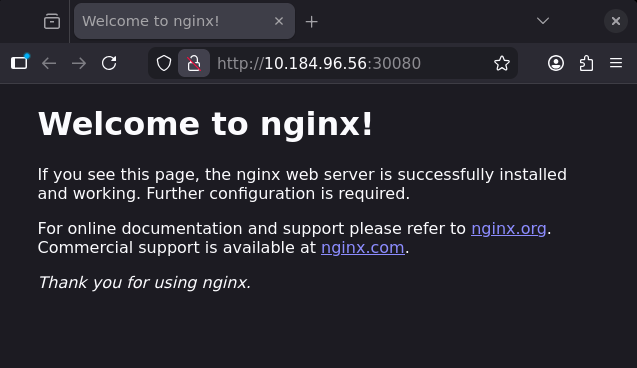

## Module 7: Kubernetes Assignment - 2

Tasks To Be Performed:  
1. Use the previous deployment  
2. Create a service of type NodePort for NGINX deployment  
3. Check the NodePort service on a browser to verify  

---

### Prerequisites
- Follow [cluster/README](../cluster/README.md) to bring up 3-node cluster (1 master + 2 workers)
- kubectl configured
- All nodes in Ready state
- [Assignment 1](../a01/README.md) completed: nginx-deployment running with 3 replicas

---

### Files
- [`nginx-nodeport-service.yaml`](./nginx-nodeport-service.yaml) - NodePort service manifest

---

### 1. Verify Existing Deployment
```bash
kubectl get deployment nginx-deployment
kubectl get pods -l app=nginx
```
  
> Deployment with 3 pods in Running state

---

### 2. Apply NodePort Service
```bash
kubectl apply -f nginx-nodeport-service.yaml
```

---

### 3. Get Service Details
```bash
kubectl get service nginx-nodeport
kubectl describe service nginx-nodeport
```


---

### 4. Access in Browser

- Access via any node IP  
  

---
