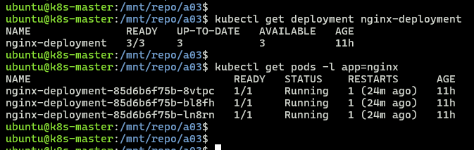
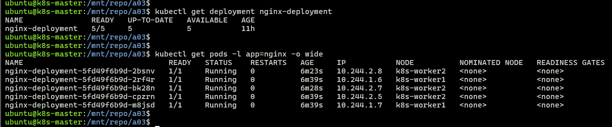

## Module 7: Kubernetes Assignment - 3

Tasks To Be Performed:  
1. Use the previous deployment  
2. Change the replicas to 5 for the deployment  

---

### Prerequisites
- Follow [cluster/README](../cluster/README.md) to bring up 3-node cluster (1 master + 2 workers)
- kubectl configured
- All nodes in Ready state
- [Assignment 2](../a02/README.md) completed: nginx-deployment running with 3 replicas

---

### Files
- [`nginx-deployment-scaled.yaml`](./nginx-deployment-scaled.yaml) - Updated deployment manifest with 5 replicas

---

### 1. Verify Existing Deployment
```bash
kubectl get deployment nginx-deployment
kubectl get pods -l app=nginx
```
  
> Deployment with 3 pods in Running state

---

### 2. Apply updated manifest to Scale up
```bash
kubectl apply -f nginx-deployment-scaled.yaml
```
---

### 3. Verify Scaled up deployment
```bash
kubectl get deployment nginx-deployment
kubectl get pods -l app=nginx -o wide
```

> Deployment horizontally scaled to 5 replicas

---
