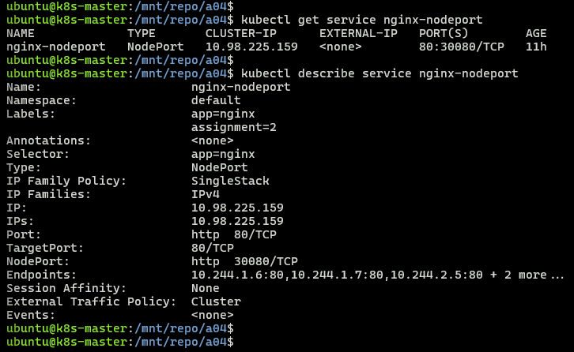
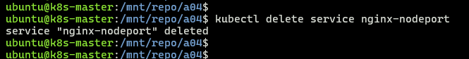
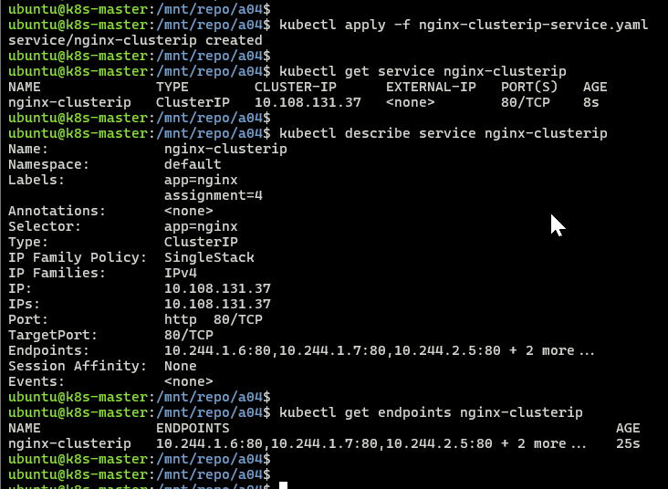

## Module 7: Kubernetes Assignment - 4  

Tasks To Be Performed:  
1. Use the previous deployment  
2. Change the service type to ClusterIP  

### Prerequisites
- Follow [cluster/README](../cluster/README.md) to bring up 3-node cluster (1 master + 2 workers)
- kubectl configured
- All nodes in Ready state
- [Assignment 3](../a03/README.md) completed: nginx-deployment running with 5 replicas

---

### Files
- [`nginx-clusterip-service.yaml`](./nginx-clusterip-service.yaml) - ClusterIP service manifest

---

### 1. Verify Existing Service
```bash
kubectl get service nginx-nodeport
kubectl describe service nginx-nodeport
```
  


---

### 2. Delete NodePort Service
```bash
kubectl delete service nginx-nodeport
```
  

---

### 3. Create ClusterIP Service
```bash
kubectl apply -f nginx-clusterip-service.yaml
```
---

### 4. Verify New Service
```bash
kubectl get service nginx-clusterip
kubectl describe service nginx-clusterip
kubectl get endpoints nginx-clusterip
```

> ClusterIP assigned

---