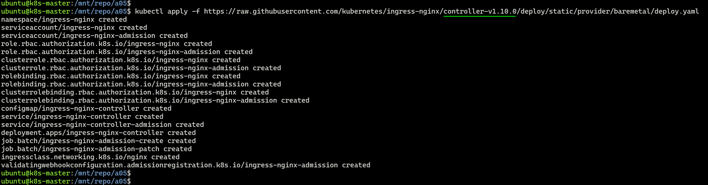
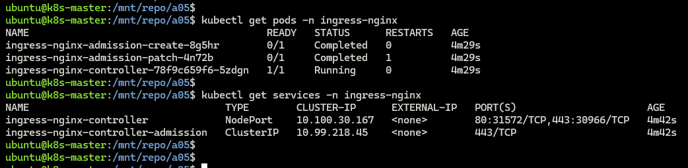
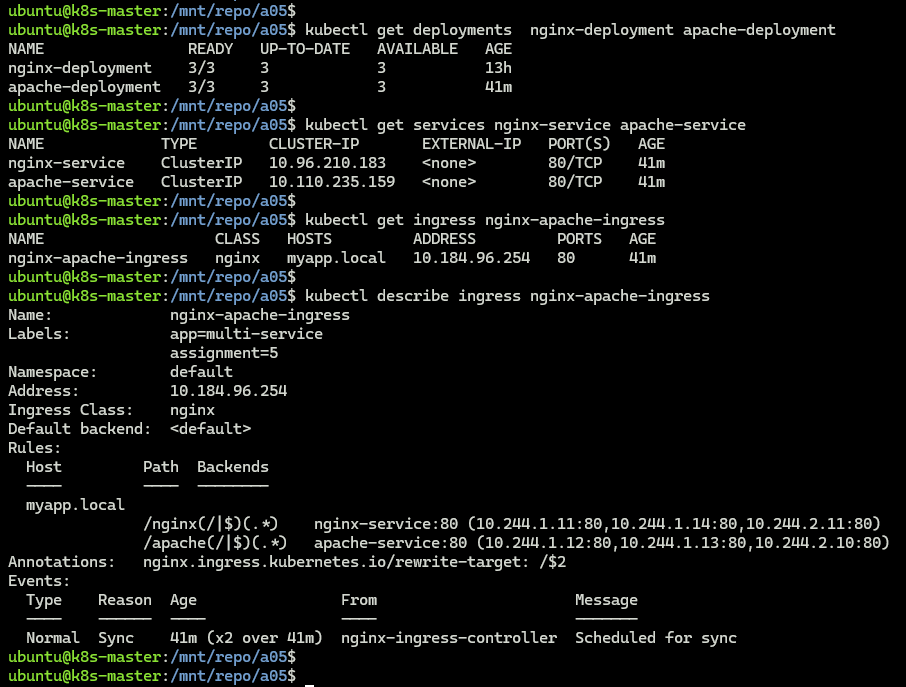
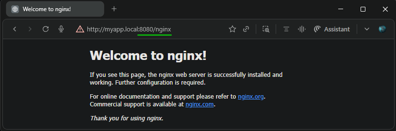
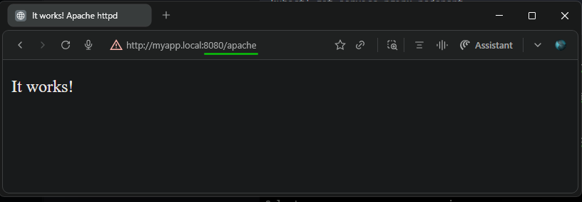

## Module 7: Kubernetes Assignment - 5  

Tasks To Be Performed:  
1. Use the previous deployment  
2. Deploy an NGINX deployment of 3 replicas  
3. Create an NGINX service of type ClusterIP  
4. Create an ingress service/ Apache to Apache service/ NGINX to NGINX service

---

### Prerequisites
- Follow [cluster/README](../cluster/README.md) to bring up 3-node cluster (1 master + 2 workers)
- kubectl configured
- All nodes in Ready state
- [Assignment 4](../a04/README.md) completed: nginx-deployment and  nginx-clusterip service

---

### Files
[`nginx-deployment.yaml`](./nginx-deployment.yaml) - NGINX deployment (3 replicas)  
[`nginx-service.yaml`](./nginx-service.yaml) - ClusterIP service for NGINX  
[`apache-deployment.yaml`](./apache-deployment.yaml) - Apache deployment (3 replicas)  
[`apache-service.yaml`](./apache-service.yaml) - ClusterIP service for Apache  
[`ingress.yaml`](./ingress.yaml) - Ingress resource with path-based routing rules  

---

### 1. Install NGINX Ingress Controller
```bash
# Deploy the ingress controller
kubectl apply -f https://raw.githubusercontent.com/kubernetes/ingress-nginx/controller-v1.10.0/deploy/static/provider/baremetal/deploy.yaml
```
  

---

### 2. Verify Ingress Controller
```bash
kubectl get pods -n ingress-nginx
kubectl get services -n ingress-nginx
```


### 3. Deploy Application Resources
```bash
kubectl apply \
  -f nginx-deployment.yaml \
  -f apache-deployment.yaml \
  -f nginx-service.yaml \
  -f apache-service.yaml \
  -f ingress.yaml
```

### 4. Verify Resources
```bash
# Deployments
kubectl get deployments  nginx-deployment apache-deployment

# Services
kubectl get services nginx-service apache-service

# Ingress
kubectl get ingress nginx-apache-ingress
kubectl describe ingress nginx-apache-ingress
```



### 5. Test Access  

- Port forward to enable host access
  ```bash
  echo "127.0.0.1 myapp.local" | sudo tee -a /etc/hosts
  kubectl port-forward -n ingress-nginx svc/ingress-nginx-controller 8080:80 --address 0.0.0.0 &
  ```
- Access Nginx via: `http://myapp.local:8080/nginx`  

  

- Access Apache via: `http://myapp.local:8080/apache`  

  

---
