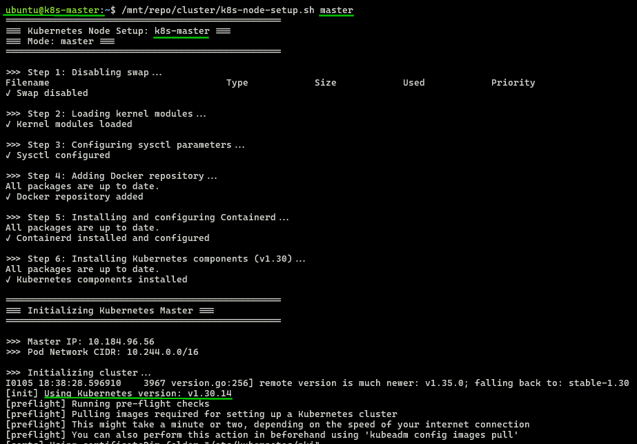
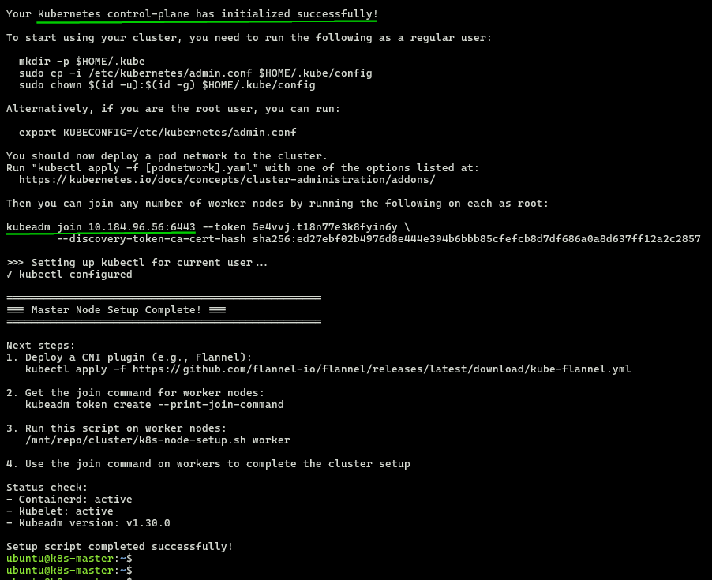
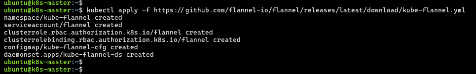
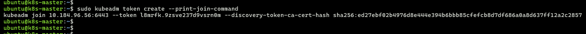
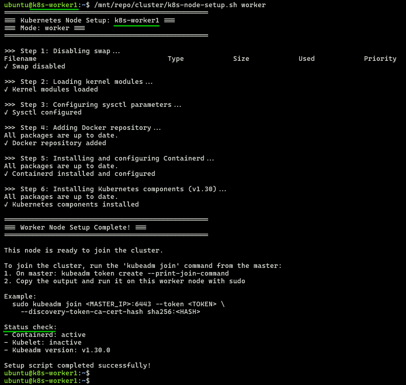
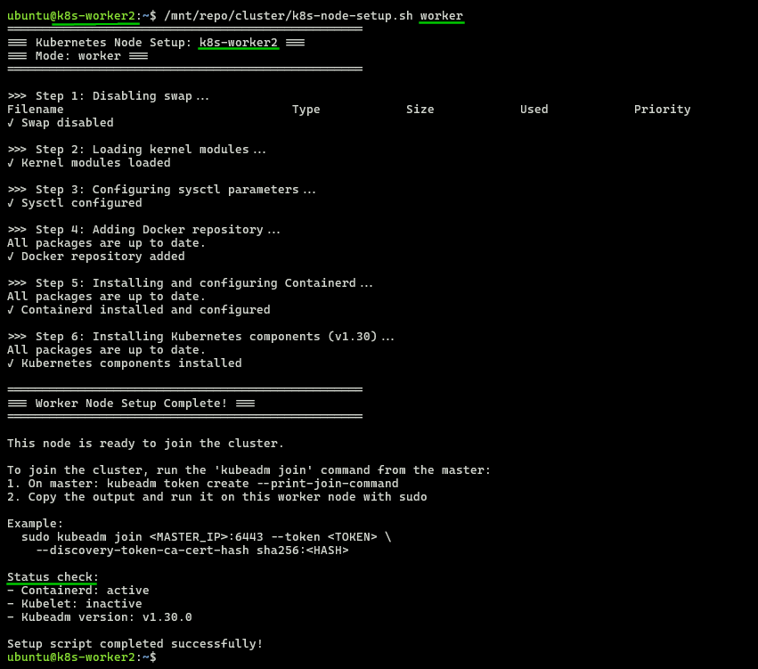
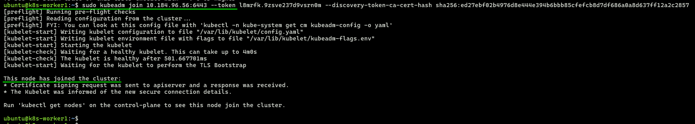
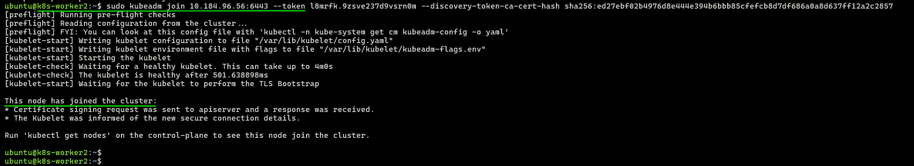
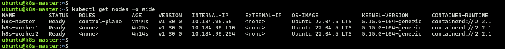
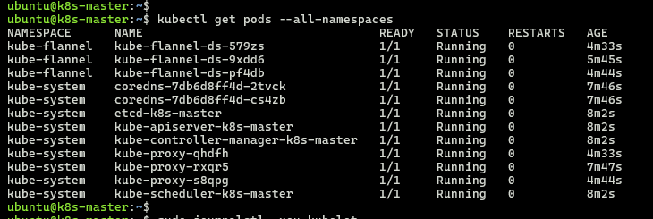

## Module 7: Kubernetes Cluster Infrastructure

Local 3-node `Multipass` cluster with `kubeadm` initialization, `containerd` runtime, `Flannel` networking.


> **[Multipass](https://documentation.ubuntu.com/multipass/latest/)** creates local Ubuntu VM mini-clouds.  
> **Host:** WSL2/Ubuntu 24.04.3 LTS  
> **Nodes:** Ubuntu 22.04.5 LTS

---

### 1. Prerequisites
 
  ```bash
  # Install multipass
  sudo snap install multipass
  
  Output:
  multipass 1.16.1 from Canonical✓ installed
  ```
---

### 2. Launch 3 VMs: `k8s-master` `k8s-worker1` `k8s-worker2`

  ```bash
  multipass launch --name k8s-master --memory 4G --disk 20G --cpus 2 ubuntu:22.04
  multipass launch --name k8s-worker1 --memory 4G --disk 20G --cpus 2 ubuntu:22.04
  multipass launch --name k8s-worker2 --memory 4G --disk 20G --cpus 2 ubuntu:22.04
  ```

  ```bash
  # VMs running
  multipass list
  Name                    State             IPv4             Image
  k8s-master              Running           10.184.96.56     Ubuntu 22.04 LTS
  k8s-worker1             Running           10.184.96.110    Ubuntu 22.04 LTS
  k8s-worker2             Running           10.184.96.254    Ubuntu 22.04 LTS
  ```

  ```bash
  # Mount repository folder the VMs
  multipass mount m7-kubernetes/ k8s-master:/mnt/repo
  multipass mount m7-kubernetes/ k8s-worker1:/mnt/repo
  multipass mount m7-kubernetes/ k8s-worker2:/mnt/repo
  ```
---

### 2. Master Node Setup

- SSH Master  
  ```bash
  multipass shell k8s-master
  ```

- Run setup script
  ```bash
  /mnt/repo/cluster/k8s-node-setup.sh master
  ```
  
  

- Install CNI (Flannel) on master  
  ```bash
  kubectl apply -f https://github.com/flannel-io/flannel/releases/latest/download/kube-flannel.yml
  ```
  

- Get join command from master  
  ```bash
  sudo kubeadm token create --print-join-command
  ```
  

---

### 3. Worker1 Node Setup

- SSH Worker1
  ```bash
  multipass shell k8s-worker1
  ```
- Run setup script
  ```bash
  /mnt/repo/cluster/k8s-node-setup.sh worker
  ```
  

---

### 4. Worker2 Node Setup

- SSH Worker2
  ```bash
  multipass shell k8s-worker2
  ```
- Run setup script
  ```bash
  /mnt/repo/cluster/k8s-node-setup.sh worker
  ```
  

---

### 5. Join workers to master
- Worker #1
  ```bash
  sudo kubeadm join 10.184.96.56:6443 --token l8mrfk.9zsve237d9vsrn0m --discovery-token-ca-cert-hash sha256:ed27ebf02b4976d8e444e394b6bbb85cfefcb8d7df686a0a8d637ff12a2c2857
  ```
  

- Worker #2
  ```bash
  sudo kubeadm join 10.184.96.56:6443 --token l8mrfk.9zsve237d9vsrn0m --discovery-token-ca-cert-hash sha256:ed27ebf02b4976d8e444e394b6bbb85cfefcb8d7df686a0a8d637ff12a2c2857
  ```
  

---

### 6. Verify cluster

- Nodes status: Ready  
  ```bash
  kubectl get nodes -o wide
  ```
  
- Pods status: Ready & Running  
  ```bash
  kubectl get pods --all-namespaces
  ```
  

---

**3-node cluster ready!**  

**Next:**  
- [a01/README.md](../a01/README.md) for Assignment #1  
- [a02/README.md](../a02/README.md) for Assignment #2  
- [a03/README.md](../a03/README.md) for Assignment #3
- [a04/README.md](../a04/README.md) for Assignment #4
- [a05/README.md](../a05/README.md) for Assignment #5

---

### Cleanup *(Optional)*
```bash
# Umount
multipass umount k8s-master:/mnt/repo
multipass umount k8s-worker1:/mnt/repo
multipass umount k8s-worker2:/mnt/repo

# Stop all nodes
multipass stop k8s-master k8s-worker1 k8s-worker2

# Delete + purge (complete removal)
multipass delete k8s-master k8s-worker1 k8s-worker2 --purge
```

---
