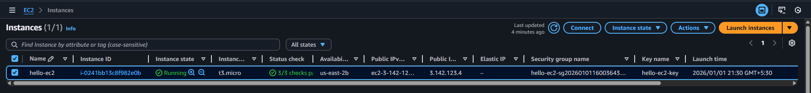
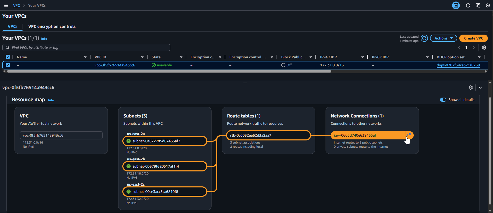
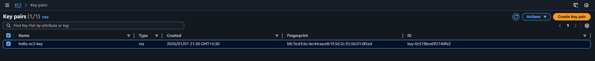
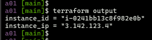
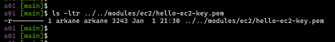

<div align="center">


</div>

## Module 8: Terraform Assignment - 1

Tasks To Be Performed:  
1) Create an EC2 service in the default subnet in the Ohio region

---

### Solution Overview
Modular Terraform setup with reusable `ec2` module, creates:
- Ubuntu 22.04 EC2 (t3.micro) in Ohio default subnet (`us-east-2`)
- Security group
- Auto-generated SSH key pair and local PEM file
- Local PEM key file for SSH access
- [`modules/ec2/`](../../modules/ec2/): Reusable ec2 module
- [`environments/a01/`](../a01/): Environment for Assignment 1
- Outputs: `instance_ip`, `instance_id`

---

**Repo Structure**:

<pre>
m8-terraform/                              # Module 8 assignments
├── modules                                # terraform modules
# ----------------- ec2 module -----------------------------------------------
│   ├── ec2                                # Reusable EC2 module
│   │   ├── main.tf                        # EC2 + SG + SSH key logic
│   │   ├── outputs.tf                     # instance_ip, ssh_private_key_path
│   │   ├── variables.tf                   # instance_name, my_ip, vpc_id, user_data
│   │   └── versions.tf                    # aws/tls/local providers
├── environments
# -----------------Assignment 1 environment code ------------------------------
│   ├── a01                                # Assignment 1: Ohio default subnet
│   │   ├── README.md                      # Setup and execution instructions
│   │   ├── main.tf                        # Calls ec2 module
│   │   ├── outputs.tf                     # instance_ip, instance_id
│   │   ├── terraform.tfvars               # my_ip=<client-ip>/32
│   │   ├── variables.tf                   # aws_region=Ohio, instance_name=hello-ec2
│   │   ├── versions.tf                    # Provider constraints
│   │   ├── images                         # AWS console screenshots folder
│   │   │   ├── 01-ec2-instance.png
│   │   │   ├── 02-security-group.png
│   │   │   ├── 03-default-vpc.png
│   │   │   ├── 04-terraform-output.png
│   │   │   ├── 05-terraform-ssh-key.png
│   │   │   └── 06-ec2-key-pair.png
</pre>

---

### 1. Create an EC2 service in the default subnet in the Ohio region

- Create `terraform.tfvars` and set following information in it
  ```bash
  cp terraform.tfvars.example terraform.tfvars
  # Edit terraform.tfvars:
  my_ip      = "<client-ip>/32" # Set client public IP for SSH access
  ```

- Create EC2 with Terraform 
  ```bash
  cd environments/a01
  terraform init 
  terraform validate
  terraform plan
  terraform apply -auto-approve
  ```
- EC2 instance: "hello-ec2" (t3.micro, Ubuntu 22.04)  
  

- Security group: "hello-ec2-sg" (SSH:22 from my IP)  
  

- Default VPC/subnet
  

- Key Pair  
  

- Terraform outputs  
  

- Local pem file  
  

---
