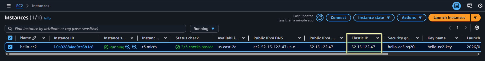

<div align="center">


</div>

## Module 8: Terraform Assignment - 2

Tasks To Be Performed:  
1. Destroy the previous deployment
2. Create a new EC2 instance with an Elastic IP

---

### Solution Overview
Assignment-2 solution builds on the reusable `ec2` module from [Assignment 1](../a01/README.md), adding **Elastic IP (EIP)** support:

- Same 5 resources as Assignment 1 (EC2, SG, SSH key) + 1 new `aws_eip`
- [`modules/ec2/`](../../modules/ec2/): Reusable ec2 module
- [`environments/a02/`](../a02/): Environment for Assignment 2
- [`environments/a01/`](../a01/): Environment for Assignment 1
- Single change in [`environments/a02/main.tf`](./main.tf); set `create_eip = true`
- Output: elastic_ip + instance_ip

---

**Repo Structure**:

<pre>
m8-terraform/                               # Module 8 assignments
├── modules                                 # terraform modules
# ----------------- ec2 module -----------------------------------------------
│   ├── ec2                                 # Reusable EC2 module
│   │   ├── main.tf                         # EC2 + SG + SSH key logic
│   │   ├── outputs.tf                      # instance_ip, ssh_private_key_path
│   │   ├── variables.tf                    # instance_name, my_ip, vpc_id, user_data
│   │   └── versions.tf                     # aws/tls/local providers
├── environments
# -----------------Assignment 2 environment code ------------------------------
│   ├── a02                                 # Assignment 2: 'Elastic IP'
│   │   ├── README.md                       # Setup and execution instructions
│   │   ├── images                          # AWS console screenshots folder
│   │   │   └── 01-ec2-instance.png
│   │   ├── main.tf                         # Calls ec2 module
│   │   ├── outputs.tf                      # instance_ip, instance_id
│   │   ├── terraform.tfvars.example        # my_ip=<client-ip>/32
│   │   ├── variables.tf                    # aws_region=Ohio, instance_name=hello-ec2
│   │   └── versions.tf                     # Provider constraints
# -----------------Assignment 1 environment code ------------------------------
│   ├── a01                                 # Assignment 1: Ohio default subnet
│   │   ├── README.md                       # Setup and execution instructions
│   │   ├── main.tf                         # Calls ec2 module
│   │   ├── outputs.tf                      # instance_ip, instance_id
│   │   ├── terraform.tfvars.example        # my_ip=<client-ip>/32
│   │   ├── variables.tf                    # aws_region=Ohio, instance_name=hello-ec2
│   │   ├── versions.tf                     # Provider constraints
│   │   ├── images                          # AWS console screenshots folder
│   │   │   ├── 01-ec2-instance.png
│   │   │   ├── 02-security-group.png
│   │   │   ├── 03-default-vpc.png
│   │   │   ├── 04-terraform-output.png
│   │   │   ├── 05-terraform-ssh-key.png
│   │   │   └── 06-ec2-key-pair.png
</pre>

---

### Prereqquisite
- Provision resources as desribed in [Assignment 1](../a01/README.md)

---

### 1. Destroy the previous deployment
  ```bash
  cd environments/a01
  terraform destroy -auto-approve

  # Output:
  .......<snip>.......
  module.ec2_instance.local_file.private_key_pem: Destroying... [id=5f840779706210fae4b1c8febda75c05ce1f35eb]
  module.ec2_instance.local_file.private_key_pem: Destruction complete after 0s
  module.ec2_instance.aws_instance.this: Destroying... [id=i-0241bb13c8f982e0b]
  module.ec2_instance.aws_instance.this: Still destroying... [id=i-0241bb13c8f982e0b, 00m10s elapsed]
  module.ec2_instance.aws_instance.this: Still destroying... [id=i-0241bb13c8f982e0b, 00m20s elapsed]
  module.ec2_instance.aws_instance.this: Still destroying... [id=i-0241bb13c8f982e0b, 00m31s elapsed]
  module.ec2_instance.aws_instance.this: Still destroying... [id=i-0241bb13c8f982e0b, 00m41s elapsed]
  module.ec2_instance.aws_instance.this: Still destroying... [id=i-0241bb13c8f982e0b, 00m51s elapsed]
  module.ec2_instance.aws_instance.this: Destruction complete after 54s
  module.ec2_instance.aws_key_pair.this_key: Destroying... [id=hello-ec2-key]
  module.ec2_instance.aws_security_group.ec2_sg: Destroying... [id=sg-04503ecb7216db038]
  module.ec2_instance.aws_key_pair.this_key: Destruction complete after 1s
  module.ec2_instance.tls_private_key.this_key: Destroying... [id=3a5f64b0df7fcc242a1b4955556befbd766fde15]
  module.ec2_instance.tls_private_key.this_key: Destruction complete after 0s
  module.ec2_instance.aws_security_group.ec2_sg: Destruction complete after 2s

  Destroy complete! Resources: 5 destroyed.
  ```

---

### 2. Create a new EC2 instance with an Elastic IP

- Edit [`environments/a02/main.tf`](./main.tf); set `create_eip = true`

- Create `terraform.tfvars` and set following information in it
  ```bash
  cp terraform.tfvars.example terraform.tfvars
  # Edit terraform.tfvars:
  my_ip      = "<client-ip>/32" # Set client public IP for SSH access
  ```

- Create EC2 with Terraform 
  ```bash
  cd environments/a02
  terraform init 
  terraform validate
  terraform plan -out=tfplan
  terraform apply -auto-approve tfplan

  # Output
  module.ec2_instance.tls_private_key.this_key: Creating...
  module.ec2_instance.tls_private_key.this_key: Creation complete after 2s [id=10207329961fdc3745cf14962852bb86dff8e34f]
  module.ec2_instance.local_file.private_key_pem: Creating...
  module.ec2_instance.local_file.private_key_pem: Creation complete after 0s [id=c9a80401ca493e0a0f471a66d47cb60ba0af8078]
  module.ec2_instance.aws_key_pair.this_key: Creating...
  module.ec2_instance.aws_security_group.ec2_sg: Creating...
  module.ec2_instance.aws_key_pair.this_key: Still creating... [00m10s elapsed]
  module.ec2_instance.aws_security_group.ec2_sg: Still creating... [00m10s elapsed]
  module.ec2_instance.aws_key_pair.this_key: Creation complete after 12s [id=hello-ec2-key]
  module.ec2_instance.aws_security_group.ec2_sg: Creation complete after 15s [id=sg-03a04812b7fceaccd]
  module.ec2_instance.aws_instance.this: Creating...
  module.ec2_instance.aws_instance.this: Still creating... [00m11s elapsed]
  module.ec2_instance.aws_instance.this: Creation complete after 17s [id=i-0a92884ad9cc6b1c8]
  module.ec2_instance.aws_eip.this[0]: Creating...
  module.ec2_instance.aws_eip.this[0]: Creation complete after 3s [id=eipalloc-0e71c4d61d76c4574]

  Apply complete! Resources: 6 added, 0 changed, 0 destroyed.

  Outputs:

  elastic_ip = "52.15.122.47"
  instance_id = "i-0a92884ad9cc6b1c8"
  instance_ip = "3.134.83.3"

  ```
- EC2 instance with Elastic IP  
  

---
