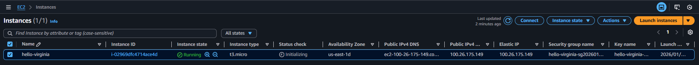
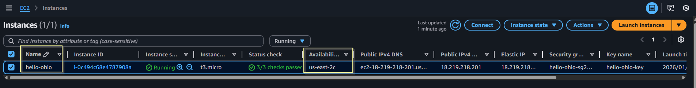

<div align="center">


</div>

## Module 8: Terraform Assignment - 3

Tasks To Be Performed:  
1. Destroy the previous deployment  
2. Create 2 EC2 instances in Ohio and N.Virginia respectively  
3. Rename Ohio’s instance to ‘hello-ohio’ and Virginia’s instance to ‘hello-virginia’  

---

### Solution Overview
Assignment-3 solution builds on the reusable `ec2` module from [Assignment 2](../a02/README.md), adding  multi-region support via AWS provider aliases:

- 2 identical EC2 deployments
- [environments/a03/main.tf](./main.tf) 
  - Ohio: us-east-2 provider alias `hello-ohio` instance
  - Virginia: us-east-1 provider alias `hello-virginia` instance
  - Provider mapping: providers = { aws = aws.ohio } and { aws   = aws.virginia }
  - EIPs on both (create_eip = true)
  - SSH keys per region: `hello-ohio-key`, `hello-virginia-key`
  - [`modules/ec2/`](../../modules/ec2/): Reusable ec2 module
  - [`environments/a03/`](../a03/): Environment for Assignment 3
  - [`environments/a02/`](../a02/): Environment for Assignment 2
  - [`environments/a01/`](../a01/): Environment for Assignment 1
  - Outputs: ohio_instance_ip, ohio_elastic_ip, virginia_instance_ip, virginia_elastic_ip

---

**Repo Structure**:

<pre>
m8-terraform/                               # Module 8 assignments
├── modules                                 # terraform modules
# ----------------- ec2 module -----------------------------------------------
│   ├── ec2                                 # Reusable EC2 module
│   │   ├── main.tf                         # EC2 + SG + SSH key logic
│   │   ├── outputs.tf                      # instance_ip, ssh_private_key_path
│   │   ├── variables.tf                    # instance_name, my_ip, vpc_id, user_data
│   │   └── versions.tf                     # aws/tls/local providers
├── environments
# -----------------Assignment 3 environment code ------------------------------
│   ├── a03                                   # Assignment 3: EC2 in Ohio and N.Virginia
│   │   ├── README.md                         # Setup and execution instructions
│   │   ├── images                            # AWS console screenshots folder
│   │   │   ├── 01-ec2-instance-virginia.png
│   │   │   └── 02-ec2-instance-ohio.png
│   │   ├── main.tf                           # Calls ec2 module
│   │   ├── outputs.tf                        # Outputs: instance_ip, elastic_ip for both regions
│   │   ├── terraform.tfvars.example          # my_ip=<client-ip>/32                  
│   │   ├── variables.tf                      # Variables/defaults
│   │   └── versions.tf                       # Provider constraints
# -----------------Assignment 2 environment code ------------------------------
│   ├── a02                                 # Assignment 2: 'Elastic IP'
│   │   ├── README.md                       # Setup and execution instructions
│   │   ├── images                          # AWS console screenshots folder
│   │   │   └── 01-ec2-instance.png
│   │   ├── main.tf                         # Calls ec2 module
│   │   ├── outputs.tf                      # instance_ip, instance_id
│   │   ├── terraform.tfvars.example        # my_ip=<client-ip>/32
│   │   ├── variables.tf                    # aws_region=Ohio, instance_name=hello-ec2
│   │   └── versions.tf                     # Provider constraints
# -----------------Assignment 1 environment code ------------------------------
│   ├── a01                                 # Assignment 1: Ohio default subnet
│   │   ├── README.md                       # Setup and execution instructions
│   │   ├── main.tf                         # Calls ec2 module
│   │   ├── outputs.tf                      # instance_ip, instance_id
│   │   ├── terraform.tfvars.example        # my_ip=<client-ip>/32
│   │   ├── variables.tf                    # aws_region=Ohio, instance_name=hello-ec2
│   │   ├── versions.tf                     # Provider constraints
│   │   ├── images                          # AWS console screenshots folder
│   │   │   ├── 01-ec2-instance.png
│   │   │   ├── 02-security-group.png
│   │   │   ├── 03-default-vpc.png
│   │   │   ├── 04-terraform-output.png
│   │   │   ├── 05-terraform-ssh-key.png
│   │   │   └── 06-ec2-key-pair.png
</pre>

---

### Prereqquisite
- Provision resources as desribed in [Assignment 2](../a02/README.md)

---

### 1. Destroy the previous deployment
  ```bash
  cd environments/a02
  terraform destroy -auto-approve
  
  # Output
  ...<snip>...
  module.ec2_instance.local_file.private_key_pem: Destroying... [id=c9a80401ca493e0a0f471a66d47cb60ba0af8078]
  module.ec2_instance.local_file.private_key_pem: Destruction complete after 0s
  module.ec2_instance.aws_eip.this[0]: Destroying... [id=eipalloc-0e71c4d61d76c4574]
  module.ec2_instance.aws_eip.this[0]: Still destroying... [id=eipalloc-0e71c4d61d76c4574, 00m11s elapsed]
  module.ec2_instance.aws_eip.this[0]: Destruction complete after 14s
  module.ec2_instance.aws_instance.this: Destroying... [id=i-0a92884ad9cc6b1c8]
  module.ec2_instance.aws_instance.this: Still destroying... [id=i-0a92884ad9cc6b1c8, 00m10s elapsed]
  module.ec2_instance.aws_instance.this: Still destroying... [id=i-0a92884ad9cc6b1c8, 00m20s elapsed]
  module.ec2_instance.aws_instance.this: Still destroying... [id=i-0a92884ad9cc6b1c8, 00m31s elapsed]
  module.ec2_instance.aws_instance.this: Still destroying... [id=i-0a92884ad9cc6b1c8, 00m41s elapsed]
  module.ec2_instance.aws_instance.this: Still destroying... [id=i-0a92884ad9cc6b1c8, 00m51s elapsed]
  module.ec2_instance.aws_instance.this: Still destroying... [id=i-0a92884ad9cc6b1c8, 01m01s elapsed]
  module.ec2_instance.aws_instance.this: Destruction complete after 1m4s
  module.ec2_instance.aws_security_group.ec2_sg: Destroying... [id=sg-03a04812b7fceaccd]
  module.ec2_instance.aws_key_pair.this_key: Destroying... [id=hello-ec2-key]
  module.ec2_instance.aws_key_pair.this_key: Destruction complete after 1s
  module.ec2_instance.tls_private_key.this_key: Destroying... [id=10207329961fdc3745cf14962852bb86dff8e34f]
  module.ec2_instance.tls_private_key.this_key: Destruction complete after 0s
  module.ec2_instance.aws_security_group.ec2_sg: Destruction complete after 2s

  Destroy complete! Resources: 6 destroyed.
  ```

---

### 2. Create 2 EC2 instances in Ohio `hello-ohio` and N.Virginia `hello-virginia` respectively 

- Create `terraform.tfvars` and set following information in it
  ```bash
  cp terraform.tfvars.example terraform.tfvars
  # Edit terraform.tfvars:
  my_ip      = "<client-ip>/32" # Set client public IP for SSH access
  ```

- Create EC2 with Terraform 
  ```bash
  cd environments/a03
  terraform init 
  terraform validate
  terraform plan -out=tfplan
  terraform apply -auto-approve tfplan

  # Output
  module.hello_ohio.tls_private_key.this_key: Creating...
  module.hello_virginia.tls_private_key.this_key: Creating...
  module.hello_virginia.tls_private_key.this_key: Creation complete after 0s [id=4d3388521698803c5d3537215a17f691f0d7e1e5]
  module.hello_virginia.local_file.private_key_pem: Creating...
  module.hello_virginia.local_file.private_key_pem: Creation complete after 0s [id=c361c128526a1e023d30bb8e9cafd8f02bb58ef4]
  module.hello_ohio.tls_private_key.this_key: Creation complete after 2s [id=2ba50320814d822e114434ce4aefad468781bfa2]
  module.hello_ohio.local_file.private_key_pem: Creating...
  module.hello_ohio.local_file.private_key_pem: Creation complete after 0s [id=38d519e2c2fa5cae284409d36d33d8c7cc524a13]
  module.hello_ohio.aws_key_pair.this_key: Creating...
  module.hello_ohio.aws_security_group.ec2_sg: Creating...
  module.hello_virginia.aws_security_group.ec2_sg: Creating...
  module.hello_virginia.aws_key_pair.this_key: Creating...
  module.hello_ohio.aws_key_pair.this_key: Still creating... [00m11s elapsed]
  module.hello_ohio.aws_security_group.ec2_sg: Still creating... [00m11s elapsed]
  module.hello_virginia.aws_key_pair.this_key: Still creating... [00m11s elapsed]
  module.hello_virginia.aws_security_group.ec2_sg: Still creating... [00m11s elapsed]
  module.hello_ohio.aws_key_pair.this_key: Creation complete after 12s [id=hello-ohio-key]
  module.hello_virginia.aws_key_pair.this_key: Creation complete after 13s [id=hello-virginia-key]
  module.hello_ohio.aws_security_group.ec2_sg: Creation complete after 16s [id=sg-0cc158a8ebe9f5815]
  module.hello_ohio.aws_instance.this: Creating...
  module.hello_virginia.aws_security_group.ec2_sg: Creation complete after 17s [id=sg-0ebf24b644a4babb6]
  module.hello_virginia.aws_instance.this: Creating...
  module.hello_ohio.aws_instance.this: Still creating... [00m10s elapsed]
  module.hello_virginia.aws_instance.this: Still creating... [00m10s elapsed]
  module.hello_ohio.aws_instance.this: Creation complete after 16s [id=i-0c494c68e4787908a]
  module.hello_ohio.aws_eip.this[0]: Creating...
  module.hello_virginia.aws_instance.this: Creation complete after 15s [id=i-02969dfc4714ace4d]
  module.hello_virginia.aws_eip.this[0]: Creating...
  module.hello_ohio.aws_eip.this[0]: Creation complete after 3s [id=eipalloc-00240bc952331eda1]
  module.hello_virginia.aws_eip.this[0]: Creation complete after 5s [id=eipalloc-0a6bfdb81891d8e42]

  Apply complete! Resources: 12 added, 0 changed, 0 destroyed.

  Outputs:

  ohio_elastic_ip = "18.219.218.201"
  ohio_instance_ip = "18.191.255.199"
  virginia_elastic_ip = "100.26.175.149"
  virginia_instance_ip = "44.192.58.72"
  ```

- `hello-virginia` instance in virginia region  
  

- `hello-ohio` instance in ohio region  
  

---