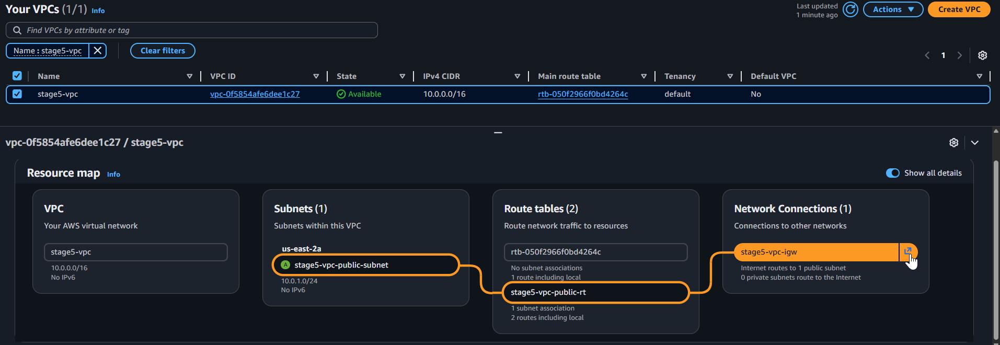
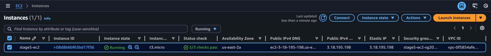
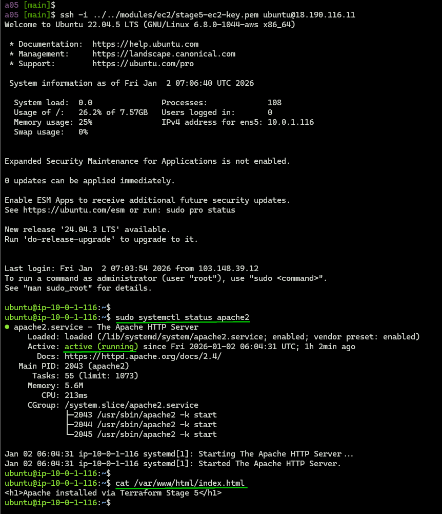
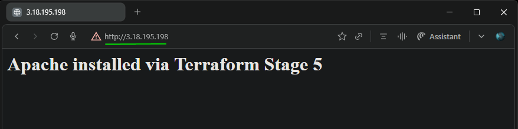
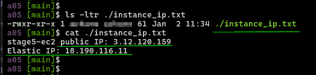

<div align="center">


</div>

## Module 8: Terraform Assignment - 5

Tasks To Be Performed:  
1. Destroy the previous deployments  
2. Create a script to install Apache2  
3. Run this script on a newly created EC2 instance  
4. Print the IP address of the instance in a file on the local once deployed  

---

### Solution Overview
Assignment-5 solution builds on the reusable `ec2` module from [Assignment 4](../a04/README.md), adding automation and local reporting:

- Cloud-init user_data: Apache2 install + custom index.html on boot
- `local_file` resource: Writes IPs to `instance_ip.txt` after deploy
- HTTP access: Security group opens port 80 (0.0.0.0/0)
- Verification: curl <EIP> shows Apache page
- EIP + SSH: Full connectivity maintained
- [`environments/a04/`](../a05/): Environment for Assignment 5
- [`environments/a04/`](../a04/): Environment for Assignment 4
- [`environments/a03/`](../a03/): Environment for Assignment 3
- [`environments/a02/`](../a02/): Environment for Assignment 2
- [`environments/a01/`](../a01/): Environment for Assignment 1
- [`modules/vpc/`](../../modules/vpc/): Reusable vpc module
- [`modules/ec2/`](../../modules/ec2/): Reusable ec2 module


---

**Repo Structure**:

<pre>
m8-terraform/                               # Module 8 assignments
├── modules                                 # terraform modules
# ----------------- vpc module -----------------------------------------------
├── vpc/                                    # Reusable VPC module
│   ├── main.tf                             # VPC core resources: VPC, public subnet, IGW, route table, subnet association
│   ├── outputs.tf                          # Exports: vpc_id, public_subnet_id
│   ├── variables.tf                        # Variables/Defaults
│   ├── versions.tf                         # Provider constraints
# ----------------- ec2 module -----------------------------------------------
│   ├── ec2                                 # Reusable EC2 module
│   │   ├── main.tf                         # EC2 + SG + SSH key logic
│   │   ├── outputs.tf                      # instance_ip, ssh_private_key_path
│   │   ├── variables.tf                    # instance_name, my_ip, vpc_id, user_data
│   │   └── versions.tf                     # aws/tls/local providers
├── environments
# -----------------Assignment 5 environment code ------------------------------
│   ├── a05                                 # Assignment 5: automation and local reporting
│   │   ├── README.md                       # Setup and execution instructions
│   │   ├── images                          # AWS console screenshots folder                  
│   │   │   ├── 01-vpc.png
│   │   │   ├── 02-ec2-instance.png
│   │   │   ├── 03-apache-installation.png
│   │   │   └── 04-webbrowser-access.png
│   │   ├── main.tf                         # Calls ec2 module
│   │   ├── outputs.tf                      # Outputs
│   │   ├── terraform.tfvars                # my_ip=<client-ip>/32 
│   │   ├── variables.tf                    # Variables/defaults
│   │   └── versions.tf                     # Provider constraints
# -----------------Assignment 4 environment code ------------------------------
│   ├── a04                                 # Assignment 4: Custom VPC + EC2
│   │   ├── README.md                       # Setup and execution instructions
│   │   ├── images                          # AWS console screenshots folder
│   │   │   ├── 01-vpc.png
│   │   │   └── 02-ec2-instance.png
│   │   ├── main.tf                         # Calls ec2 module
│   │   ├── outputs.tf                      # Outputs
│   │   ├── terraform.tfvars.example        # my_ip=<client-ip>/32          
│   │   ├── variables.tf                    # Variables/defaults
│   │   └── versions.tf                     # Provider constraints
# -----------------Assignment 3 environment code ------------------------------
│   ├── a03                                   # Assignment 3: EC2 in Ohio and N.Virginia
│   │   ├── README.md                         # Setup and execution instructions
│   │   ├── images                            # AWS console screenshots folder
│   │   │   ├── 01-ec2-instance-virginia.png
│   │   │   └── 02-ec2-instance-ohio.png
│   │   ├── main.tf                           # Calls ec2 module
│   │   ├── outputs.tf                        # Outputs: instance_ip, elastic_ip for both regions
│   │   ├── terraform.tfvars.example          # my_ip=<client-ip>/32                  
│   │   ├── variables.tf                      # Variables/defaults
│   │   └── versions.tf                       # Provider constraints
# -----------------Assignment 2 environment code ------------------------------
│   ├── a02                                 # Assignment 2: 'Elastic IP'
│   │   ├── README.md                       # Setup and execution instructions
│   │   ├── images                          # AWS console screenshots folder
│   │   │   └── 01-ec2-instance.png
│   │   ├── main.tf                         # Calls ec2 module
│   │   ├── outputs.tf                      # instance_ip, instance_id
│   │   ├── terraform.tfvars.example        # my_ip=<client-ip>/32
│   │   ├── variables.tf                    # aws_region=Ohio, instance_name=hello-ec2
│   │   └── versions.tf                     # Provider constraints
# -----------------Assignment 1 environment code ------------------------------
│   ├── a01                                 # Assignment 1: Ohio default subnet
│   │   ├── README.md                       # Setup and execution instructions
│   │   ├── main.tf                         # Calls ec2 module
│   │   ├── outputs.tf                      # instance_ip, instance_id
│   │   ├── terraform.tfvars.example        # my_ip=<client-ip>/32
│   │   ├── variables.tf                    # aws_region=Ohio, instance_name=hello-ec2
│   │   ├── versions.tf                     # Provider constraints
│   │   ├── images                          # AWS console screenshots folder
│   │   │   ├── 01-ec2-instance.png
│   │   │   ├── 02-security-group.png
│   │   │   ├── 03-default-vpc.png
│   │   │   ├── 04-terraform-output.png
│   │   │   ├── 05-terraform-ssh-key.png
│   │   │   └── 06-ec2-key-pair.png
</pre>

---

### Prereqquisite
- Provision resources as desribed in [Assignment 4](../a04/README.md)

---

### 1. Destroy the previous deployment
  ```bash
  cd environments/a04
  terraform destroy -auto-approve
  
  # Output
  ...<snip>...
  Plan: 0 to add, 0 to change, 11 to destroy.

  Changes to Outputs:
  - elastic_ip  = "3.134.144.76" -> null
  - instance_ip = "3.134.144.76" -> null
  - subnet_id   = "subnet-0e8e18864d2dbbf59" -> null
  - vpc_id      = "vpc-0bc34b4d581abdc79" -> null
  module.ec2_instance.local_file.private_key_pem: Destroying... [id=58d3f1e4ad3a100193a660370d0542561f40a1ee]
  module.ec2_instance.local_file.private_key_pem: Destruction complete after 0s
  module.vpc.aws_route_table_association.public: Destroying... [id=rtbassoc-0f4f305a5eaf1fa01]
  module.ec2_instance.aws_eip.this[0]: Destroying... [id=eipalloc-06b8b7269334ac571]
  module.ec2_instance.aws_eip.this[0]: Still destroying... [id=eipalloc-06b8b7269334ac571, 00m10s elapsed]
  module.vpc.aws_route_table_association.public: Still destroying... [id=rtbassoc-0f4f305a5eaf1fa01, 00m10s elapsed]
  module.vpc.aws_route_table_association.public: Destruction complete after 12s
  module.vpc.aws_route_table.public: Destroying... [id=rtb-0238b9d5676d25731]
  module.ec2_instance.aws_eip.this[0]: Destruction complete after 13s
  module.ec2_instance.aws_instance.this: Destroying... [id=i-00c97c305d816c764]
  module.vpc.aws_route_table.public: Destruction complete after 2s
  module.vpc.aws_internet_gateway.this: Destroying... [id=igw-088131db117ee34aa]
  module.ec2_instance.aws_instance.this: Still destroying... [id=i-00c97c305d816c764, 00m10s elapsed]
  module.vpc.aws_internet_gateway.this: Still destroying... [id=igw-088131db117ee34aa, 00m10s elapsed]
  module.ec2_instance.aws_instance.this: Still destroying... [id=i-00c97c305d816c764, 00m21s elapsed]
  module.vpc.aws_internet_gateway.this: Still destroying... [id=igw-088131db117ee34aa, 00m21s elapsed]
  module.vpc.aws_internet_gateway.this: Destruction complete after 23s
  module.ec2_instance.aws_instance.this: Destruction complete after 30s
  module.ec2_instance.aws_key_pair.this_key: Destroying... [id=stage4-ec2-key]
  module.vpc.aws_subnet.public: Destroying... [id=subnet-0e8e18864d2dbbf59]
  module.ec2_instance.aws_security_group.ec2_sg: Destroying... [id=sg-02cee5de549801783]
  module.ec2_instance.aws_key_pair.this_key: Destruction complete after 0s
  module.ec2_instance.tls_private_key.this_key: Destroying... [id=5672a3de5ba6aad3c7a4a93dba189e058f2709e5]
  module.ec2_instance.tls_private_key.this_key: Destruction complete after 0s
  module.vpc.aws_subnet.public: Destruction complete after 0s
  module.ec2_instance.aws_security_group.ec2_sg: Destruction complete after 1s
  module.vpc.aws_vpc.this: Destroying... [id=vpc-0bc34b4d581abdc79]
  module.vpc.aws_vpc.this: Destruction complete after 2s

  Destroy complete! Resources: 11 destroyed.
  ```

---

### 2. Apache2 installation script

- Cloud-init `user_data` defined in [`main.tf`](./main.tf), passed to `ec2` module:

  ```terraform
  locals {
    apache_user_data = <<-EOF
      #!/bin/bash
      apt-get update -y
      apt-get install -y apache2
      systemctl enable apache2
      systemctl start apache2
      echo "<h1>Apache installed via Terraform Stage 5</h1>" > /var/www/html/index.html
    EOF
  }

### 3. Execute script on EC2 boot

- Cloud-init executes `user_data` script automatically on first boot:
  ```terraform
  module "ec2_instance" {
    user_data = local.apache_user_data  # Runs automatically on boot
    # ...
  }

### 4. Deploy EC2 with Apache2 & VPC

- Create `terraform.tfvars` and set following information in it
  ```bash
  cp terraform.tfvars.example terraform.tfvars
  # Edit terraform.tfvars:
  my_ip      = "<client-ip>/32" # Set client public IP for SSH access
  ```

- Create EC2 with Apache2
  ```bash
  cd environments/a05
  terraform init
  terraform validate
  terraform plan -out=tfplan
  terraform apply -auto-approve tfplan

  # # Key outputs:
  Apply complete! Resources: 12 added, 0 changed, 0 destroyed.

  Outputs:

  elastic_ip = "18.190.116.11"
  instance_ip = "3.12.120.159"
  subnet_id = "subnet-0d5a264a7d6ad478b"
  vpc_id = "vpc-0eb87262b89faa79f"
  ```

- Custom VPC + public subnet
  

- EC2 instance in VPC subnet  
  

- Apache2 installed (user_data)  
  

- Web access (Elastic IP)  
  

### 5. Local IP File

- `local_file.instance_ip` creates instance_ip.txt:  
  


### 6. Cleanup
```bash
terraform destroy -auto-approve

# Output:
...<snip>...
Plan: 0 to add, 0 to change, 12 to destroy.

Changes to Outputs:
  - elastic_ip  = "18.190.116.11" -> null
  - instance_ip = "18.190.116.11" -> null
  - subnet_id   = "subnet-0d5a264a7d6ad478b" -> null
  - vpc_id      = "vpc-0eb87262b89faa79f" -> null
local_file.instance_ip: Destroying... [id=6d0d8bf1bdc16e82a5b2dec99f75d17f6787a4c3]
module.ec2_instance.local_file.private_key_pem: Destroying... [id=4944dfb4b82bb21721769310b96942212eedb57e]
module.ec2_instance.local_file.private_key_pem: Destruction complete after 0s
local_file.instance_ip: Destruction complete after 0s
module.vpc.aws_route_table_association.public: Destroying... [id=rtbassoc-003489e7fa1e05264]
module.ec2_instance.aws_eip.this[0]: Destroying... [id=eipalloc-02795d5883d1c67ed]
module.vpc.aws_route_table_association.public: Still destroying... [id=rtbassoc-003489e7fa1e05264, 00m10s elapsed]
module.ec2_instance.aws_eip.this[0]: Still destroying... [id=eipalloc-02795d5883d1c67ed, 00m10s elapsed]
module.vpc.aws_route_table_association.public: Destruction complete after 12s
module.vpc.aws_route_table.public: Destroying... [id=rtb-03fcea5dbc6fd78db]
module.ec2_instance.aws_eip.this[0]: Destruction complete after 13s
module.ec2_instance.aws_instance.this: Destroying... [id=i-0ef6475a42c58b682]
module.vpc.aws_route_table.public: Destruction complete after 1s
module.vpc.aws_internet_gateway.this: Destroying... [id=igw-070b49ce1fd5e3522]
module.ec2_instance.aws_instance.this: Still destroying... [id=i-0ef6475a42c58b682, 00m10s elapsed]
module.vpc.aws_internet_gateway.this: Still destroying... [id=igw-070b49ce1fd5e3522, 00m10s elapsed]
module.ec2_instance.aws_instance.this: Still destroying... [id=i-0ef6475a42c58b682, 00m21s elapsed]
module.vpc.aws_internet_gateway.this: Still destroying... [id=igw-070b49ce1fd5e3522, 00m21s elapsed]
module.ec2_instance.aws_instance.this: Still destroying... [id=i-0ef6475a42c58b682, 00m31s elapsed]
module.vpc.aws_internet_gateway.this: Still destroying... [id=igw-070b49ce1fd5e3522, 00m31s elapsed]
module.ec2_instance.aws_instance.this: Still destroying... [id=i-0ef6475a42c58b682, 00m41s elapsed]
module.vpc.aws_internet_gateway.this: Still destroying... [id=igw-070b49ce1fd5e3522, 00m41s elapsed]
module.ec2_instance.aws_instance.this: Destruction complete after 51s
module.ec2_instance.aws_key_pair.this_key: Destroying... [id=stage5-ec2-key]
module.ec2_instance.aws_security_group.ec2_sg: Destroying... [id=sg-06e743c83566a89cb]
module.vpc.aws_subnet.public: Destroying... [id=subnet-0d5a264a7d6ad478b]
module.ec2_instance.aws_key_pair.this_key: Destruction complete after 1s
module.ec2_instance.tls_private_key.this_key: Destroying... [id=30a5910f96a8d3b8474458f076fe46e3b556838d]
module.ec2_instance.tls_private_key.this_key: Destruction complete after 0s
module.vpc.aws_internet_gateway.this: Still destroying... [id=igw-070b49ce1fd5e3522, 00m53s elapsed]
module.vpc.aws_subnet.public: Destruction complete after 2s
module.ec2_instance.aws_security_group.ec2_sg: Destruction complete after 3s
module.vpc.aws_internet_gateway.this: Destruction complete after 1m3s
module.vpc.aws_vpc.this: Destroying... [id=vpc-0eb87262b89faa79f]
module.vpc.aws_vpc.this: Destruction complete after 1s

Destroy complete! Resources: 12 destroyed.
```
---