## Capstone Project - I:

### **Scenario**  
You have been hired as a Sr. DevOps Engineer in Abode Software. They want to implement DevOps Lifecycle in their company. You have been asked to
implement this lifecycle as fast as possible. Abode Software is a product-based company and their product is available on this GitHub link.  
https://github.com/hshar/website.git  

**Following are the specifications of the lifecycle:**  
1. Install the necessary software on the machines using a configuration management tool  
2. Git workflow has to be implemented  
3. CodeBuild should automatically be triggered once a commit is made to master branch or develop branch.  
   - If a commit is made to master branch, test and push to prod  
   - If a commit is made to develop branch, just test the product, do not push to prod  
4. The code should be containerized with the help of a Dockerfile. The Dockerfile should be built every time there is a push to GitHub. Use the following pre-built container for your application: `hshar/webapp`. The code should reside in `/var/www/html`.  
5. The above tasks should be defined in a Jenkins Pipeline with the following jobs:  
  a. Job1 : build  
  b. Job2 : test  
  c. Job3 : prod  

---

## 1. Requirements & Assumptions

### 1.1. Functional Requirements
- Software installation and configuration through configuration management tool (Ansible) on all required machines.
- GitHub repository acts as source of truth containing application code, `Dockerfile`, `buildspec.yml`, and , and pipeline scripts (`pipelines/Job1-Build.groovy`, `scripts/test-pipeline.groovy`, `scripts/deploy-pipeline.groovy`).
- Commits to `main` or `develop` branches automatically trigger AWS CodeBuild via GitHub webhook.
- CodeBuild builds Docker image from `Dockerfile` and pushes tagged images to Docker Hub (`arkb2023/abode-website:main-v1.0.xx.<sha>`, `arkb2023/abode-website:develop-v1.0.xx.<sha>`).
- Dockerfile uses base image `hshar/webapp` with application code copied to `/var/www/html`.  
- Jenkins Multijob `Abode-Website-Pipeline` orchestrates three distinct Pipeline jobs triggered by DockerHub webhook:
  - **Job1-Build**: Docker image verification (pull, smoke test, metadata) using `scripts/smoke.sh`.
  - **Job2-Test**: SSH test server - tests image using `scripts/test.sh`.
  - **Job3-Prod**: SSH prod server - deploys `main` image only using `scripts/deploy.sh`
- `main` branch images are processed through all three jobs: `Job1-Build` -> `Job2-Test` -> `Job3-Prod`.
- `develop` branch images are processed through `Job1-Build` -> `Job2-Test` only; no production deployment.

### 1.2. Non-Functional Requirements

**Configuration Files & Infrastructure Codification**
- `Dockerfile` follows layered optimization best practices for efficient builds and caching.
- `buildspec.yml` defines CodeBuild phases: source checkout, Docker build/push, artifact reporting.
- Jenkins uses Git-sourced Pipeline scripts (`pipelines/Job1-Build.groovy`, `scripts/test-pipeline.groovy`, `scripts/deploy-pipeline.groovy`) orchestrated by Multijob phases. 
- Terraform provisions AWS infrastructure (VPC, EC2 instances, security groups, CodeBuild project) idempotently.
- Ansible playbooks install software stacks (Docker, Jenkins, Java) idempotently across nodes.

**Integration & Authentication**
- GitHub webhook triggers CodeBuild with branch filter only `main` or `develop` (`^refs/heads/main|develop$`).
- DockerHub webhook acts as Jenkins Generic Trigger (`$.push_data.tag`=`image_tag`).
- AWS Secrets Manager stores GitHub PAT and Docker Hub tokens, referenced in CodeBuild environment variables.

**Infrastructure Requirements**
- AWS `ap-south-1` region with custom VPC, public subnets across 3 AZs, Internet Gateway.
- 4 EC2 t3.micro instances (Ubuntu 22.04 LTS):
  - Control node: Ansible controller.
  - Jenkins node: CI/CD orchestrator.
  - Production server: Application Deployment
  - Test server: Application testing environment.
- Security groups restrict access: SSH (22), HTTP (80), Jenkins (8080) 
- CloudWatch Logs for CodeBuild and Jenkins audit trails.

**System Reliability & Repeatability**
- All configurations idempotent: Terraform `apply` and Ansible `ad-hoc` commands produce consistent state.
- Secrets externalized—no credentials in GitHub repo or config files.

### 1.3 Assumptions
- Project minimum: Ansible for software install, GitHub→CodeBuild→Jenkins workflow, Docker containerization, 3-job Jenkins pipeline.
- Enhancements: Terraform IaC, 4-node AWS cluster, Secrets Manager, CloudWatch
- Only `main`/`develop` branches trigger builds; others ignored.
- Production deployments and test failures require manual remediation.
- Base image `hshar/webapp` serves web content from `/var/www/html` on port 80.

### 1.4. Project Artifacts

| Artifact | Location | Purpose |
|----------|----------|---------|
| **GitHub Repository** | [github/arkb2023/abode-website](https://github.com/arkb2023/abode-website.git) | Fork of [hshar/website.git](https://github.com/hshar/website.git) + `Dockerfile`, `buildspec.yml`, `pipelines/*.groovy`, `scripts/*.sh` |
| **Docker Hub Registry** | [docker/arkb2023/abode-website](https://hub.docker.com/repository/docker/arkb2023/abode-website) | Stores tagged images from CodeBuild (`:main-v1.0-01-<sha>` and `:develop-v1.0.xx.<sha>`) |
| **AWS Resources** | `ap-south-1` (VPC/EC2/SG) | Infrastructure via Terraform |
| **Jenkins Multijob** | `Abode-Website-Pipeline` | Orchestrates Job1-Build/Job2-Test/Job3-Prod (Git-sourced) |

### 1.5 Design Decisions
- Branch-level gating implemented in AWS CodeBuild using webhook filters. 
- CodeBuild owns Docker builds/pushes with branch-specific tagging (Source to Registry)
- Jenkins Multijob validates/tests/deploys via DockerHub webhook (`image_tag=$.push_data.tag`).
- **Job3-Prod** Deploy condition `"${image_tag}".startsWith("main-")`  
- Jenkins pipeline is designed to Multi-job with build, test and deploy phases 
- `Generic Webhook Trigger` mechanism in Jenkins for branch-specific job triggering
- Project uses 4-node architecture - Control, Jenkins, Test & Prod
- GitOps: All pipelines (`pipelines/*.groovy`) + scripts (`scripts/*.sh`) versioned in repo: [github/arkb2023/abode-website](https://github.com/arkb2023/abode-website/tree/main/pipelines)  
- SSH Agent wraps test/deploy for secure remote execution. 

### 1.6 Software & Tools Used
- Ubuntu 22.04 LTS AMI (EC2 base)
- Terraform v1.6.0
- Ansible Core 2.17.14
- Jenkins 2.541.1
- Java 21.0.9
- Docker 29.1.5
- AWS CLI v2.15.0
- Base Image: `hshar/webapp`
---

## 2. High Level Workflow

**Four-phase deployment strategy** transforms bare AWS infrastructure into a fully operational CI/CD pipeline.

### 2.1. Terraform IaC: AWS VPC + Security Groups + EC2 Instances Infrastructure Setup  
One-time execution from local machine provisions VPC with Internet Gateway, public subnets, 
security groups, and 4 EC2 instances across ap-south-1a, ap-south-1b, and ap-south-1c. 
Outputs EC2 public IPs as Terraform outputs for Ansible inventory consumption.

  

### 2.2. Ansible Configuration Management  

Two-step process:

**Initial Setup:** Bootstrap Control node as Ansible controller and establish passwordless SSH access to Control, Jenkins, Prod & Test nodes (manual step)

**Ansible Orchestration:** Use Control node to execute configuration management across nodes:
- **Jenkins:** Jenkins + Java + Docker installation and configuration on Jenkins node
- **Prod:** Docker installation and configuration on Production node
- **Test:** Docker installation and configuration on Test node

  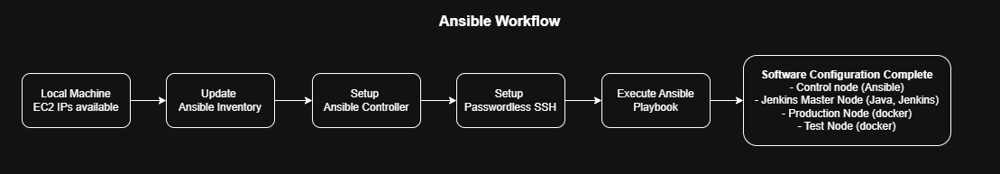

### 2.3 CodeBuild provisioning (ShellScript + Terraform):  
One-time execution from local machine to provision IAM role, CodeBuild project `website-build`, 
and Secrets Manager integration for GitHub PAT and Docker Hub credentials. Registers GitHub webhook on the `arkb2023/abode-website` repository to trigger CodeBuild on `main` and `develop`  branch commits. Establishes Docker image build and push automation foundation.

  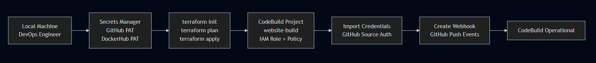

### 2.4. End-to-End CI/CD Pipeline (Operational)
Recurring automated workflow upon each `main` and `develop` branch commit:

Git push → GitHub Webhook → CodeBuild (builds Docker image, pushes `:main-v1.0-01-<sha>` and `:develop-v1.0.xx.<sha>` to Docker Hub) 
→ Docker Hub Webhook → Jenkins (detects image, evaluates branch → [If `main`] Build → Test → Prod deployment | [If `develop`] Build → Test only) 
→ Website live at http://prod-public-ip:80

  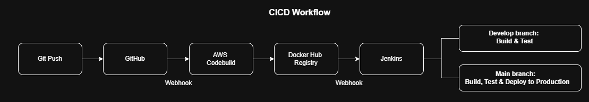
---
## 3. Architecture

### 3.1 End-to-End CI/CD Architecture  

The architecture diagram illustrates the end-to-end CI/CD pipeline deployed in AWS `ap-south-1`, showing both foundational infrastructure and operational workflows.

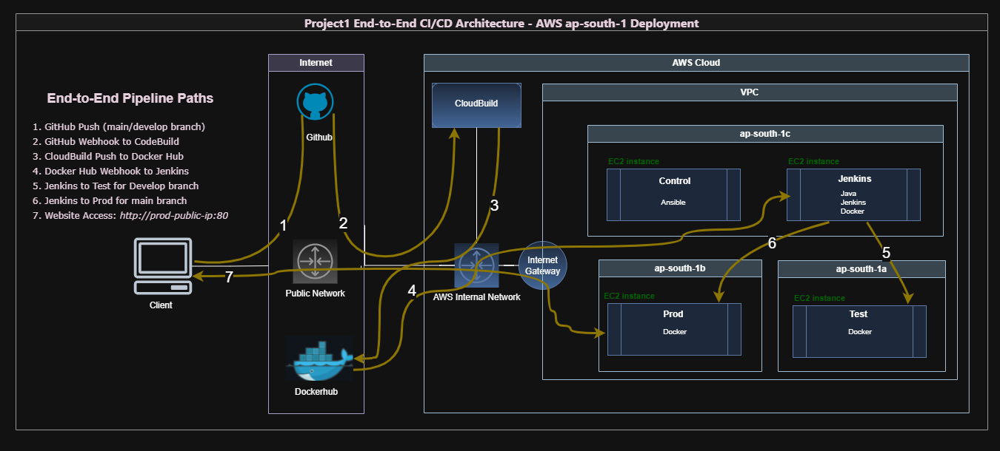


**AWS Cloud Resources (ap-south-1):**  
- **Region & Availability Zones:** Deployed across `ap-south-1a` `ap-south-1b`  and `ap-south-1c` for high availability
- **VPC & Networking:** A dedicated VPC with an Internet Gateway for public internet connectivity and public subnets configured with a route table default route (0.0.0.0/0 → IGW). 

- **EC2 Instances and Software Mapping**  

  | Instance   | Role                        | Software stack        |
  | ---------- | --------------------------- | --------------------- |
  | Control    | Ansible orchestrator        | Ansible               |
  | Jenkins    | Jenkins controller / master | Java, Jenkins, Docker |
  | Production | Production application host | Docker                |
  | Test       | Pre‑production test host    | Docker                |


### 3.2 Jenkins CI/CD Workflow  

The Multijob project `Abode-Website-Pipeline` implements a multi-phase CI/CD workflow triggered by Docker Hub webhook. The pipeline automatically orchestrates three sequential job phases: **Build**, **Test**, and **Prod Deployment**.  

- **Build Phase** executes `Build Job1`, that pulls image from Docker Hub and performs image verification.  
- **Test Phase** runs `Test Job2`, which pulls the image and executes validation tests to ensure quality before production.  
- **Prod Phase** (conditional) executes `Prod Job3` only on `main` branch pushes. For `develop` branch pushes, the pipeline skips production deployment and signals readiness for manual release. Job3 deploys the validated image to the production host via SSH.  

**Data Flow**: Each phase passes critical information downstream — image tags (develop/main), Docker Hub repository — enabling traceability and conditional logic. Any phase failure stops the pipeline immediately, preventing broken code from reaching production.  

This architecture ensures **automated deployments** with branch-aware controls: `develop` for pre-production testing, `main` for production releases.  

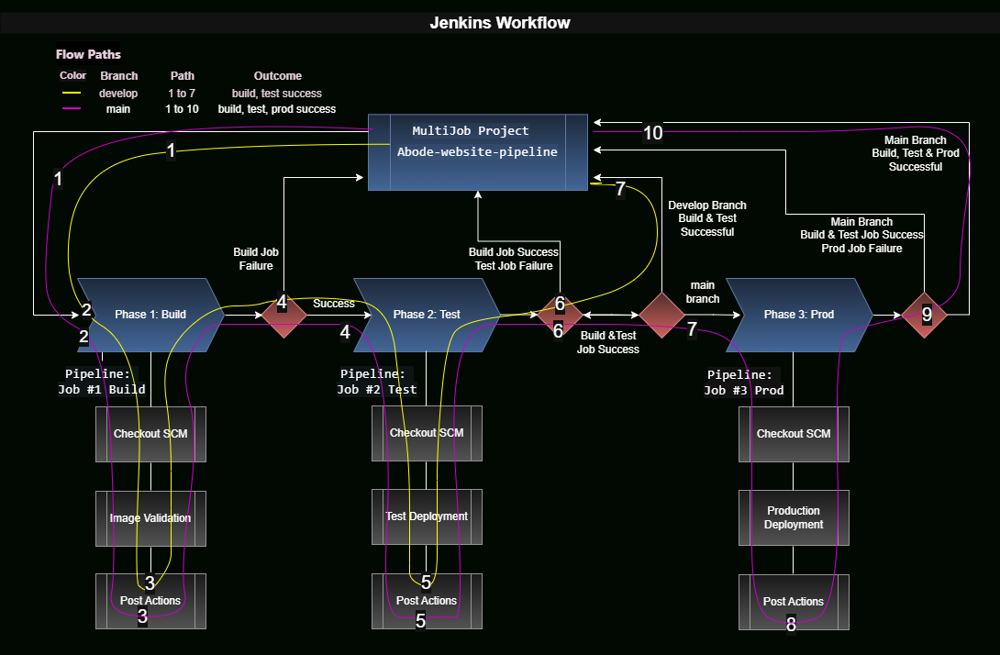  

### 3.3 AWS CodeBuild  
Builds Docker images from the GitHub repository using `buildspec.yml` and pushes tagged images `:main-v1.0-01-<sha>` and `:develop-v1.0.xx.<sha>` to Docker Hub.  

### 3.4 Supporting AWS Services  
- **AWS Secrets Manager:** Stores GitHub and Docker Hub credentials used by CodeBuild for secure authentication.  
- **Amazon CloudWatch Logs:** Captures AWS CodeBuild build logs for auditability and troubleshooting.

### 3.5 External Services  
- **GitHub:** [arkb2023/abode-website](https://github.com/arkb2023/abode-website.git) repository for source control with `main` and `develop` branches.  
- **Docker Hub:** [arkb2023/abode-website](https://hub.docker.com/repository/docker/arkb2023/abode-website/) as centralized container registry for application images.


---

## 4. Repository organization

### 4.1. **Terraform Infrastructure as Code (IaC):**
Provisions AWS EC2 infrastructure for `Control`, `Jenkins`, `Production` and `Test` instances in ap-south-1, 
separating networking (VPC, Internet Gateway, public subnet) from compute (4 EC2 instances distributed across ap-south-1a, ap-south-1b, ap-south-1c). Outputs EC2 public IPs as Terraform outputs for Ansible inventory generation.

**Detailed code structure**: [project1/terraform](./terraform/)  
```bash
├── main.tf              # Root module orchestrates vpc + ec2 modules
├── outputs.tf           # EC2 public IPs, VPC ID, security group IDs
├── terraform.tfvars     # Environment config (region, AZs, instance type)
├── variables.tf         # Input validation + descriptions
├── versions.tf          # Provider constraints (aws ~> 5.0)
└── modules/             # Reusable, self-contained infrastructure modules
    ├── vpc/             # Networking layer
    │   ├── main.tf      # VPC + IGW + public subnets + route tables
    │   ├── outputs.tf   # vpc_id, public_subnet_ids, igw_id
    │   ├── variables.tf # vpc_cidr, public_subnets
    │   └── versions.tf  # Module provider pinning
    └── ec2/             # Compute layer (4 instances)
        ├── main.tf      # 4x EC2 + security groups
        ├── outputs.tf   # instance_public_ip, instance_id
        ├── variables.tf # Input validation + descriptions
        └── versions.tf  # Module provider pinning
```

### 4.2. Ansible Configuration Management:   
The approach defines `4-node inventory`, `playbook` and `5 modular roles` enabling configuration management of AWS EC2 instances.

**Inventory:**  
- [inventory/aws-managed.ini](./ansible/inventory/aws-managed.ini): Inventory for Control, Jenkins, Prod, Test nodes

**Playbook:**
- [playbook/site.yml](./ansible/playbook/site.yml): Orchestrates setup of all nodes (control, jenkins, prod, test)

**Roles**
- [roles/common](./ansible/roles/common): Installs common packages
- [roles/control-setup](./ansible/roles/control-setup): Ansible controller dependencies
- [roles/jenkins-setup](./ansible/roles/jenkins-setup/): Installs Jenkins, Java, Docker
- [roles/prod-setup](./ansible/roles/prod-setup/): Installs Docker on Production node
- [roles/test-setup](./ansible/roles/test-setup/): Installs Docker on Test node


**Detailed code structure**: [project1/ansible](./ansible/)  
```bash
├── ansible.cfg                          # Ansible configuration: inventory path, SSH settings, privilege escalation
├── inventory
│   └── aws-managed.ini                 # Inventory file: defines control, jenkins, prod, test hosts with IPs and SSH keys
├── playbook
│   └── site.yml                        # Main playbook: orchestrates setup of all nodes (common, jenkins, prod, test)
├── roles
│   ├── common
│   │   └── tasks
│   │       └── main.yml                # Common setup tasks: applied to all nodes (updates, basic packages)
│   ├── control-setup
│   │   └── tasks
│   │       └── main.yml                # Control node setup: installs Ansible controller dependencies
│   ├── jenkins-setup
│   │   ├── handlers
│   │   │   └── main.yml                # Jenkins handlers: service restart/reload triggers
│   │   └── tasks
│   │       └── main.yml                # Jenkins setup: installs Java, Jenkins, Docker on jenkins node
│   ├── prod-setup
│   │   ├── group_vars
│   │   │   └── all.yml                 # Prod variables: configuration values for production environment
│   │   └── tasks
│   │       └── main.yml                # Prod setup: installs Docker on production node
│   └── test-setup
│       ├── group_vars
│       │   └── all.yml                 # Test variables: configuration values for test environment
│       └── tasks
│           └── main.yml                # Test setup: installs Docker on test node
```

### 4.3. AWS CodeBuild Provisioning Code:  
IaC solution provisions **AWS CodeBuild project** (`website-build`) for automated Docker image builds. Bootstrap script `setup-codebuild.sh` creates AWS Secrets Manager entries for GitHub PAT + DockerHub credentials. Terraform module creates IAM role/policy with least-privilege access and fully configured CodeBuild project pointing to `arkb2023/abode-website` GitHub repo.

**Components:**
- **Bootstrap Script** `setup-codebuild.sh`: Wraps AWS CLI `aws secretsmanager create-secret` for GitHub PAT + DockerHub PAT storage
- **Terraform IaC** provisions:
  - **IAM Role** `website-build-service-role` for CodeBuild assume-role
  - **Inline Policy** with granular permissions:
    - **CloudWatch Logs**: `logs:CreateLogGroup`, `CreateLogStream`, `PutLogEvents`
    - **Secrets Manager**: `secretsmanager:GetSecretValue` (GitHub PAT + Docker Hub PAT)
  - **CodeBuild Project** `website-build`:
    | Property | Value |
    |----------|-------|
    | Source | GitHub: `https://github.com/arkb2023/abode-website.git` (main branch) |
    | Buildspec | [buildspec.yml](https://github.com/arkb2023/abode-website/blob/main/buildspec.yml) (Docker build + DockerHub push) |
    | Environment | `aws/codebuild/standard:7.0` + privileged mode |
    | Artifacts | `NO_ARTIFACTS` (pushes directly to DockerHub) |
    | Logs | CloudWatch enabled |

**Detailed code structure:** [project2/codebuild](./codebuild/)  
```bash
codebuild/
├── setup-codebuild.sh      # Secrets Manager bootstrap (8 steps)
├── main.tf                 # Calls codebuild_project module
├── terraform.tfvars        # github_token_secret_arn, dockerhub_token_secret_arn
├── variables.tf            # project_name, github_repo_url, buildspec_path
└── modules/
    └── codebuild_project/
        ├── main.tf         # IAM role + CodeBuild resources
        ├── outputs.tf      # Project ARN for webhook setup
        └── variables.tf    # Module inputs with validation
```

### 4.5. GitHub Application Repository: 

**Application repository forked from [hshar/website](https://github.com/hshar/website.git)** per project requirement. Enhanced with complete **CI/CD pipeline configuration** enabling automated GitHub → CodeBuild → DockerHub → Jenkins → Docker deployment workflow.

**Pipeline Components:**

- **Dockerfile:** Containerizes application using base image `hshar/webapp`, copies code to `/var/www/html`.
- **buildspec.yml:** Defines CodeBuild phases for source checkout, Docker build, DockerHub push with branch-specific tagging (`main-v1.0-xx`, `develop-v1.0-xx`).
- **Groovy Pipeline Files:** Orchestrate Jenkins MultiJob phases:
  - `pipelines/build-pipeline.groovy`: Executes `scripts/smoke.sh` for image sanity checks (pull, smoke test, metadata)  
  - `pipelines/test-pipeline.groovy`: Executes `scripts/test.sh` to run validation tests on Test server
  - `pipelines/deploy-pipeline.groovy`: Executes `scripts/deploy.sh` for production deployment(main branch only), exposes port 80.

**Application Repository Structure (Fork + CICD Enhancements)** [arkb2023/abode-website](https://github.com/arkb2023/abode-website.git)
```bash
.
├── Dockerfile                          # Container image definition
├── buildspec.yml                       # AWS CodeBuild configuration
├── config.properties                   # Pipeline configuration
├── images/
│   └── github3.jpg
├── index.html                          # Web application
├── pipelines/                          # Jenkins MultiJob phase orchestrators
│   ├── build-pipeline.groovy           # Calls scripts/smoke.sh
│   ├── test-pipeline.groovy            # Calls scripts/test.sh
│   └── deploy-pipeline.groovy          # Calls scripts/deploy.sh
└── scripts/                            # Executable pipeline stages
    ├── smoke.sh                        # Docker image sanity check
    ├── test.sh                         # Validation tests
    └── deploy.sh                       # Production deployment
```
---

## 5. Foundation (Infrastructure & Configuration)

**Prerequisites:**  
Before deploying the infrastructure and CI/CD pipeline, ensure the following prerequisites are configured on local machine:

- **Required Environment Variables:** Create a `.env.local.sh` file in project root with the following variables:
  ```bash
  # AWS Configuration
  export AWS_REGION=ap-south-1
  export ACCOUNT_ID=<AccountID>

  # GitHub Integration
  export GITHUB_PAT="ghp_AAAAAAAAAAAA"
  export GITHUB_CONNECTION_ARN="arn:aws:codeconnections:$AWS_REGION:$ACCOUNT_ID:connection/<connection-id>"
  export GITHUB_SECRET="codebuild/github/website"

  # Docker Hub Integration
  export DOCKERHUB_USERNAME=<docker-hub-username>
  export DOCKERHUB_PAT="dckr_pat_DDDDDDDDDDD"
  export DOCKERHUB_SECRET="codebuild/dockerhub/credentials"
  ```
- **Terraform Configuration:** Create a `terraform/terraform.tfvars` file with the following variables:
  ```hcl
  # AWS Region Configuration (same as env file!)
  aws_region        = "ap-south-1"
  availability_zones = ["ap-south-1a", "ap-south-1b", "ap-south-1c"]

  # Local Machine IP/CIDR for admin SSH Access
  # Find your public IP: curl https://checkip.amazonaws.com
  my_ip = "1.1.1.0/28"
  ```

### 5.1. AWS VPC, EC2 & Security Groups Infrastructure with Terrafrom IaC:    
  - Setup AWS EC2 worker instances  
    ```bash
    cd terraform/

    # Init project
    terraform init
    
    # Prepare the plan
    terraform plan -out=tfplan

    # Apply the plan
    terraform apply -auto-approve tfplan

    # Verify provisioned resources
    terraform output
    ```
    
    - Terraform Output: Provisions vpc-id, 4 worker EC2 instances with public IP addresses, and generates SSH keypairs

    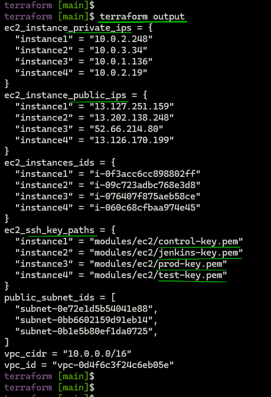

    - Set environment variables for EC2 instance private and public IPs
      ```bash
      export CONTROL_PVT_IP="10.0.2.248"
      export JENKINS_PVT_IP="10.0.3.34"
      export PROD_PVT_IP="10.0.1.136"
      export TEST_PVT_IP="10.0.2.19"

      export CONTROL_PUB_IP="13.127.251.159"
      export JENKINS_PUB_IP="13.202.138.248"
      export PROD_PUB_IP="52.66.214.80"
      export TEST_PUB_IP="13.126.170.199"
      ```

    - Provisioned `VPC` resources - `subnets` `route table` `internet gateway`

    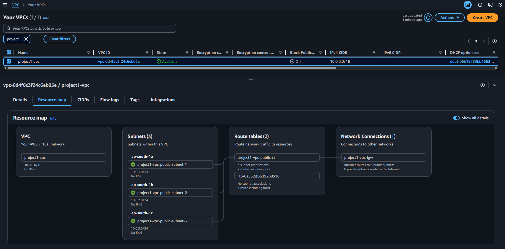

    - 4 EC2 worker instances up and running
 
    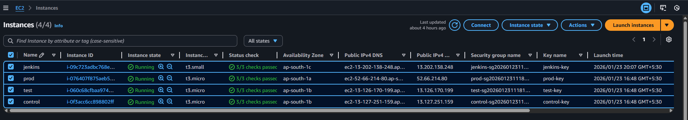

    - Provisioned Security groups for workers    

    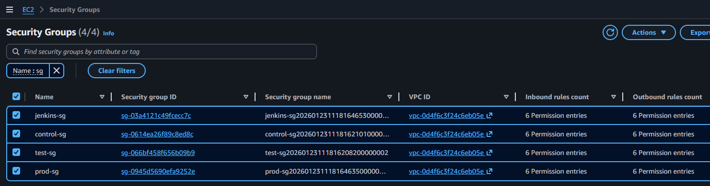
  
    - Inbound Allow rules  
      - Allow internal kubernetes cluster inbound traffic (pod-to-pod, kubelet, Flannel, API, etc2) in VPC subnet (10.0.0.0/16) only
      - Allow external inbound traffic for admin management 
        - ssh to workers instances
        - Access to jenkins
      - Allow external inbound DockerHub Webhook traffic
    
      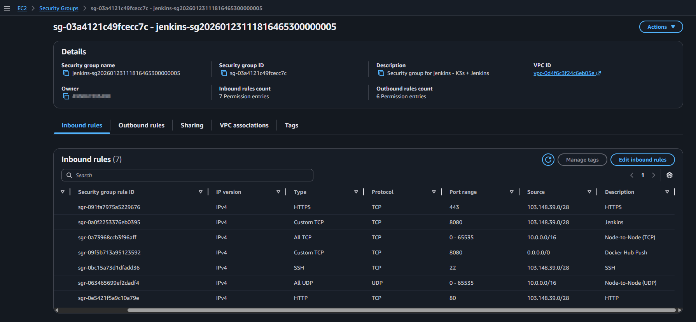

    - Outbound Allow rules  
      - Allow internal kubernetes cluster outbound traffic in VPC subnet (10.0.0.0/16) only
      - Allow external SSH, HTTPS, HTTP and DNS outbound traffic

      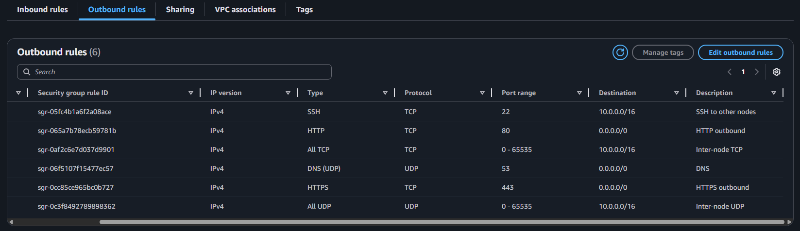

### 5.2. Ansible based Configuration Management
#### 5.2.1 Phase 1: Bootstrap the Control Instance
- Run the following steps from local machine:  
  - Transfer PEM files to control instance  
    ```bash
    cd terraform/modules/ec2/
    scp -i control-key.pem control-key.pem jenkins-key.pem prod-key.pem test-key.pem ubuntu@$CONTROL_PUB_IP:~/.ssh/
    ```
  - Edit `./ansible/inventory/aws-managed.ini` with provisioned private IPs and SSH public key paths for Jenkins, Prod, Test nodes  

  - Copy Ansible project to Control Instance
    ```bash
    tar -czf ansible.tar.gz ansible/
    scp -i terraform/modules/ec2/control-key.pem ansible.tar.gz ubuntu@$CONTROL_PUB_IP:~/
    ```

- Set up Ansible on Control Instance  
  ```bash
  # SSH into control instance
  ssh -i control-key.pem ubuntu@$CONTROL_PUB_IP
  
  # Untar the zip package
  tar -zxf ansible.tar.gz
  
  # Set permisions
  chmod 400 ~/.ssh/*.pem
  
  # Update and install Ansible
  sudo apt update
  sudo apt install software-properties-common -y
  sudo add-apt-repository --yes --update ppa:ansible/ansible
  sudo apt install ansible -y

  # Verify installation
  ansible --version
  ```
  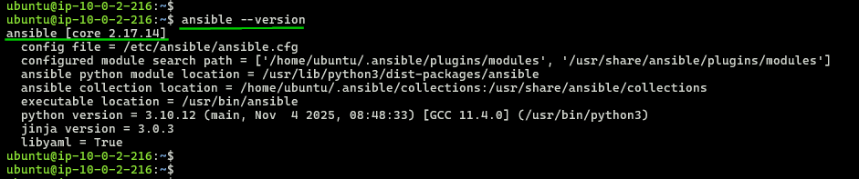

- Test Connectivity
  ```bash
  cd ~/ansible
  ansible all -m ping
  ```
  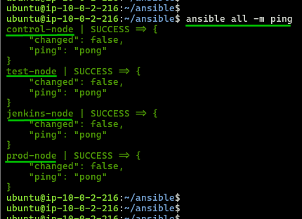

#### 5.2. Phase 2: Ansible Playbooks for AWS EC2 Instances
- Run the Playbook
  ```bash
  cd ~/ansible
  ansible-playbook playbook/site.yml
  ```
  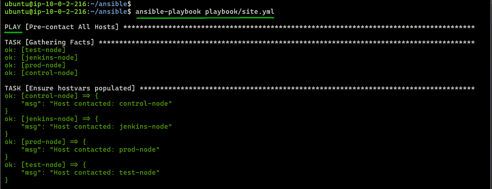  
  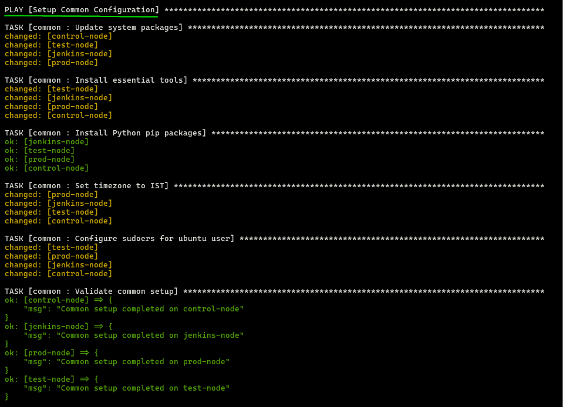  
  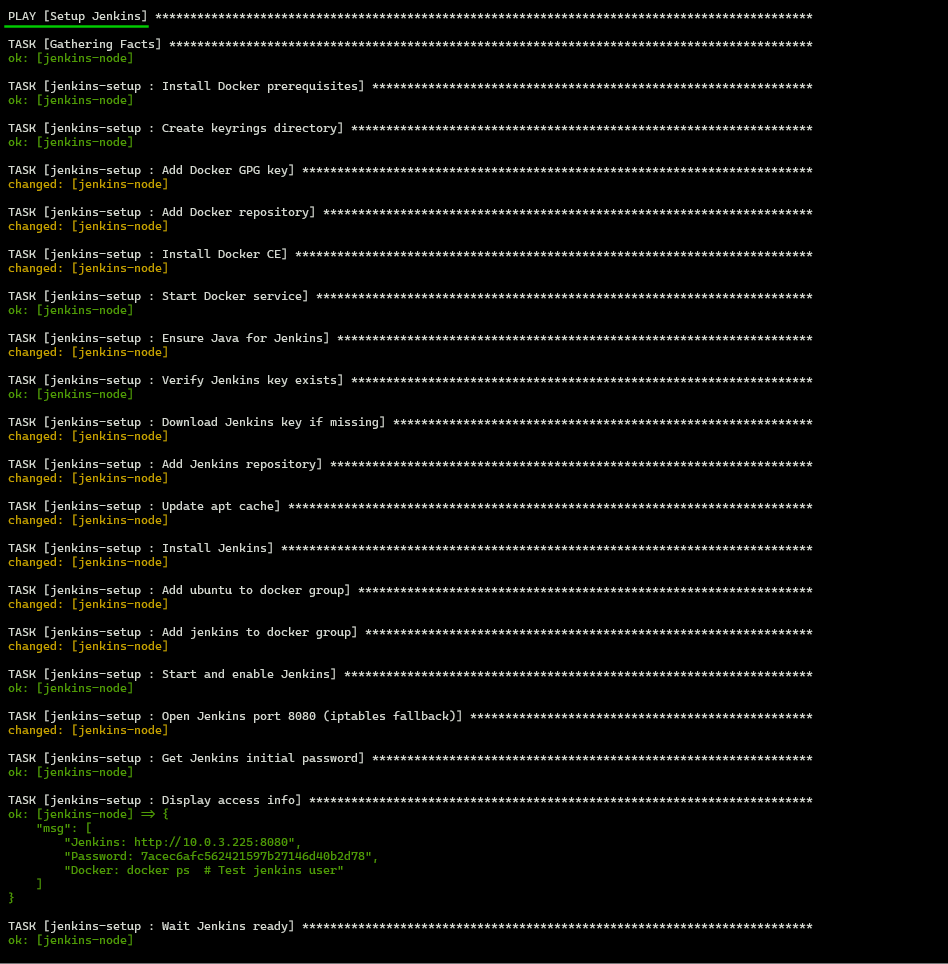  
  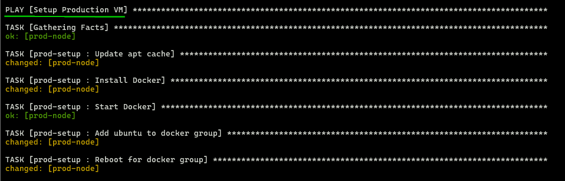  
  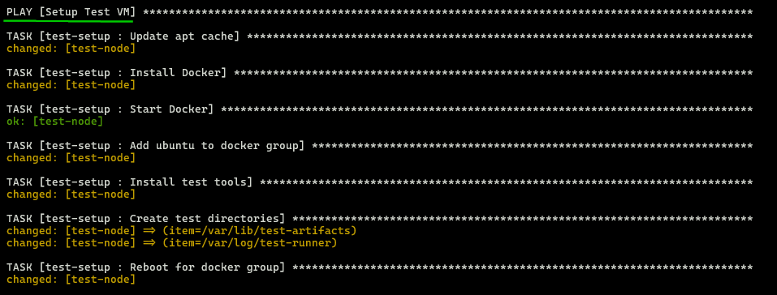  
  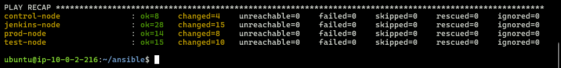  

- Verify configuration  
  ```bash
  # Check Jenkins node
  ansible jenkins -m shell -a "java -version"
  ansible jenkins -m shell -a "docker --version"
  ansible jenkins -m shell -a "systemctl status jenkins"
  ```
  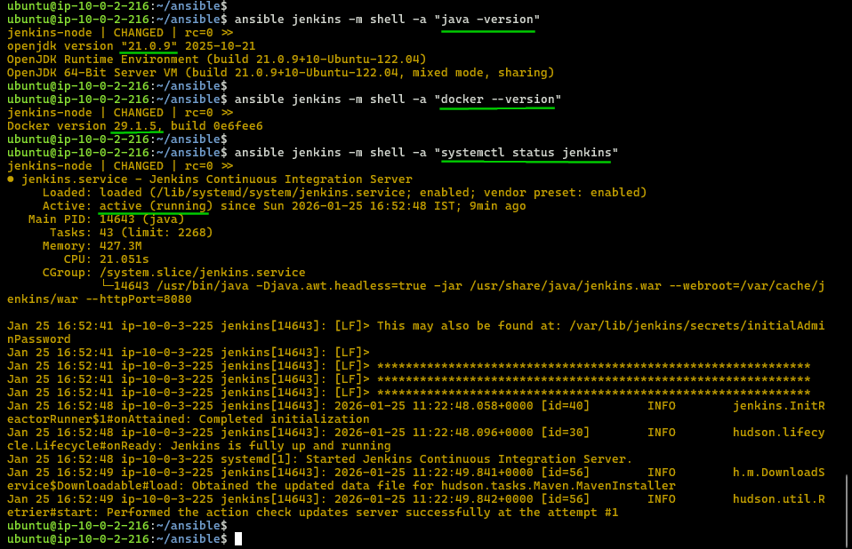

  ```bash
  # Check prod node
  ansible prod -m shell -a "docker --version"

  # Check test node
  ansible test -m shell -a "docker --version"
  ```

  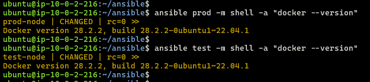  


### 5.3. Jenkins configuration and pipeline setup
#### 5.3.1. Access Jenkins and setup admin account 

  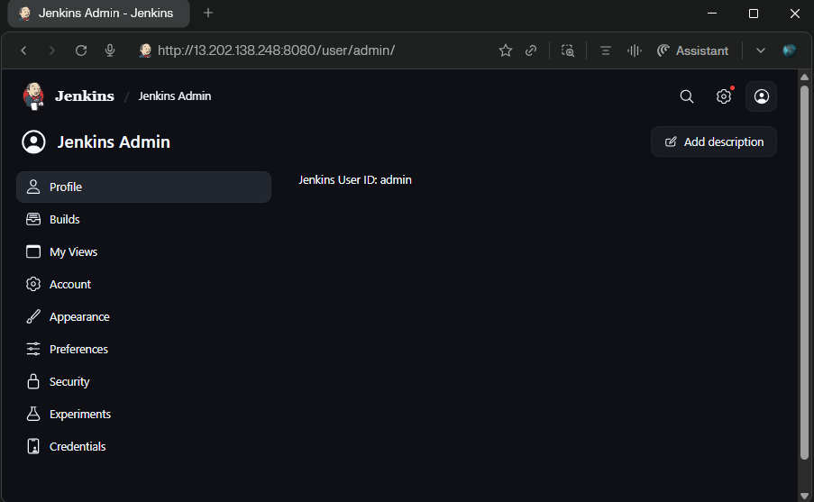

  > Access Jenkins at Jenkins public IP on port 8080: `http://<JENKINS_PUB_IP>:8080`

#### 5.3.2. Install plugins  
  > Multijob (jenkins-multijob-plugin)  
  > Generic Webhook Trigger (generic-webhook-trigger)  
  > SSH Agent (ssh-agent)  
  > Pipeline (workflow-aggregator)   
  >  Git (git)  
  > Parameterized Trigger (parameterized-trigger)  
  > HTML Publisher (htmlpublisher)  

#### 5.3.3. Setup SSH Credentials for Prod and Test nodes  
  - Description: SSH Key for Prod & Test nodes  
  - Kind: SSH Username with private key  
  - Username: `ubuntu`  
  - Private Key: (paste content of ~/.ssh/id_rsa from control node)  
  - ID: `prod-ssh-key`  
  - Save  

#### 5.3.4. Setup MultiJob pipeline 
- New Item > Name: `Abode-website-pipeline`, Type: `MultiJob Project` > OK
- General settings:    
  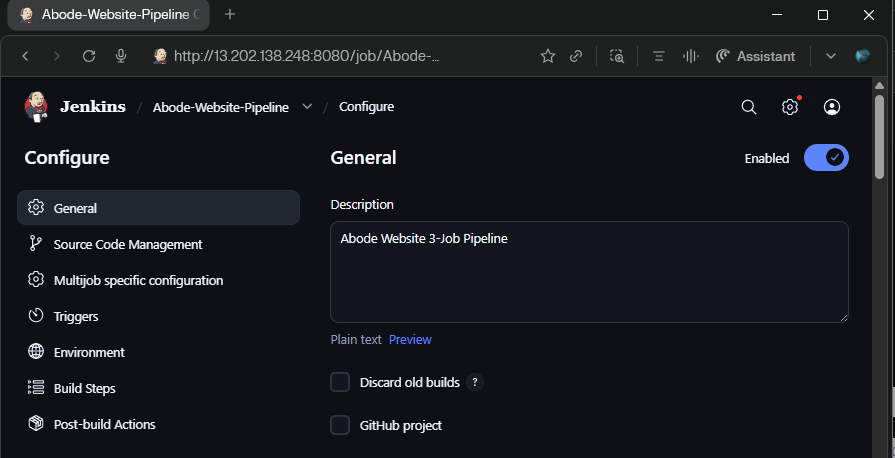
  
  - Set Parameters:  
    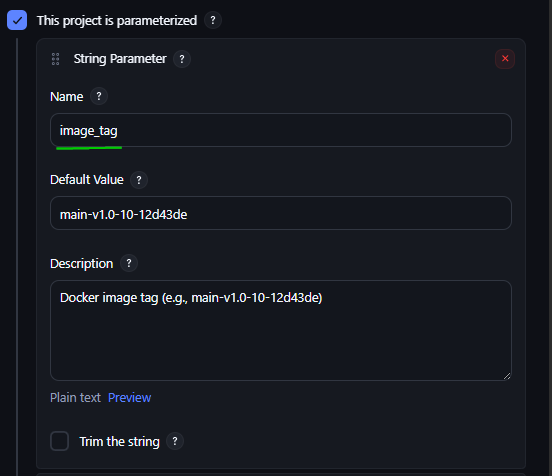  
    > String Parameter: `image_tag`   

    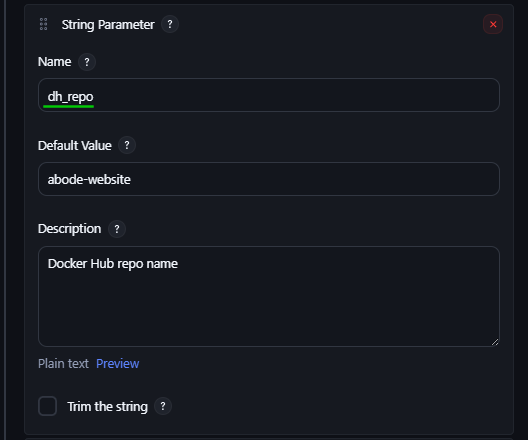
    > String Parameter: `dh_repo`  

    
    > String Parameter: `TEST_USER`, `TEST_HOST`  

    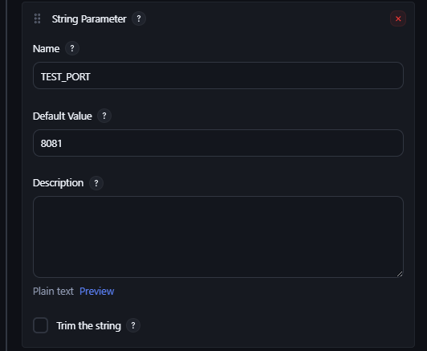
    > String Parameter: `TEST_PORT`  

    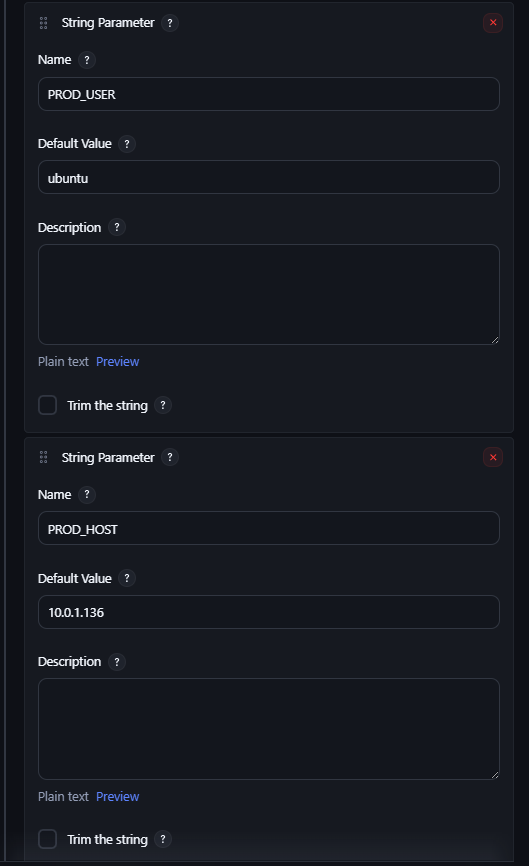
    > String Parameter: `PROD_USER`, `PROD_HOST`  
  
    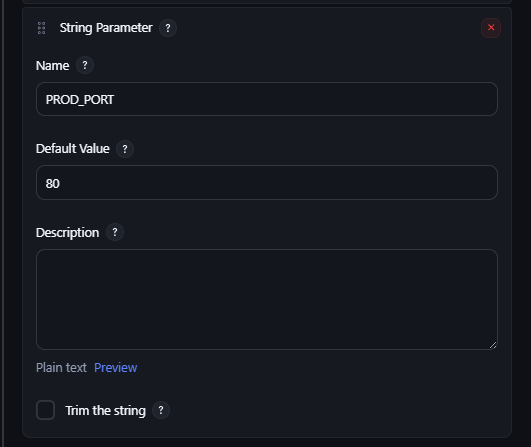  
    > String Parameter: `PROD_PORT`  

- Source Code Management:  
    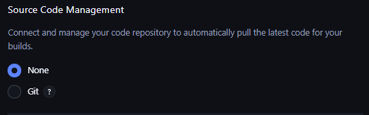  

- Generic Webhook Trigger configured to extract `image_tag` and `dh_repo` from Docker Hub webhook payload  
    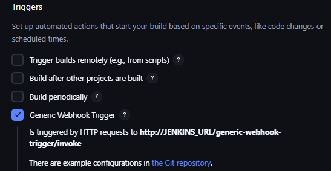  
    
    - Set Post content parameters:  
      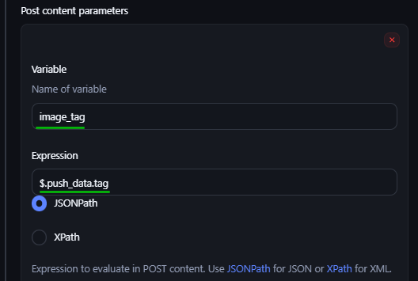  
      > Variable: `image_tag`, Expression: `$.push_data.tag`, Check `JSONPath`  
      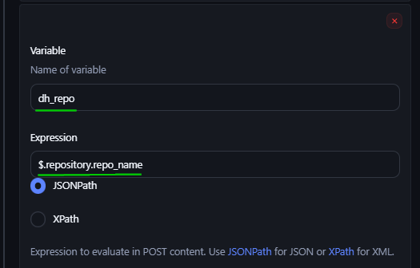  
      > Variable: `dh_repo`, Expression: `$.repository.repo_name`, Check `JSONPath`  

    - Set Token: `dockerhub-abode`, Cause: `Docker Hub Push`  
      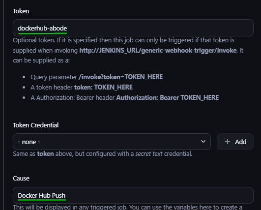  

    - Select Print post content and Print contributed variables for debugging  
      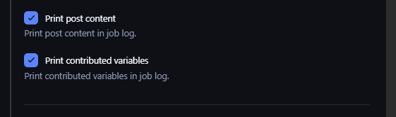  

- Build Steps:  
  - Phase 1: Build  
    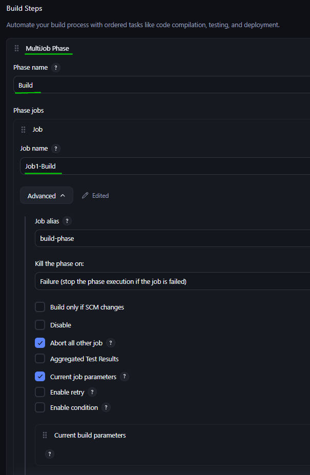  
      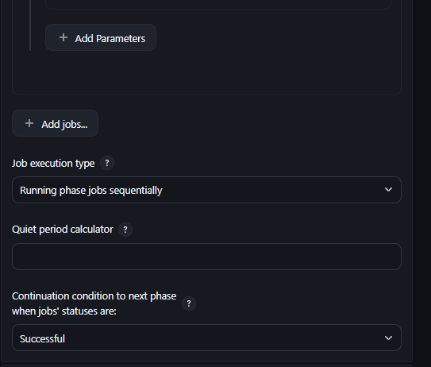  
    > Job Name: `Job1-Build`  
    > Job Alias: `build-phase`  
    > Kill the phase on: `Failure`  
    > Select `Abort all other job` & `Current job parameters`  
    > Job Execution type: `Running phase jobs sequentially`  
    > Continuation condition: `Successful`  

  - Phase 2: Test  
    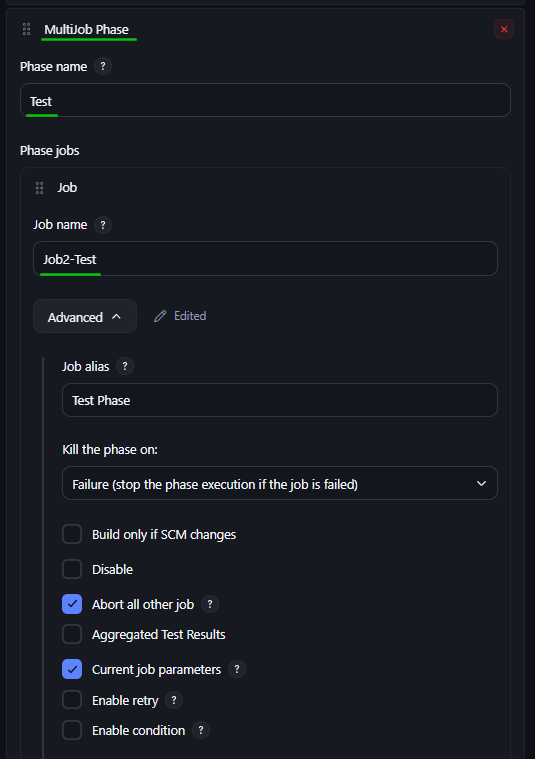  
    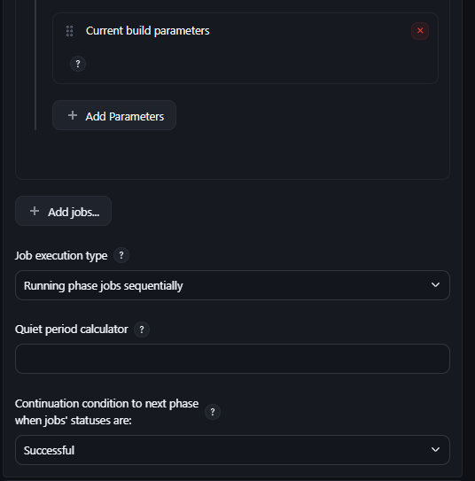  
    > Job Name: `Job2-Test`  
    > Job Alias: `Test-phase`  
    > Kill the phase on: `Failure`  
    > Select `Abort all other job` & `Current job parameters`  
    > Job Execution type: `Running phase jobs sequentially`  
    > Continuation condition: `Successful`  

  - Phase 3: Deploy  
    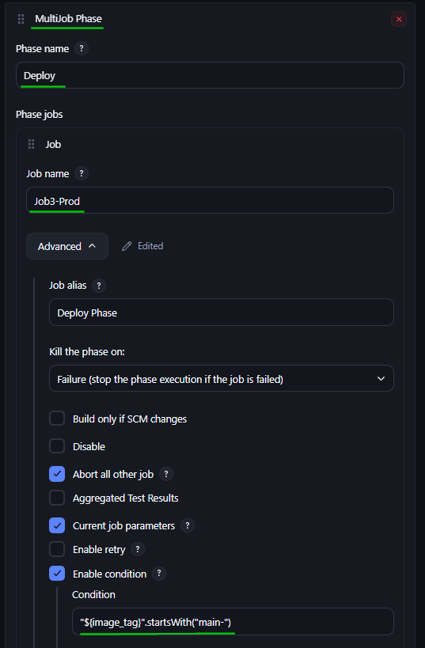  
      
    > Job Name: `Job3-Prod`  
    > Job Alias: `Deploy Phase`  
    > Kill the phase on: `Failure`  
    > Select `Abort all other job` & `Current job parameters`  
    > Set `Enable Condition` with: `"${image_tag}".startsWith("main-")`  
    > Job Execution type: `Running phase jobs sequentially`  
    > Continuation condition: `Successful`  

#### 5.3.5. Setup Build job  
- New Item > Name: `Job1-Build`, Type: `Pipeline` > OK  

- Set Parameters:  
  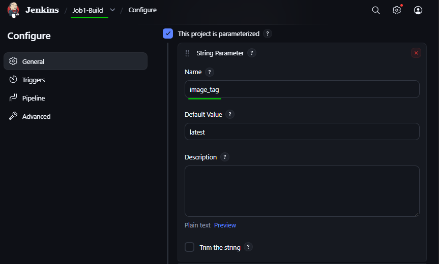  
  > String Parameter: `image_tag`  

  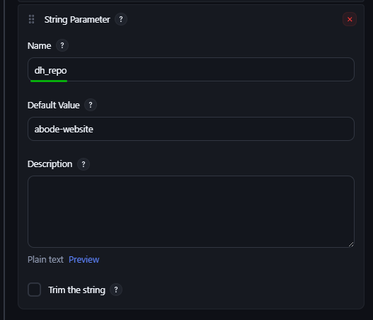  
  > String Parameter: `dh_repo`  

- Pipeline Script from SCM:  
  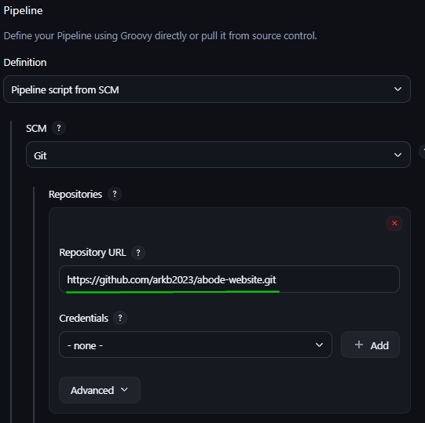  
  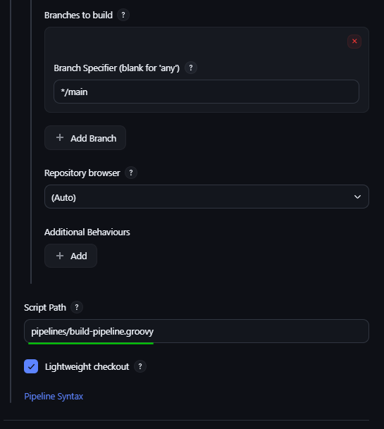  
  > SCM: Git  
  > Repository URL: `https://github.com/arkb2023/abode-website.git`  
  > Branches to build: `main`  
  > Script Path: `pipelines/build-pipeline.groovy`  

#### 5.3.6. Setup Test job 
- New Item > Name: `Job2-Test`, Type: `Pipeline` > OK  

- Set Parameters:  
  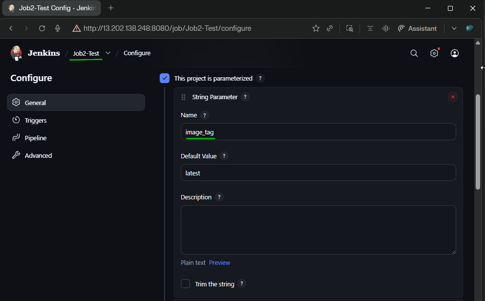  
  > String Parameter: `image_tag`  

  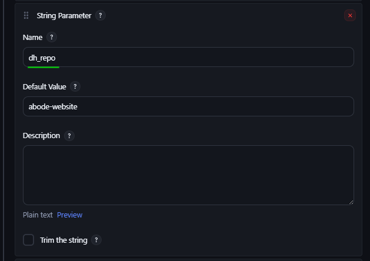  
  > String Parameter: `dh_repo`  

  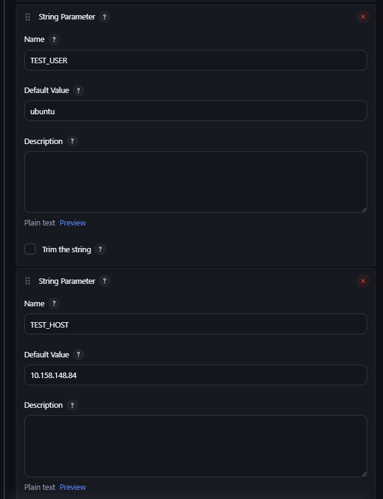  
  > String Parameter: `TEST_USER`, `TEST_HOST`  

  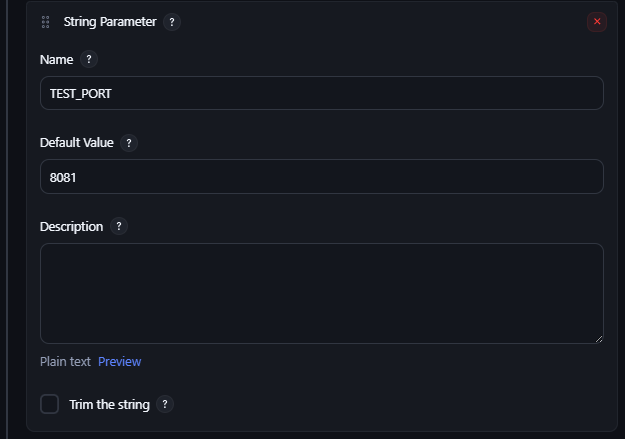  
  > String Parameter: `TEST_PORT`   

- Pipeline Script from SCM:  
  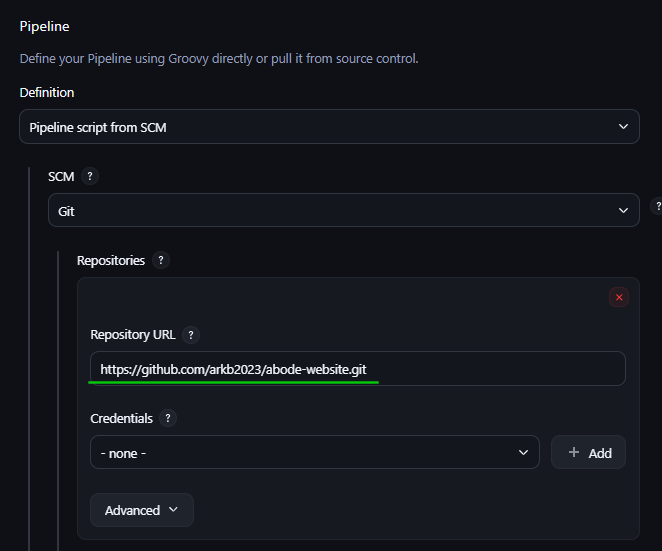  
  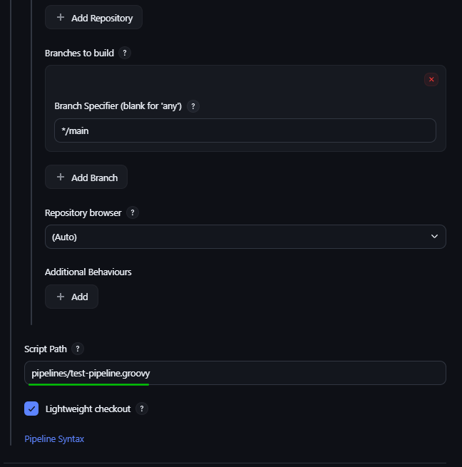  
  > SCM: Git  
  > Repository URL: `https://github.com/arkb2023/abode-website.git`  
  > Branches to build: `main`  
  > Script Path: `pipelines/test-pipeline.groovy`  

#### 5.3.7. Setup Prod job  
- New Item > Name: `Job3-Prod`, Type: `Pipeline` > OK  
- Set Parameters:  
  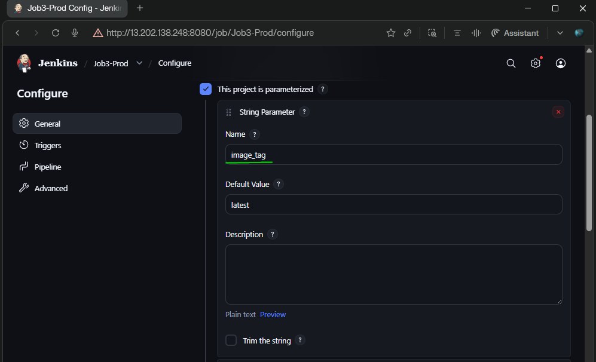  
  > String Parameter: `image_tag`  

    
  > String Parameter: `dh_repo`  

    
  > String Parameter: `PROD_USER`, `PROD_HOST`   

    
  > String Parameter: `PROD_PORT`  

- Pipeline Script from SCM:  
    
    
  > SCM: Git  
  > Repository URL: `https://github.com/arkb2023/abode-website.git`  
  > Branches to build: `main`  
  > Script Path: `pipelines/deploy-pipeline.groovy`  

#### 5.3.8. Visualize Multijob Pipeline  
Dashboard shows Multijob pipeline with 3 phases: Build, Test, Deploy  

    

### 5.4. Docker Hub Webhook registration   
Register generic webhook URL in Docker Hub repository settings    
> http://<JENKINS_PUB_IP>:8080/generic-webhook-trigger/invoke?token=dockerhub-abode  

    

### 5.5. AWS CodeBuild infrastructure with Terraform IaC and AWS CLI    

  - Setup code connection with github `codebuild-github` in AWS developer tools  
      

  - Execute script: [setup-codebuild.sh](./codebuild/setup-codebuild.sh)  
    ```bash
    cd codebuild
    source ../.env.local.sh
    ./setup-codebuild.sh
    ```

    The Script sets up following resources:  
    - Stores Github PAT and Docker Hub PAT in AWS Secrets manager using AWS CLI `aws secretsmanager create-secret ...`  
    - Updates [codebuild/terrafrom.tfvars](./codebuild/) with the returned ARNs for Terraform reference 
    
    - Runs [Terraform IaC code](./codebuild/modules/codebuild_project/) to setup:
      - Codebuild project: `website-build`
      - Creates IAM service role `website-build-service-role` for codebuild project
      - Attaches inline policy codebuild role allowing access to,
        - Cloudwatch logging
        - Access to Github and DockerHub secret tokens in AWS Secrets Manager
      - Enables Cloudwatch logging  

  - Codebuild project  
      
  
  - Codebuild project source configuration    
      
    > Github source repository: [arkb2023/abode-website](https://github.com/arkb2023/abode-website.git)  
    > Webhook events set Build on `PUSH` to `main` branch  
    > Webhook filter set to `(HEAD_REF = ^refs/heads/(main|develop)$)` accepting pushes to `main` and `develop` branches only

  - IAM role `website-build-service-role` for Codebuild project  
      

  - Inline policy attached to Codebuild role  
       
    > Access to Secrets Manager (for GitHub PAT and Docker Hub PAT) and Cloudwatch logs  

  - IAM role trust relationship for Codebuild service  
      

  - CodeBuild base policy  
      

  - CodeBuild Secrets Manager access policy  
      

### 5.6. GitHub Webhook registration   

- AWS codebuild URL configured in GitHub Webhook  
    

## 6. Test CICD Pipeline    

### 6.1 Test A: Main branch push leads to Build, Test and Production Deployment  

**Test Execution Flow:**

- Git `Push` to `main`  
  ```bash
  git add test.txt
  git commit -m "Test 05"
  git push origin main
  ```

    
  > Note the `Commit ID: 4c76461` for correlation in upcoming pipeline stages  

- GitHub Webhook Triggered: Request/Response successful    
    
  > Note: Request coorelates to `Commit ID: 4c76461`  
    
  > Note: Response status `200 Webhook received and build started`  

- Codebuild shows build submitted from Github corresponding to `Commit ID: 4c76461`  
    

- Codebuild shows build build phases    
    

- Codebuild logs: `PRE_BUILD` phase    
  

- Codebuild logs: `BUILD` phase    
  
  
  > Shows Docker image build successful  

- Codebuild logs: `POST_BUILD` phase    
  
  
  > Shows image pushed to Docker Hub
  > Note sha256: `f2957c4522fa` for correlation in upcoming stage  
  > [Build log file](./images/aws/main/codebuild/build.log)

- Docker Hub shows latest uploded image  
  
  > Note:  
  > Image corresponding to sha256: `f2957c4522fa` is uploaded with `4c76461` *(Git CommitID)*
- Docker Hub triggerd webhook successful  
    

- Jenkins Build job #10 triggered in response to Docker Hub Webhook  

  

- Jenkins shows `Abode-Website-Pipeline` Job triggered with Build, Test, Deploy phase execution in sequence   
  
  > Job1-Build #10 
  > Job2-Test #5 
  > Job3-Prod #2

  > [Abode-Website-Pipeline-Build #10 log file](./images/aws/main/jenkins/main-pipeline.log)

- Job1-Build #10 details: 
  - Status shows stages executed successfully  
    
    > Note: Commit ID `4c76461`, confirming correlation with GitHub push.  
    > Note: Coorelation to upstream Job `Abode Website Pipeline` Build #10
    > Stages: `Checkout SCM`, `Image Validation`, `Post Actions` successful

  - All Pipeline steps successfully executed  
      

  > [Job1-Build #10 log file](./images/aws/main/jenkins/job1-build10.log)

- Job2-Test #5 details: 
  - Status shows stages executed successfully  
      
    > Note: Coorelation to upstream Job `Abode Website Pipeline` Build #10  
    > Stages: `Checkout SCM`, `Test Deployment`, `Post Actions` successful

  - All Pipeline steps successfully executed  
    

  > [Job2-Test #5 log file](./images/aws/main/jenkins/job2-test05.log)

- Job3-Prod #2 details: 
  - Status shows stages executed successfully  
      
    > Note: Coorelation to upstream Job `Abode Website Pipeline` Build #10  
    > Stages: `Checkout SCM`, `Production Deploy`, `Post Actions` successful

  - Production depoloyment successful  
      
      
  
  > [Job3-Prod #2 log file](./images/aws/main/jenkins/job3-prod02.log)

- Access the live application through a browser at `http://<PROD_PUB_IP>:80`  
  


**Test A Validation Summary:**

| Checkpoint | Expected Behavior | Test Result | Status |
|------------|-------------------|-------------|--------|
| GitHub webhook | Triggers for main branch push | Commit `4c76461` | **PASS** |
| CodeBuild | Builds Docker image from source | SHA256 `f2957c4522fa` generated | **PASS** |
| Docker Hub | Pushes image with dual tags | Tags `:main-v1.0-5-4c76461` | **PASS** |
| Jenkins trigger | Receives webhook notification | MultiJob pipeline #10, Build Job #10, Test Job #5, Prod Job #2 successful | **PASS** |
| Production deployment | Docker rollout | Rollout restart successful | **PASS** |
| Application live | Website accessible at Production instance | `http://<PROD_PUB_IP>:80` responding | **PASS** |

---

### 6.2 Test B: Develop Branch Push leads to Build & Test Only *(No production deployment)*

**Test Execution Flow:**

- Git `Push` to `develop`  
  ```bash
  git add test.txt
  git commit -m "Test 03"
  git push origin develop
  ```

    
  > Note the `Commit ID: 4134157` for correlation in upcoming pipeline stages  

- GitHub Webhook Triggered: Request/Response successful    
     
  > Note: Request coorelates to `Commit ID: 4134157`  
    
  > Note: Response status `200 Webhook received and build started`  

- Codebuild shows build submitted from Github corresponding to `Commit ID: 4134157`  
    

- Codebuild shows build build phases    
    

- Codebuild logs: `PRE_BUILD` phase    
  

- Codebuild logs: `BUILD` phase    
  
  
  > Shows Docker image build successful  

- Codebuild logs: `POST_BUILD` phase    
  
  
  > Shows image pushed to Docker Hub
  > Note sha256: `d80a785f4fcb` for correlation in upcoming stage  
  > [Build log file](./images/aws/develop/codebuild/build.log)

- Docker Hub shows latest uploded image  
  
  > Note:  
  > Image corresponding to sha256: `d80a785f4fcb` is uploaded with `4134157` *(Git CommitID)*
- Docker Hub triggerd webhook successful  
    

- Jenkins Build job #10 triggered in response to Docker Hub Webhook  

  

- Jenkins shows `Abode-Website-Pipeline` Job triggered with Build and Test phase execution in sequence
  
  > Job1-Build #11 
  > Job2-Test #6 

> [Abode-Website-Pipeline-Build #11 log file](./images/aws/develop/jenkins/main-pipeline.log)

- Job1-Build #11 details: 
  - Status shows stages executed successfully  
    
    > Note: Commit ID `4134157`, confirming correlation with GitHub push.  
    > Note: Coorelation to upstream Job `Abode Website Pipeline` Build #11
    > Stages: `Checkout SCM`, `Image Validation`, `Post Actions` successful

  - All Pipeline steps successfully executed  
      

  > [Job1-Build #11 log file](./images/aws/develop/jenkins/job1-build11.log)

- Job2-Test #6 details: 
  - Status shows stages executed successfully  
      
    > Note: Coorelation to upstream Job `Abode Website Pipeline` Build #11  
    > Stages: `Checkout SCM`, `Test Deployment`, `Post Actions` successful

  - All Pipeline steps successfully executed  
    

  > [Job2-Test #6 log file](./images/aws/develop/jenkins/Job2-test06.log)

**Test B Validation Summary:**

| Checkpoint | Expected Behavior | Test Result | Status |
|------------|-------------------|-------------|--------|
| GitHub webhook | Triggers for main branch push | Commit `4134157` | **PASS** |
| CodeBuild | Builds Docker image from source | SHA256 `d80a785f4fcb` generated | **PASS** |
| Docker Hub | Pushes image with dual tags | Tags `:develop-v1.0-6-4134157` | **PASS** |
| Jenkins trigger | Receives webhook notification | MultiJob pipeline #11, Build Job #11, Test Job #6 successful | **PASS** |
> No Production deployment - **PASS**


---

## 7. Conclusion

**Project Summary:**
- Successfully implemented a production-grade CI/CD pipeline for containerized application deployment on AWS
- Integrated GitHub, AWS CodeBuild, Docker Hub, Jenkins and Docker with automated release gating
- Demonstrated end-to-end automation with manual intervention eliminated post-setup

**Key Achievements:**
- Infrastructure-as-Code approach enabling reproducible deployments
- Modular Ansible configuration management for consistent environments
- Push to `Main` branch leading to build, test and production deployment
- Push to `Develop` branch leading build and test only
- Comprehensive End to End CICD pipeline validation

---