## Capstone Project - II:

### **Scenario**  
You are hired as a DevOps Engineer for Analytics Pvt Ltd. This company is a product based organization which uses Docker for their containerization needs within the company. The final product received a lot of traction in the first few weeks of launch. Now with the increasing demand, the organization needs to have a platform for automating deployment, scaling and operations of application containers across clusters of hosts. As a DevOps Engineer, you need to
implement a DevOps lifecycle such that all the requirements are implemented without any change in the Docker containers in the testing environment.  

Up until now, this organization used to follow a monolithic architecture with just 2 developers. The product is present on: https://github.com/hshar/website.git  

**Following are the specifications of the lifecycle:**  
1. Git workflow should be implemented. Since the company follows a monolithic architecture of development, you need to take care of version control. The release should happen only on the 25th of every month.  
2. CodeBuild should be triggered once the commits are made in the master branch.  
3. The code should be containerized with the help of the Dockerfile. The Dockerfile should be built every time if there is a push to GitHub. Create a custom Docker image using a Dockerfile  
4. As per the requirement in the production server, you need to use the Kubernetes cluster and the containerized code from Docker Hub should be deployed with 2 replicas. Create a NodePort service and configure the same for port 30008.  
5. Create a Jenkins Pipeline script to accomplish the above task.  
6. For configuration management of the infrastructure, you need to deploy the configuration on the servers to install necessary software and configurations.  
7. Using Terraform, accomplish the task of infrastructure creation in the AWS cloud provider.  

**Architectural Advice:**  
Softwares to be installed on the respective machines using configuration management.  
- `Worker1:` Jenkins, Java  
- `Worker2:` Docker, Kubernetes  
- `Worker3:` Java, Docker, Kubernetes  
- `Worker4:` Docker, Kubernetes  
---

## 1. Requirements & Assumpations

### 1.1. Functional Requirements
- Terraform IaC provisions 4 EC2 instances in AWS cloud with required VPC, subnets, and security groups
- Ansible automates software installation across all workers per architectural specifications (`Worker1=jenkins+java+kubectl`, `Worker3=java+k3s-control`, `Worker2-4=k3s-agents`)
- Git workflow: A GitHub repository as one source of truth—one place with instructions to Build + Package + Deploy (application code + `Dockerfile` + `buildspec` + `Jenkinsfile`)
- All commits to the main branch trigger a GitHub webhook to AWS CodeBuild
- Feature branch commits do not trigger builds
- Each CodeBuild execution builds a Docker image and pushes to Docker Hub with tags `:latest` and `:<commit-id>`
- CodeBuild uses Dockerfile to containerize images
- Jenkins pipeline script detects new Docker images on Docker Hub via webhook
- Jenkins compares the current date; if the 25th of the month, Jenkins updates the K3s Deployment with the latest image
- If not the 25th, Jenkins build job completes successfully but does not trigger K3s rollout
- The deployment uses `2 replicas`
- The `NodePort` service on `30008` exposes the application externally
- Website application served on `http://worker3-public-ip:30008`

### 1.2. Non-Functional Requirements

**Configuration Files & Infrastructure Codification**
- A `Dockerfile` containerizes the application with layered image optimization
- A `buildspec.yml` file defines AWS CodeBuild build instructions (source checkout, build phases, artifact output)
- A `Jenkinsfile` defines the Jenkins pipeline stages for deployment orchestration and decision logic
- Terraform infrastructure-as-code provisions all AWS resources (VPC, EC2, security groups) idempotently
- Ansible playbooks configure worker software stacks and networking idempotently, supporting repeated execution without side effects

**Integration & Authentication**
- AWS CodeBuild integrates with GitHub via webhook triggers authenticated with GitHub Personal Access Token (PAT)
- Jenkins integrates with Docker Hub via Personal Access Token for image detection and deployment operations
- Docker Hub webhook notifies Jenkins of new `ark2023/website:latest` image uploads, triggering the deployment decision pipeline
- AWS Secrets Manager stores GitHub PAT and Docker Hub PAT for secure credential management across CI/CD components

**Cluster & Operational Configuration**
- K3s cluster initialization designates Worker3 as the control plane; kubeconfig is distributed to Jenkins (Worker1) for kubectl-based deployment operations
- Application Deployment uses the `:latest` Docker image tag for K3s rollout updates
- AWS CloudWatch Logs captures all AWS CodeBuild build logs for audit and troubleshooting

**System Reliability & Repeatability**
- Terraform and Ansible configurations are idempotent—repeated execution produces consistent state without unintended side effects
- All CI/CD secrets and credentials are externalized to AWS Secrets Manager and never hardcoded in configuration files or repositories

### 1.3 Assumptions

- CodeBuild is triggered on every `main` branch commit
- Production release deployment occurs only on the 25th of each month
- Non-25th builds create Docker images and push to Docker Hub but do not update the running Production Deployment
- Docker Hub triggers a webhook to Jenkins upon new image upload; push-based webhook notification is preferred over pull-based polling for efficiency and instantaneous deployment evaluation
- Jenkins pipeline script evaluates the current date: if the 25th of the month, the pipeline proceeds with K3s Deployment rollout; otherwise, the pipeline completes successfully without triggering a deployment update

### 1.4. Project Artifacts

| Artifact | Location | Purpose |
|----------|----------|---------|
| **GitHub Repository** | [github/arkb2023/website](https://github.com/arkb2023/website.git) | Product application repository; Forked from [hshar/website.git](https://github.com/hshar/website.git); Added `Dockerfile`, `buildspec.yml`, and `jenkinsfile` |
| **Docker Hub Registry** | [docker/arkb2023/website](https://hub.docker.com/repository/docker/arkb2023/website) | Container image storage with `:latest` and `:<commit-id>` tags |

### 1.5 Design Decisions

- K3s cluster nodes (Worker2, Worker3, Worker4) use containerd as the container runtime instead of full Docker Engine installations. 
  This reduces resource overhead while maintaining OCI image compatibility; Docker images built by CodeBuild via `docker build` 
  are fully compatible with the containerd runtime in K3s.
- Branch-level gating is implemented in AWS CodeBuild using webhook filters 
on HEAD_REF (`^refs/heads/main$`), rather than at the GitHub webhook level. 
This centralizes build trigger logic within the build system while still 
allowing GitHub to emit generic push events.
---


## 2. High Level Workflow

**Four-phase deployment strategy** transforms bare AWS infrastructure into a fully operational CI/CD pipeline.

### 2.1. Terraform IaC: AWS VPC + Security Groups + EC2 Instances Infrastructure Setup  
One-time execution from local machine provisions VPC with Internet Gateway, public subnets, 
security groups, and 4 EC2 instances across ap-south-1a, ap-south-1b, and ap-south-1c. 
Outputs EC2 public IPs as Terraform outputs for Ansible inventory consumption.

  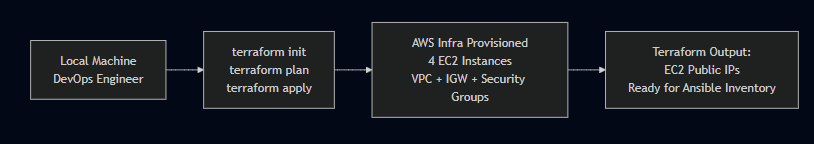

### 2.2. Ansible Configuration Management  
Two-stage Ansible orchestration:

**Stage 1:** Bootstrap Worker1 as Ansible controller and establish passwordless SSH access to all workers (manual one-time step)

**Stage 2:** Execute 6-phase configuration management across all workers:
- **Worker1:** Jenkins + Java + Ansible + Kubectl
- **Worker3:** containerd/Docker + K3s control plane
- **Worker2, Worker4:** containerd/Docker + K3s agents

  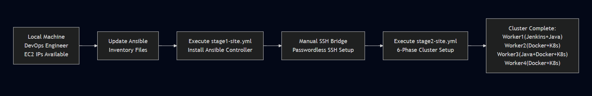

### 2.3 CodeBuild provisioning (ShellScript + Terraform):  
One-time execution from local machine to provision IAM role, CodeBuild project `website-build`, 
and Secrets Manager integration for GitHub PAT and Docker Hub credentials. Registers GitHub webhook 
on the `arkb2023/website` repository to trigger CodeBuild on `main` branch commits. Establishes 
Docker image build and push automation foundation.

  

### 2.4. End-to-End CI/CD Pipeline (Operational)
Recurring automated workflow upon each `main` branch commit:

Git push → GitHub Webhook → CodeBuild (builds Docker image, pushes `:latest` and `:<commit-id>` to Docker Hub) 
→ Docker Hub Webhook → Jenkins (detects image, evaluates date) → [If 25th] K3s Deployment update 
→ Website live at http://worker3-public-ip:30008 | [If non-25th] Build success, no deployment

Zero manual intervention post-setup.

  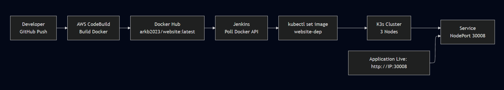
---
## 3. Architecture
The architecture diagram illustrates the end-to-end CI/CD pipeline deployed in AWS `ap-south-1`, showing both foundational infrastructure and operational workflows.

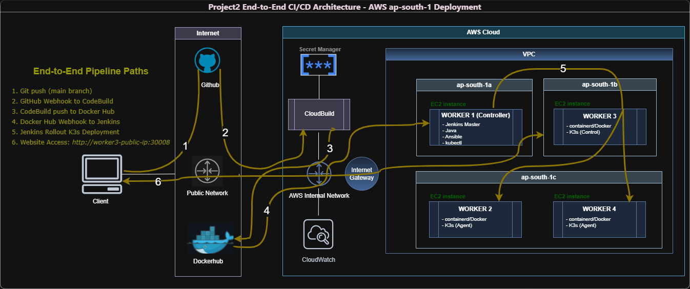

**AWS Cloud Resources (ap-south-1):**  
- **Region & Availability Zones:** Deployed across `ap-south-1a` `ap-south-1b`  and `ap-south-1c` for high availability
- **VPC & Networking:** A dedicated VPC with an Internet Gateway for public internet connectivity and public subnets configured with a route table default route (0.0.0.0/0 → IGW). 

- **EC2 Instances and Software Mapping**  

  | Worker | Role        | Software Stack                                      |
  |--------|------------|------------------------------------------------------|
  | **Worker1 (Controller)** | CI/CD Orchestrator | Jenkins Master, Java, Ansible, kubectl |
  | **Worker2**               | K3s Agent         | containerd/Docker, K3s Agent                      |
  | **Worker3**               | K3s Control Plane | Java, containerd/Docker, K3s Control Plane        |
  | **Worker4**               | K3s Agent         | containerd/Docker, K3s Agent                      |

- **AWS CodeBuild:** Builds Docker images from the GitHub repository using `buildspec.yml` and pushes tagged images to Docker Hub.  

**Supporting AWS Services**  
- **AWS Secrets Manager:** Stores GitHub and Docker Hub credentials used by CodeBuild for secure authentication.  
- **Amazon CloudWatch Logs:** Captures AWS CodeBuild build logs for auditability and troubleshooting.

**External Services**  
- **GitHub:** [arkb2023/website](https://github.com/arkb2023/website.git) repository for source control with `main` branch workflow.  
- **Docker Hub:** [arkb2023/website](https://hub.docker.com/repository/docker/arkb2023/website/tags/latest) as centralized container registry for application images.


---

## 4. Repository organization

### 4.1. **Terraform Infrastructure as Code (IaC):**
Provisions AWS EC2 infrastructure for 4 worker instances in ap-south-1, 
separating networking (VPC, Internet Gateway, public subnets) from compute 
(4 EC2 instances distributed across ap-south-1a, ap-south-1b, ap-south-1c). 
Outputs EC2 public IPs as Terraform outputs for Ansible inventory generation.

**Detailed code structure**: [project2/terraform](./terraform/)  
```bash
├── main.tf              # Root module orchestrates vpc + ec2 modules
├── outputs.tf           # EC2 public IPs, VPC ID, security group IDs
├── terraform.tfvars     # Environment config (region, AZs, instance type)
├── variables.tf         # Input validation + descriptions
├── versions.tf          # Provider constraints (aws ~> 5.0)
└── modules/             # Reusable, self-contained infrastructure modules
    ├── vpc/             # Networking layer
    │   ├── main.tf      # VPC + IGW + public subnets + route tables
    │   ├── outputs.tf   # vpc_id, public_subnet_ids, igw_id
    │   ├── variables.tf # vpc_cidr, public_subnets
    │   └── versions.tf  # Module provider pinning
    └── ec2/             # Compute layer (4 workers)
        ├── main.tf      # 4x EC2 (Worker1-4) + security groups
        ├── outputs.tf   # instance_public_ip, instance_id
        ├── variables.tf # Input validation + descriptions
        └── versions.tf  # Module provider pinning
```
### 4.2. Ansible Configuration Management:   
The design follows **2-stage deployment pattern** with **8 modular roles** enabling configuration management of AWS EC2 worker instances.

- **Stage1:**  
  - **Purpose:** Bootstrap Worker1 as Ansible controller from localhost
  - **Associated Ansible objects:**
    - Inventory: [inventory/stage1-hosts.ini](./ansible/inventory/stage1-hosts.ini) 
    - Playbook: [playbooks/stage1-site.yml](./ansible/playbooks/stage1-site.yml)
    - Role: [roles/controller](./ansible/roles/controller)
  - **Outcome**: Worker1 ready with `ansible-core` (pip), SSH keys distributed, passwordless SSH to workers2-4 established

- **Stage2:**  
  - **Purpose:** 6-phase orchestration delivering Jenkins + **Containerd CRI K3s cluster**
  - **Associated Ansible objects:**
    - Inventory: [inventory/stage2-hosts.ini](./ansible/inventory/stage2-hosts.ini) 
    - Playbook: [playbooks/stage2-site.yml](./ansible/playbooks/stage2-site.yml)
    - **Roles (7 total):**
      1. [roles/common](./ansible/roles/common) - Base packages (all nodes)
      2. [roles/java](./ansible/roles/java) - OpenJDK (Worker1,3)
      3. [roles/jenkins](./ansible/roles/jenkins) - Jenkins LTS + kubeconfig
      4. [roles/k3s_common](./ansible/roles/k3s_common) - **Containerd CRI** setup
      5. [roles/k3s_control_plane](./ansible/roles/k3s_control_plane) - K3s server
      6. [roles/k3s_worker](./ansible/roles/k3s_worker) - K3s agents  
      7. [roles/kubectl](./ansible/roles/kubectl) - Client + kubeconfig sync
  - **Outcome**: 
    - **Worker1**: Jenkins master (8080), Java, kubectl with kubeconfig access
    - **3-node Containerd K3s cluster**:
      | Node | Role | Components |
      |------|------|------------|
      | Worker2 | K3s Agent | Containerd + K3s agent |
      | Worker3 | K3s Control Plane | Containerd + K3s server (6443) + Java |
      | Worker4 | K3s Agent | Containerd + K3s agent |

- **Detailed code structure**: [project2/ansible](./ansible/)  
  ```bash
  ├── ansible.stage1.cfg        # Local execution config
  ├── ansible.stage2.cfg        # SSH execution config  
  ├── generate-inventory.sh     # AWS inventory generator
  ├── inventory/
  │   ├── stage1-hosts.ini      # localhost → Worker1
  │   └── stage2-hosts.ini      # 4-node targeting
  ├── playbooks/
  │   ├── stage1-site.yml       # Controller bootstrap
  │   └── stage2-site.yml       # 6-phase deployment
  └── roles/                    # 8 production-grade roles
      ├── common               # curl, git, python3-pip
      ├── controller           # ansible-core + SSH setup (4 tasks)
      ├── java                 # OpenJDK 17 (Worker1,3 per spec)
      ├── jenkins              # Jenkins + kubeconfig fix
      ├── k3s_common           # **Containerd CRI** (containerd.toml.j2)
      ├── k3s_control_plane    # K3s server (Worker2)
      ├── k3s_worker           # K3s agents (Worker3-4)
      └── kubectl              # Client sync from control plane
  ```

### 4.3. AWS CodeBuild Provisioning Code: [project2/codebuild](./codebuild/)  
IaC solution provisions **AWS CodeBuild project** (`website-build`) for automated Docker image builds. Bootstrap script `setup-codebuild.sh` creates AWS Secrets Manager entries for GitHub PAT + DockerHub credentials. Terraform module creates IAM role/policy with least-privilege access and fully configured CodeBuild project pointing to `arkb2023/website` GitHub repo.

**Components:**
- **Bootstrap Script** `setup-codebuild.sh`: Wraps AWS CLI `aws secretsmanager create-secret` for GitHub PAT + DockerHub PAT storage
- **Terraform IaC** provisions:
  - **IAM Role** `website-build-service-role` for CodeBuild assume-role
  - **Inline Policy** with granular permissions:
    - **CloudWatch Logs**: `logs:CreateLogGroup`, `CreateLogStream`, `PutLogEvents`
    - **Secrets Manager**: `secretsmanager:GetSecretValue` (GitHub PAT + Docker Hub PAT)
  - **CodeBuild Project** `website-build`:
    | Property | Value |
    |----------|-------|
    | Source | GitHub: `https://github.com/arkb2023/website.git` (main branch) |
    | Buildspec | `buildspec.yml` (Docker build + DockerHub push) |
    | Environment | `aws/codebuild/standard:7.0` + privileged mode |
    | Artifacts | `NO_ARTIFACTS` (pushes directly to DockerHub) |
    | Logs | CloudWatch enabled |

**Detailed code structure:**
```bash
codebuild/
├── setup-codebuild.sh      # Secrets Manager bootstrap (8 steps)
├── main.tf                 # Calls codebuild_project module
├── terraform.tfvars        # github_token_secret_arn, dockerhub_token_secret_arn
├── variables.tf            # project_name, github_repo_url, buildspec_path
└── modules/
    └── codebuild_project/
        ├── main.tf         # IAM role + CodeBuild resources
        ├── outputs.tf      # Project ARN for webhook setup
        └── variables.tf    # Module inputs with validation
```

### 4.4. Kubernetes Manifests: [project2/kubernetes](./kubernetes/)  
Declarative Kubernetes manifests provisioning **website application** with `2 replicas` and external access via **NodePort 30008**. Deployment uses `arkb2023/website:latest` from DockerHub (CodeBuild output). Service exposes port 80 to NodePort 30008 matching security group and Jenkins rollout command (`kubectl set image deployment/website=arkb2023/website:latest`).

- **Detailed manifest structure:**
  ```bash
  Kubernetes
  ├── website-deployment.yaml  # Deployment: website-dep, 2 replicas, latest image
  └── website-service.yaml     # Service: website-svc, port 80 → NodePort 30008
  ```

### 4.5. GitHub Application Repository: [arkb2023/website](https://github.com/arkb2023/website.git)  
**Application repository forked from [hshar/website](https://github.com/hshar/website.git)** per project requirement. Enhanced with complete **CI/CD pipeline configuration** enabling automated GitHub → CodeBuild → DockerHub → Jenkins → K3s workflow.

**Pipeline Components:**
- **[Dockerfile](https://github.com/arkb2023/website/blob/main/Dockerfile)**: Containerizes application using `httpd:2.4-alpine` base → `arkb2023/website:latest`
- **[buildspec.yml](https://github.com/arkb2023/website/blob/main/buildspec.yml)**: 
  AWS CodeBuild configuration that:
  - Retrieves Docker Hub credentials from Secrets Manager
  - Builds Docker image from Dockerfile
  - Tags image with `:latest` and `:<commit-id>`
  - Pushes both tags to Docker Hub `arkb2023/website` repository
- **[jenkinsfile](https://github.com/arkb2023/website/blob/main/jenkinsfile)**: Jenkins pipeline responds to Docker Hub webhook notification of new `:latest` image. On the 25th of the month, executes `kubectl set image deployment/website=arkb2023/website:latest` → rollout restart → verifies application at http://worker3:30008

**CI/CD Application Repository (Fork + Pipeline)**
```
├── Dockerfile              # httpd:2.4-alpine → arkb2023/website:latest
├── buildspec.yml           # CodeBuild: build → DockerHub push
├── jenkinsfile             # Jenkins: poll DockerHub → kubectl rollout
├── index.html              # Application entrypoint (port 80)
└── images/github3.jpg      # Static assets
```

## 5. Foundation (Infrastructure & Configuration)

**Prerequisites:**  
Before deploying the infrastructure and CI/CD pipeline, ensure the following prerequisites are configured on local machine:

- **Required Environment Variables:** Create a `.env.local.sh` file in project root with the following variables:
  ```bash
  # AWS Configuration
  export AWS_REGION=ap-south-1
  export ACCOUNT_ID=<AccountID>

  # GitHub Integration
  export GITHUB_PAT="ghp_AAAAAAAAAAAA"
  export GITHUB_CONNECTION_ARN="arn:aws:codeconnections:$AWS_REGION:$ACCOUNT_ID:connection/<connection-id>"
  export GITHUB_SECRET="codebuild/github/website"

  # Docker Hub Integration
  export DOCKERHUB_USERNAME=<docker-hub-username>
  export DOCKERHUB_PAT="dckr_pat_DDDDDDDDDDD"
  export DOCKERHUB_SECRET="codebuild/dockerhub/credentials"
  ```
- **Terraform Configuration:** Create a `terraform/terraform.tfvars` file with the following variables:
  ```hcl
  # AWS Region Configuration (same as env file!)
  aws_region        = "ap-south-1"
  availability_zones = ["ap-south-1a", "ap-south-1b", "ap-south-1c"]

  # Local Machine IP/CIDR for admin SSH Access
  # Find your public IP: curl https://checkip.amazonaws.com
  my_ip = "1.1.1.0/28"
  ```

### 5.1. AWS VPC, EC2 & Security Groups Infrastructure with Terrafrom IaC:    
  - Setup AWS EC2 worker instances  
    ```bash
    cd terraform/

    # Init project
    terraform init
    
    # Prepare the plan
    terraform plan -out=tfplan

    # Apply the plan
    terraform apply -auto-approve tfplan

    # Verify provisioned resources
    terraform output
    ```
    
    - Terraform Output: Provisions vpc-id, 4 worker EC2 instances with public IP addresses, and generates SSH keypairs

    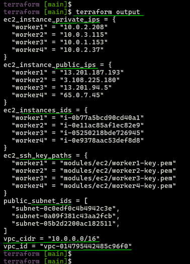

    - Provisioned `VPC` resources - `subnets` `route table` `internet gateway`

    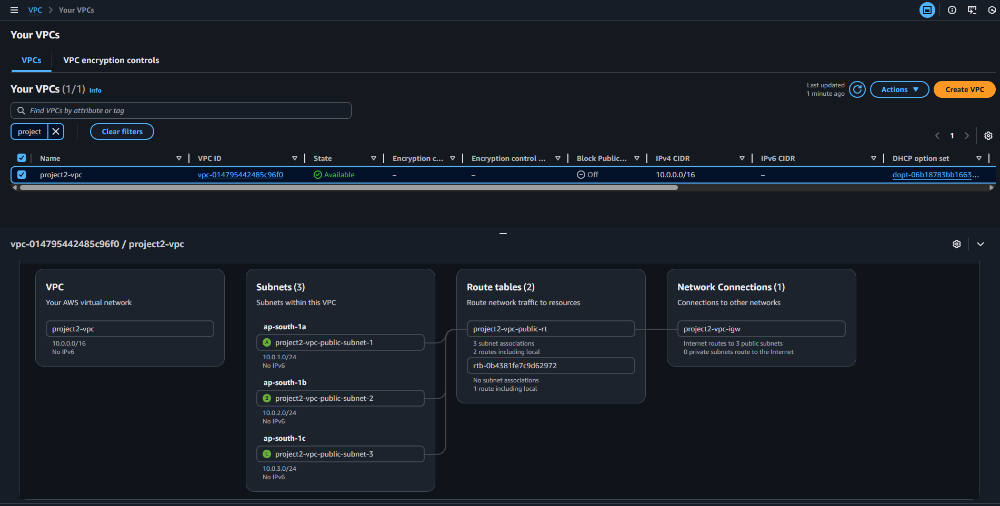

    - 4 EC2 worker instances up and running
 
    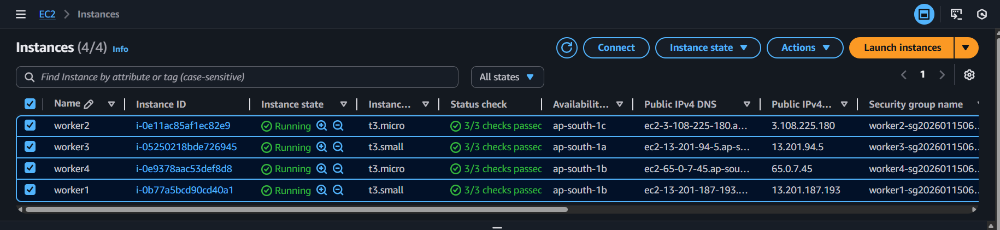

    - Provisioned Security groups for workers    

    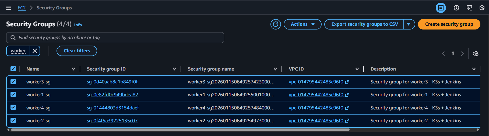
  
    - Inbound Allow rules  
      - Allow internal kubernetes cluster inbound traffic (pod-to-pod, kubelet, Flannel, API, etc2) in VPC subnet (10.0.0.0/16) only
      - Allow external inbound traffic for admin management 
        - ssh to workers instances
        - Access to jenkins
      - Allow external inbound DockerHub Webhook traffic
    
      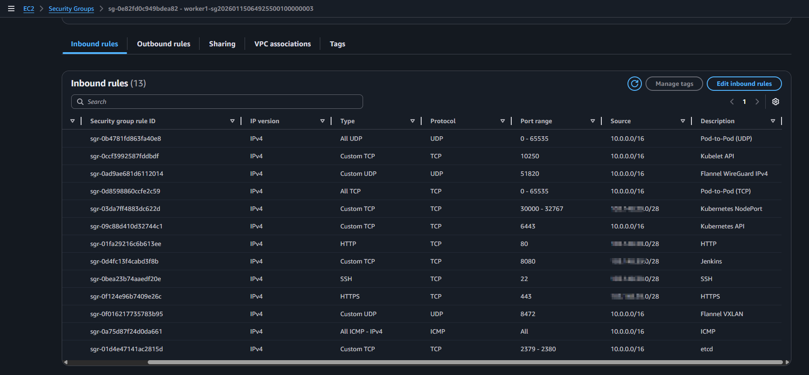

    - Outbound Allow rules  
      - Allow internal kubernetes cluster outbound traffic in VPC subnet (10.0.0.0/16) only
      - Allow external SSH, HTTPS, HTTP and DNS outbound traffic

      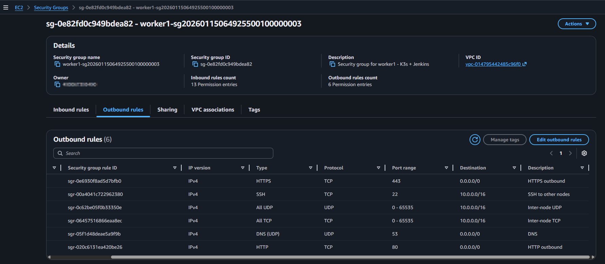

### 5.2. Ansible based Configuration Management
  - Setup Passwordless SSH:
    - local-machine to worker1: For `ansible-core` installation on worker1 to set it up for `controller` role [call it `stage1`]
      - Execute Following commands on Local machine
        ```bash
        # Set the worker1 ip address
        export worker1="13.201.187.193"

        # Create a folder to store ssh keys
        mkdir -p ssh-keys
        
        # Generate public key
        ssh-keygen -t ed25519 -f ssh-keys/terraform_bridge_key -N "" -C "project2@ec2"

        # Push the public key to worker1
        ssh -i modules/ec2/worker1-key.pem ubuntu@$worker1 "mkdir -p ~/.ssh && chmod 700 ~/.ssh && echo '$(cat ssh-keys/terraform_bridge_key.pub)' >> ~/.ssh/authorized_keys && chmod 600 ~/.ssh/authorized_keys"
        ```
        > **Outcome:** Local machine to worker1 passwordless ssh setup complete

      - Test Ansible ping  
        ```bash
        cd ansible/
        ANSIBLE_CONFIG=./ansible.stage1.cfg ansible all -i inventory/stage1-hosts.ini -m ping
        ```

        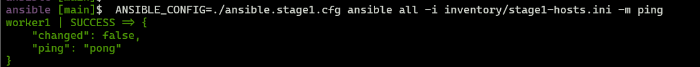

    - Worker1 (controller) to other workers: For `jenkins` `java` `Docker/containerd` `K3s` `kubectl` package installation and configuration [call it `stage2`]
      - Prerequisite: zip and transfer the ansible project code worker1
        ```bash
        cd project2
        tar -czf ansible.tar.gz ./ansible/
        scp -i ./terraform/ssh-keys/terraform_bridge_key ansible.tar.gz  ubuntu@$worker1:/home/ubuntu/project2/
        # ssh to worker1 and unzip
        ```
      - Execute the following commands on worker1  
        ```bash
        # SSH into worker1
        ssh -i modules/ec2/worker1-key.pem ubuntu@$worker1

        # Generate public key
        ssh-keygen -t rsa -b 2048 -f ~/.ssh/id_rsa -N '' && cat ~/.ssh/id_rsa.pub

        # Copy the controller public key locally
        ssh -i modules/ec2/worker1-key.pem ubuntu@$worker1 "cat ~/.ssh/id_rsa.pub" > ./ssh-keys/controller_key.pub

        # Push the public key to all worker instances
        # Worker1
        ssh -i modules/ec2/worker1-key.pem ubuntu@$worker1 "echo '$(cat ./ssh-keys/controller_key.pub)' >> ~/.ssh/authorized_keys"
        # Worker2
        ssh -i modules/ec2/worker2-key.pem ubuntu@$worker2 "echo '$(cat ./ssh-keys/controller_key.pub)' >> ~/.ssh/authorized_keys"
        # Worker3
        ssh -i modules/ec2/worker3-key.pem ubuntu@$worker3 "echo '$(cat ./ssh-keys/controller_key.pub)' >> ~/.ssh/authorized_keys"
        # Worker4
        ssh -i modules/ec2/worker4-key.pem ubuntu@$worker4 "echo '$(cat ./ssh-keys/controller_key.pub)' >> ~/.ssh/authorized_keys"
        ```
        > **Outcome:** worker1 to all other workers passwordless ssh setup complete
  
      - Test Ansible ping  
        ```bash
        cd ansible/
        ANSIBLE_CONFIG=./ansible.stage2.cfg ansible all -i inventory/stage2-hosts.ini -m ping
        ```

        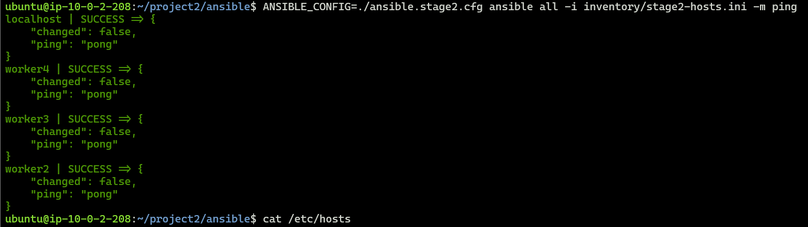

  - **Stage#1:** Configure worker1 for controller role
    - Execute the following command from local machine
      ```bash
      # ===== ON LOCAL MACHINE =====
      ANSIBLE_CONFIG=./ansible.stage1.cfg ansible-playbook playbooks/stage1-site.yml -i inventory/stage1-hosts.ini 
      ```

      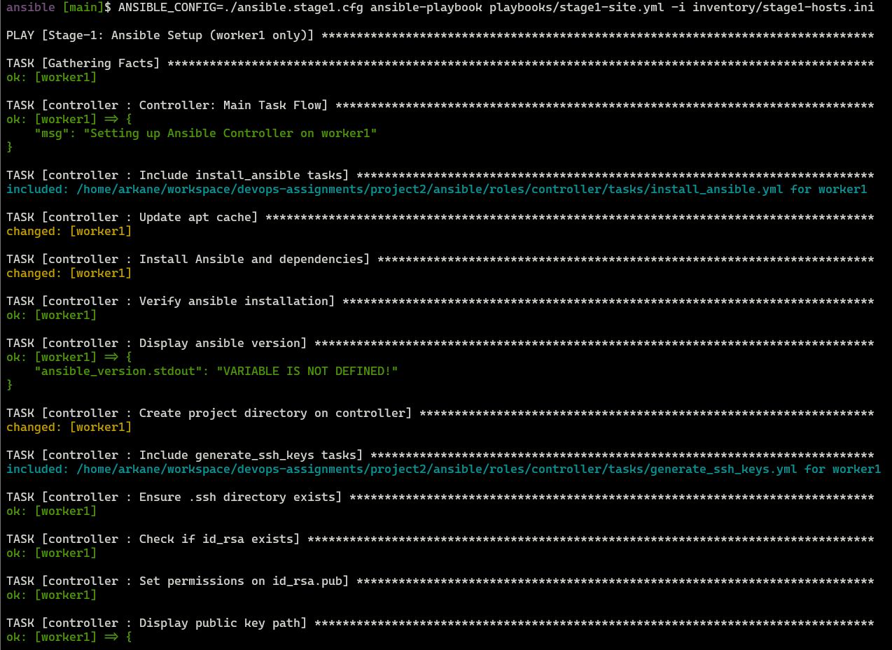
      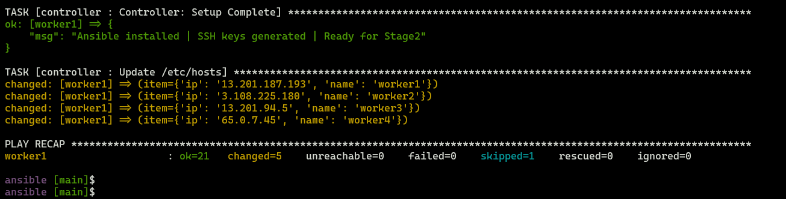

    - Ansible installed on worker1  

      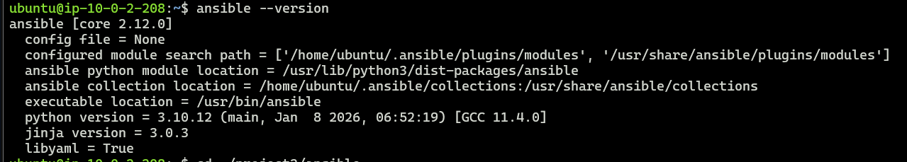
      
      > **Outcome:** worker1 setup done for controller orchestration role

  - **Stage#2:** Install and configure required software packages on workers
    - Execute the following command from worker1(controller)  
      ```bash
      # ===== ON WORKER1 (after SSH) =====
      cd ansible
      ANSIBLE_CONFIG=./ansible.stage2.cfg ansible-playbook playbooks/stage2-site.yml -i inventory/stage2-hosts.ini
      ```
      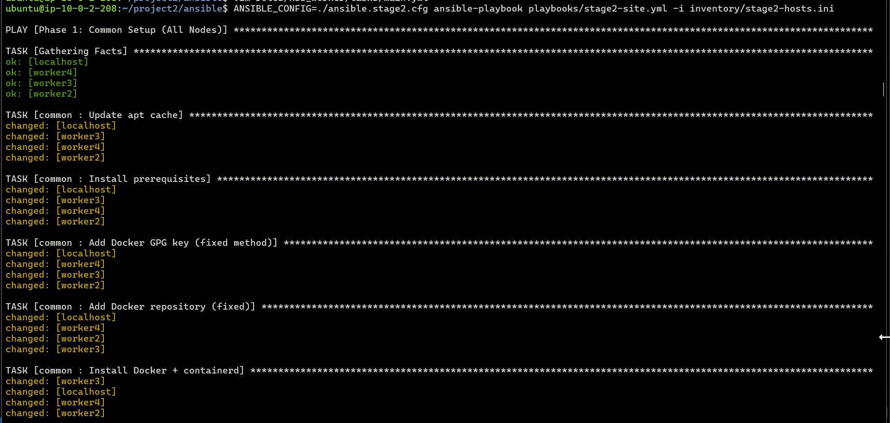
      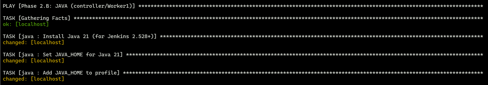
      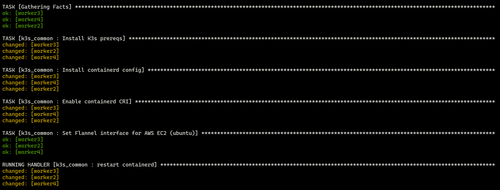
      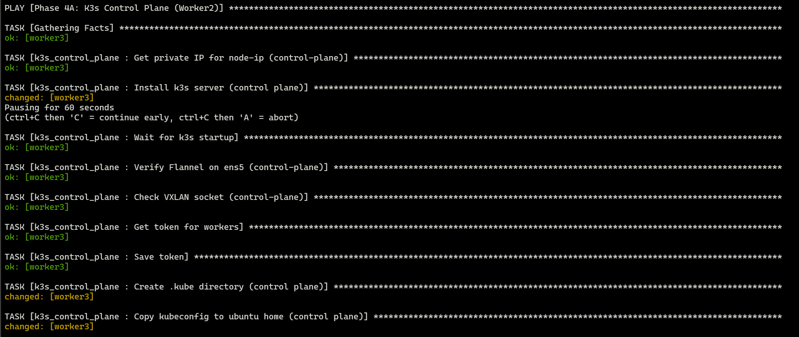
      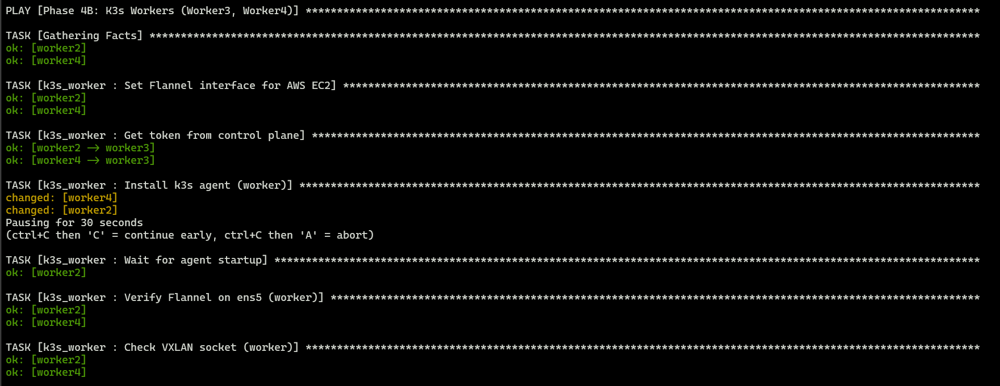
      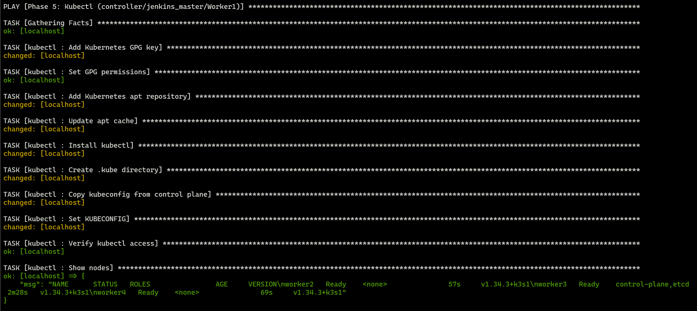
      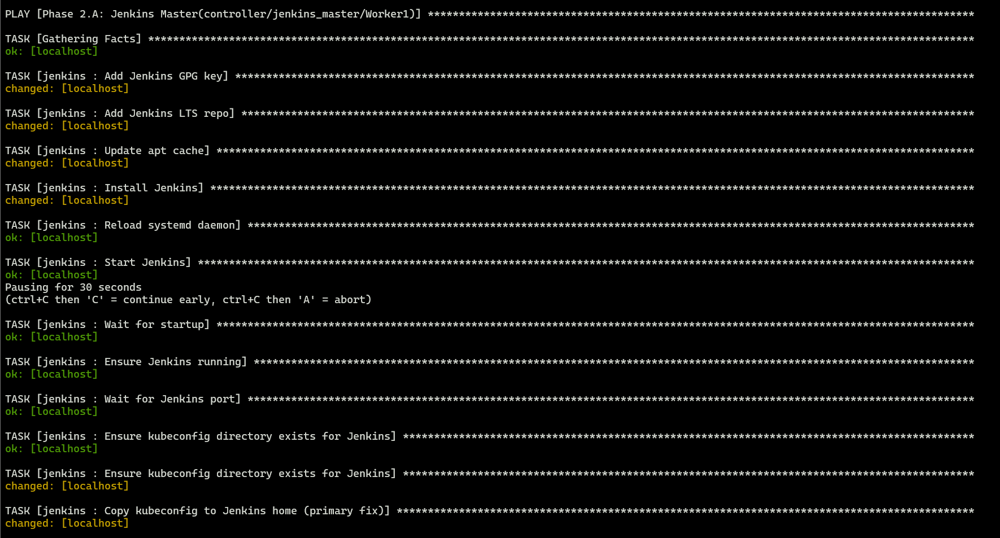
      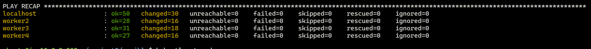
      
      > **Outcome:** Softwares installed on the respective machines using configuration management  
      > - `Worker1:` Jenkins, Java, kubectl  
      > - `Worker2:` containerd/Docker, Kubernetes  
      > - `Worker3:` Java, containerd/Docker, Kubernetes  
      > - `Worker4:` containerd/Docker, Kubernetes  
  - Kubernetes cluster setup ready  
    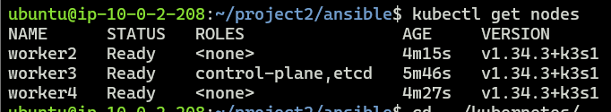

    > worker3 in K3s control plane role  
    > worker2 & worker4 in K3s worker role  
  
  - `Jenkins` service up and running on `controller`(worker1)    

    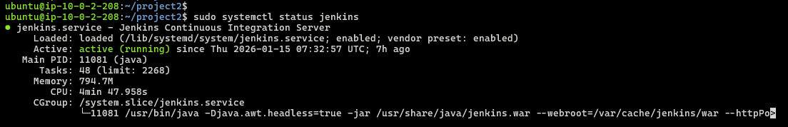  

### 5.3. Initial Kubernetes deployment (bootstrap)
On a freshly created K3s cluster, the initial website Deployment and Service must be created manually from the controller (Worker1) before the Jenkins pipeline can manage rollouts. The Jenkinsfile assumes that the Deployment `website-dep` already exists.  

- From local machine, copy Kubernetes manifests to the controller (Worker1):
  ```bash
  # From local machine
  cd project2

  # Archive Kubernetes manifests
  tar -czf kubernetes.tar.gz ./kubernetes/

  # Copy to Worker1 (controller)
  scp -i ./terraform/ssh-keys/terraform_bridge_key kubernetes.tar.gz ubuntu@$WORKER1_PUBLIC_IP:/home/ubuntu/project2/
  ```
- From controller (Worker1), apply the manifests to the K3s cluster:
  ```bash
  # On Worker1 (controller)
  cd ~/project2
  tar -xzf kubernetes.tar.gz
  cd kubernetes/

  # Create initial Deployment and Service
  kubectl apply -f website-deployment.yaml
  kubectl apply -f website-service.yaml
  ```
- Verify the application resources:
  ```bash
  kubectl get all
  ```
  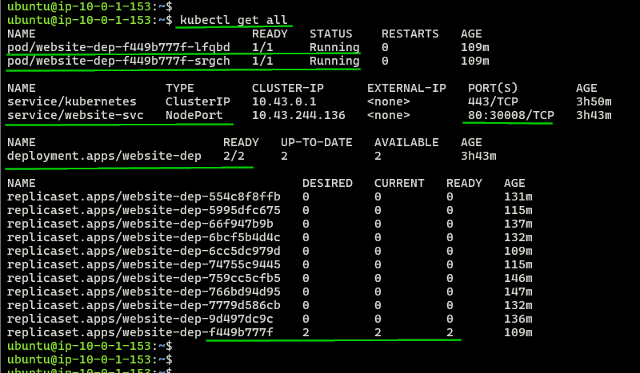

  > **Outcome:**  
  > Deployment `website-dep` exists with the configured number of replicas  
  > Service `website-svc` exists and exposes `NodePort 30008`  
  > Subsequent Jenkins pipeline runs can safely call `kubectl set image deployment/website-dep` ... and `kubectl rollout restart deployment/website-dep` to manage updates  

### 5.4. Jenkins configuration and pipeline setup
- Access Jenkins and setup admin account 

  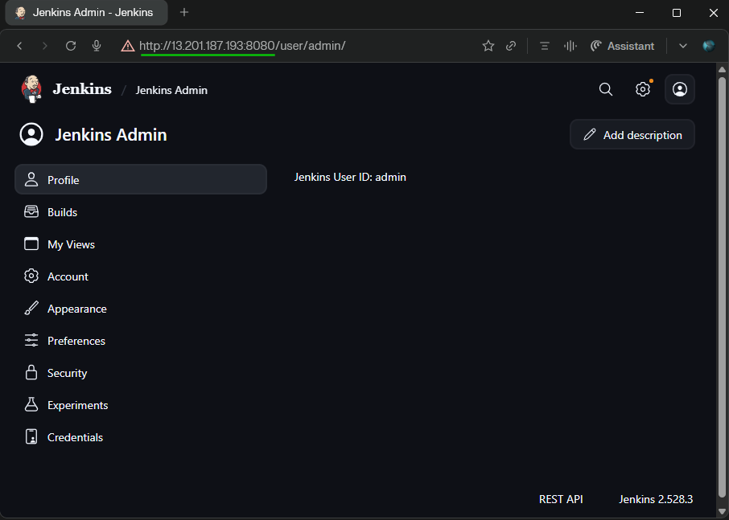
  > Access Jenkins at Worker1 public IP on port 8080: `http://<WORKER1_PUBLIC_IP>:8080`
(In test: http://13.201.187.193:8080)

- Setup jenkins build pipeline `website-cicd`  
  *General settings*  
  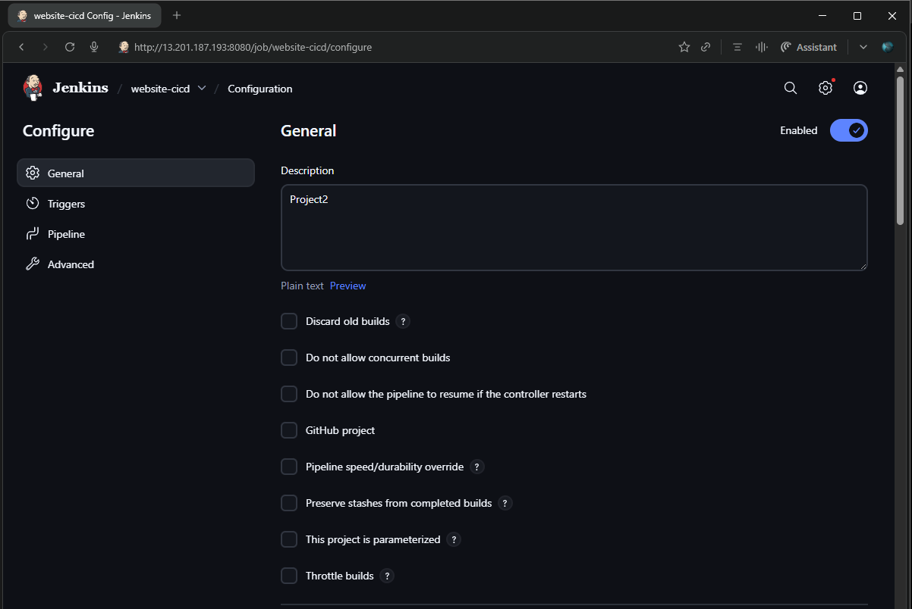
  
  *Trigger settings: Setup Docker Hub Webhook*  
  *Select Generic Webhook Trigger*  
  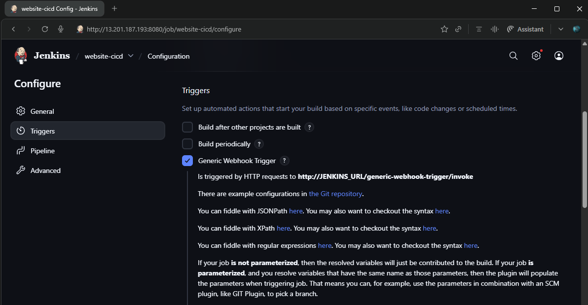  
  *Specify webhook Token and cause*  
  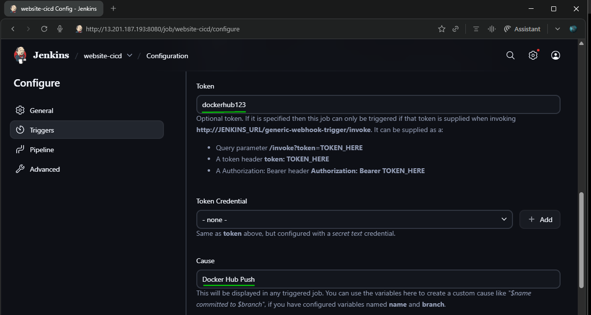  
  > Configures Generic Webhook Trigger plugin to accept POST requests at:  
  > http://<WORKER1_PUBLIC_IP>:8080/generic-webhook-trigger/invoke?token=dockerhub123
  > This endpoint receives Docker Hub webhook notifications when new images are pushed.

  *Enable logging*  
  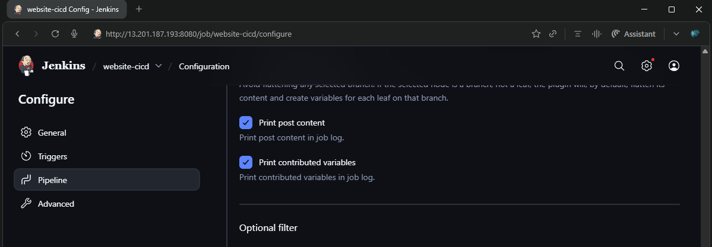  
  *Use application Git reporitory:* [arkb2023/website](https://github.com/arkb2023/website.git)  
  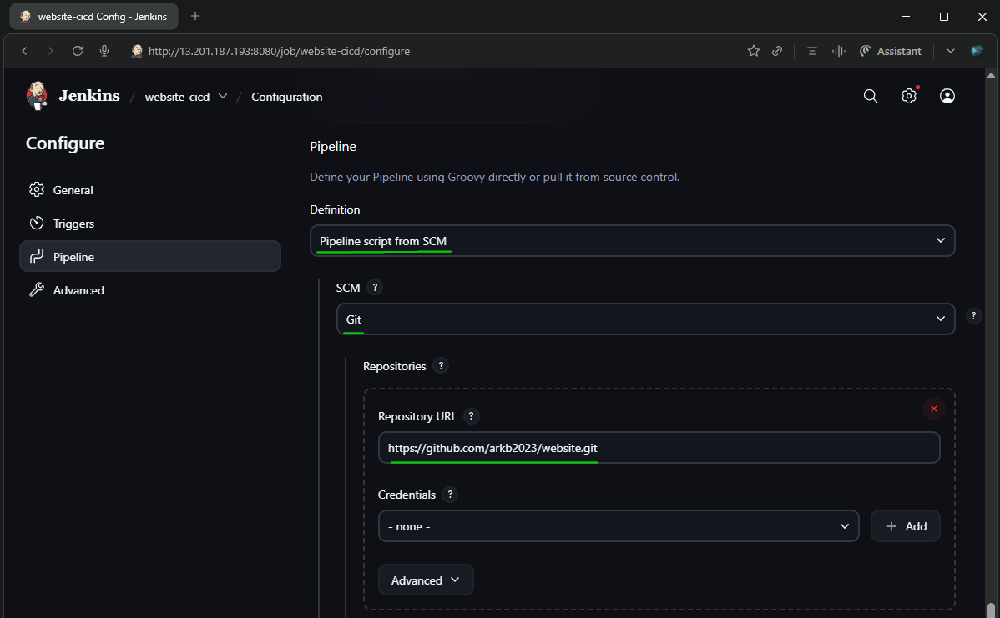  
  *Specify `main` branch and use [jenkinsfile](https://github.com/arkb2023/website/blob/main/jenkinsfile) script from the repository*  
  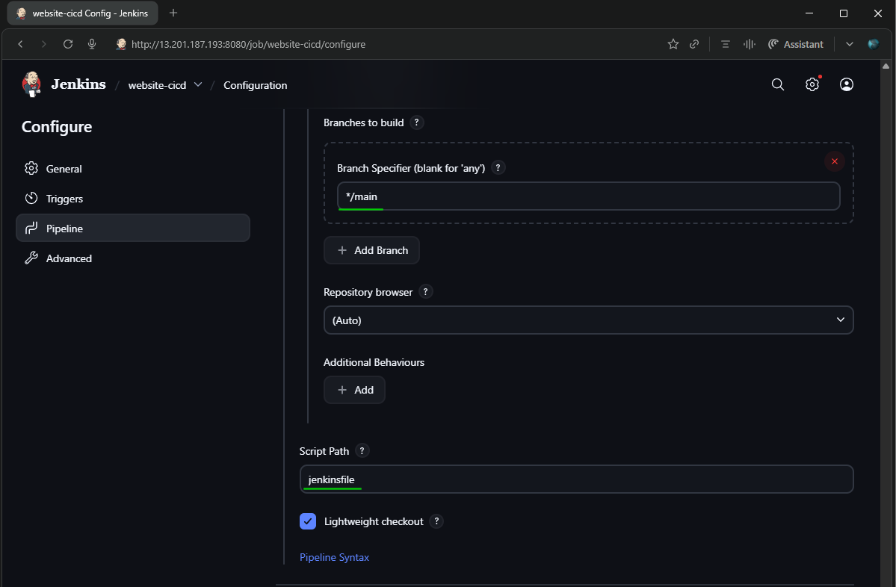


### 5.5. Docker Hub Webhook registration   
Register generic webhook URL in Docker Hub repository settings:  
http://<WORKER1_PUBLIC_IP>:8080/generic-webhook-trigger/invoke?token=dockerhub123

  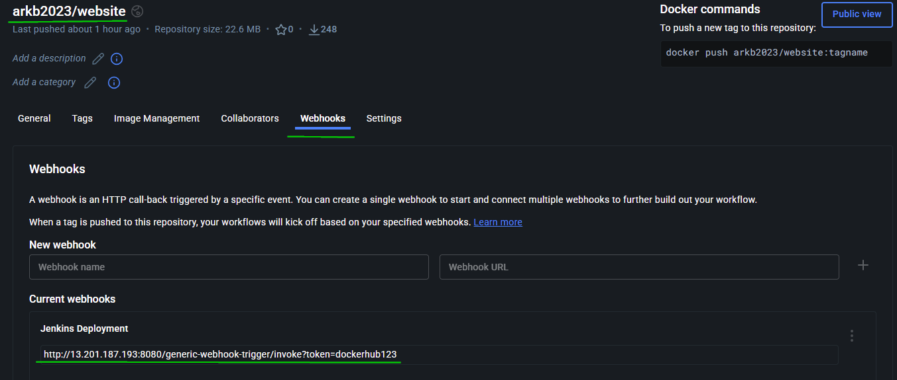  
  > **Outcome:** Docker Hub triggers webhook to jenkins on new image upload  

### 5.6. AWS CodeBuild infrastructure with Terraform IaC and AWS CLI    

  - Setup code connection with github `codebuild-github` in AWS developer tools
    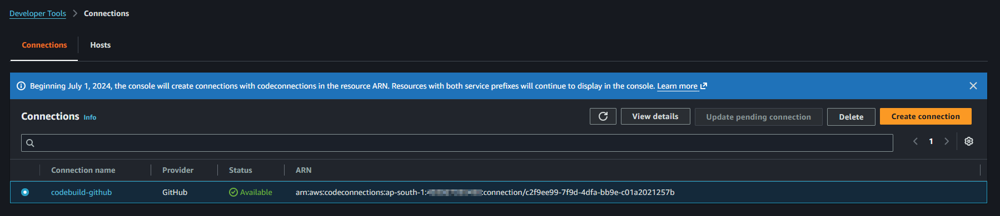

  - Execute script: [setup-codebuild.sh](./codebuild/setup-codebuild.sh)
    ```bash
    cd codebuild
    source ../.env.local.sh
    ./setup-codebuild.sh
    ```

    The Script sets up following resources:  
    - Stores Github PAT and Docker Hub PAT in AWS Secrets manager using AWS CLI `aws secretsmanager create-secret ...`  
    - Updates [codebuild/terrafrom.tfvars](./codebuild/) with the returned ARNs for Terraform reference 
    
    - Runs [Terraform IaC code](./codebuild/modules/codebuild_project/) to setup:
      - Codebuild project: `website-build`
      - Creates IAM service role `website-build-service-role` for codebuild project
      - Attaches inline policy codebuild role allowing access to,
        - Cloudwatch logging
        - Access to Github and DockerHub secret tokens in AWS Secrets Manager
      - Enables Cloudwatch logging  

  - Codebuild project  
    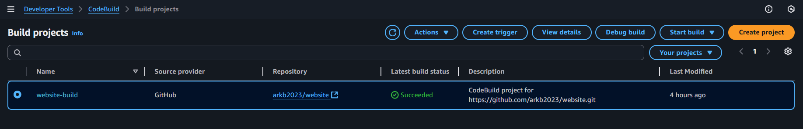  
  
  - Codebuild project details  
    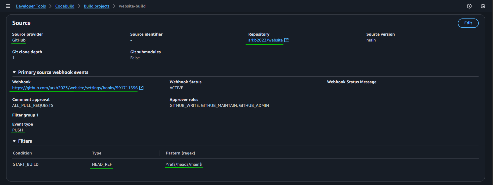  
    > Github source repository: [arkb2023/website](https://github.com/arkb2023/website.git)  
    > Webhook events set Build on `PUSH` to `main` branch  
    > Webhook filter set to `(HEAD_REF = ^refs/heads/main$)` to accept builds only for the `main` branch. 

  - IAM role `website-build-service-role` for Codebuild project  
    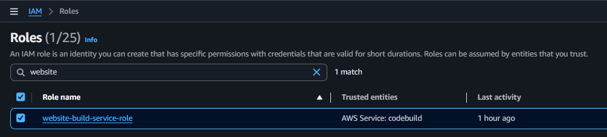

  - Inline policy attached to Codebuild role  
    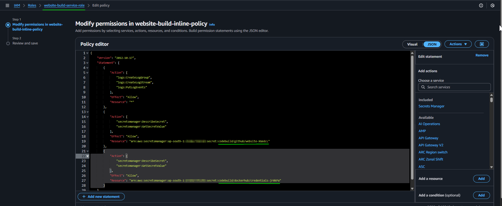
    > Access to Secrets Manager (for GitHub PAT and Docker Hub PAT) and Cloudwatch logs  

  - IAM role trust relationship for Codebuild service  
    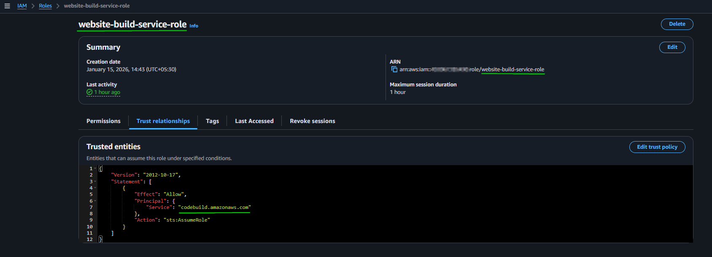

  - CodeBuild base policy  
    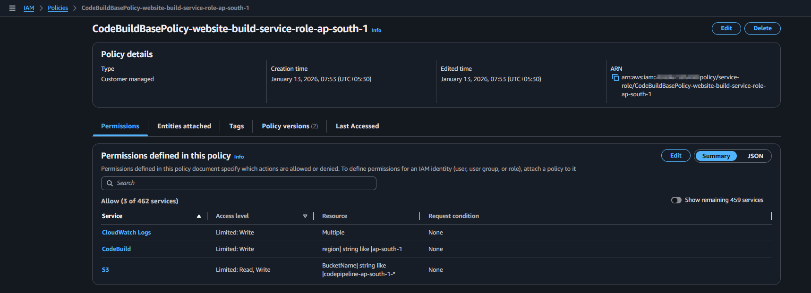

  - CodeBuild Secrets Manager access policy  
    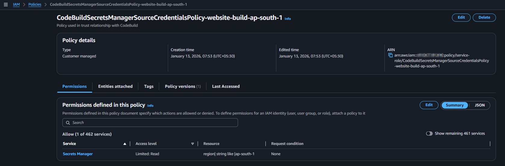
    
### 5.7. GitHub Webhook registration   

- Register AWS connector App in Github  
  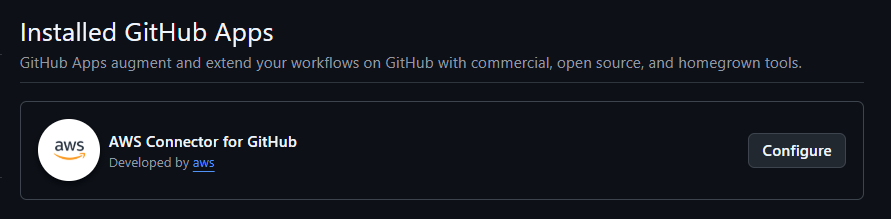  

- AWS codebuild URL configured in GitHub Webhook  
  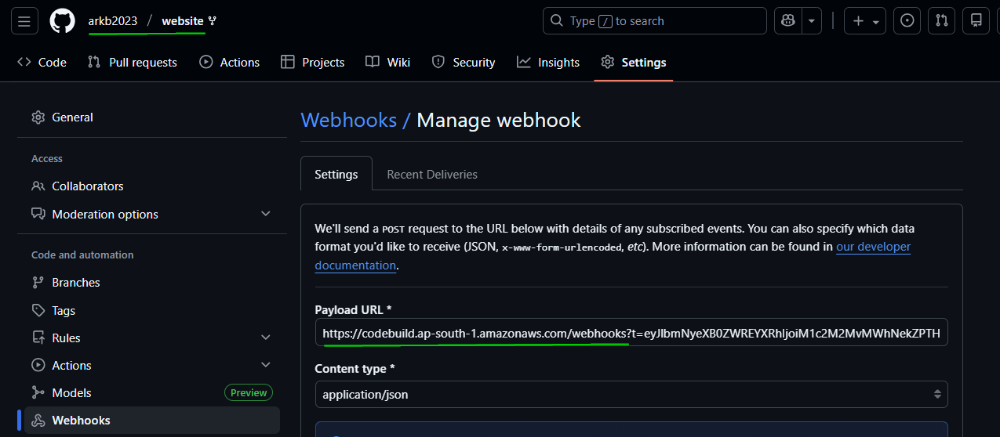  

## 6. Test CICD Pipeline    

### 6.1 Test A: On 25th date, Main branch push leads to Production Deployment    

  **Test Setup Note:**  
  This test was executed on January 15th, 2026. Since the release gate checks for the 25th of the month, the Jenkinsfile date check was temporarily modified to day `15` for local testing. The test confirmed that the release gate logic correctly evaluates dates and triggers deployment when conditions match.

  After testing, the Jenkinsfile was restored to the production configuration (day `25` check) and committed to the GitHub repository. This ensures that K3s deployments only occur on the 25th of each month in production.

- Git `Push` to `main`  
  ```bash
  # Modify index.html to reflect current timestamp, add, commit, push
  git add index.html
  git commit -m "Full pipeline test"
  git push origin main
  ```

  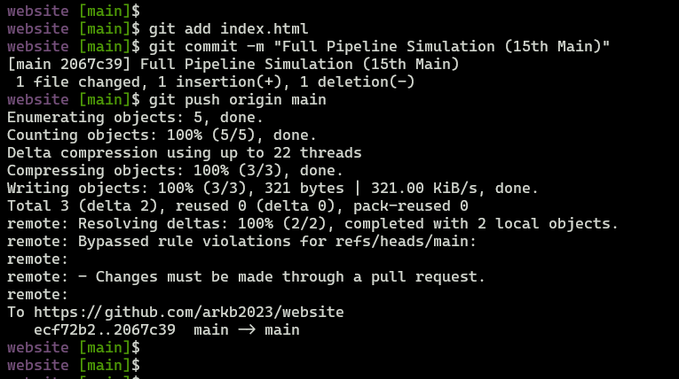  
  > Note the `Commit ID: 2067c39` for correlation in upcoming pipeline stages  

- GitHub code change corresponding to `Commit ID: 2067c39`  
  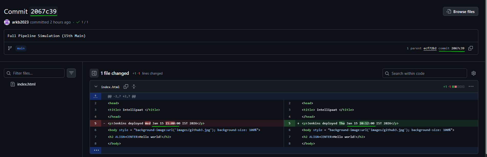  
  > Note: timestamp in `index.html` for correlation on website access upon successfull production deployment   

- GitHub Webhook Triggered  
  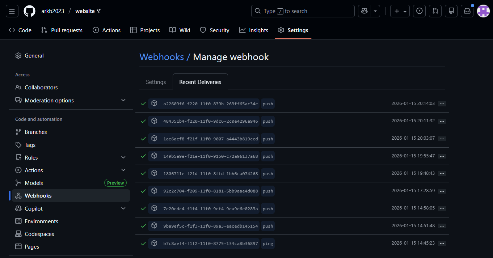

- GitHub Webhook Request/Response successful    
  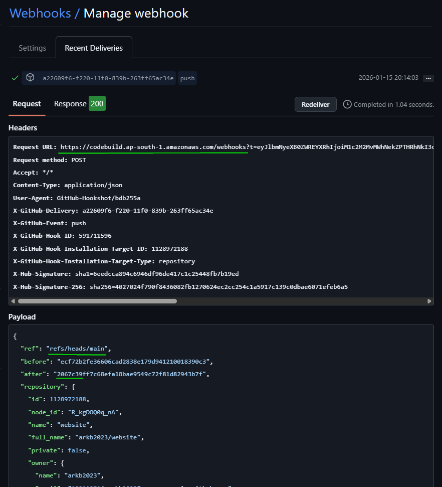  
  > Note: Request coorelates to `Commit ID: 2067c39`  

- Codebuild shows build submitted from Github corresponding to `Commit ID: 2067c39`  
  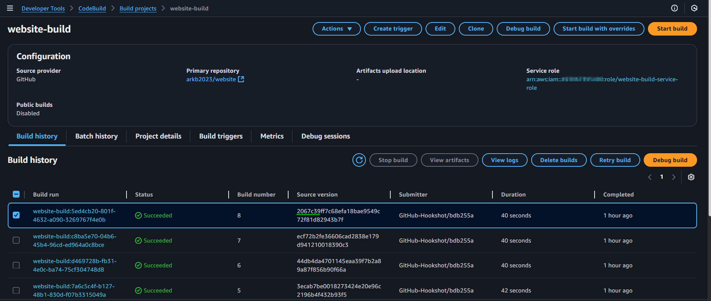  

- Codebuild shows build build phases    
  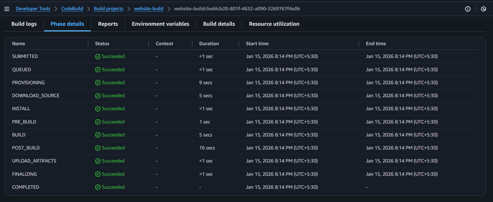  

- Codebuild logs: `PRE_BUILD` phase    
  

- Codebuild logs: `BUILD` phase    
  
  

- Codebuild logs: `POST_BUILD` phase    
  
  
  > Shows image pushed to Docker Hub
  > Note sha256: `c4560f42060e` for correlation in upcoming stage  
  > [Build log file](./images/dep-2/codebuild/logs/sha-c4560f42060e.log)  

- Docker Hub shows latest uploded image  
  
  > Note:  
  > Image corresponding to sha256: `c4560f42060e` is uploaded with two tags `latest` and `2067c39` *(Git CommitID)*
- Docker Hub triggerd webhook successful  
    

- Jenkins Build#22 triggered in response to Docker Hub Webhook  

  

- Jenkins shows multiple build stages  

    

- Jenkins Build #22: Source Checkout Stage  
  
  > Pipeline checks out the repository and identifies commit `2067c39`, confirming correlation with GitHub push.

- 25th Release Date check stage passed  
  

- Jenkins detects latest sha256: `c4560f42060e` image digest in Docker Hub   
    

- Jenkins rollout application deployment in K3s cluster with latest image  
    
  > `arkb2023/website:latest` image deployed to K3s cluster via kubectl set image command  
  > rollout restart initiated to apply new image to pods  
  > Confirmation message: deployment "website-dep" successfully rolled out  

- Jenkins verify deployment stage shows new applicaiton pods running    
  
  > kubectl get pods confirms 2 new pods running with updated image

- Jenkins post action stage shows deployment was successfull  
    

- Jenkins console output corresponsing to stages  
  
  
  

- Access the live application through a browser at  K3s control plane on NodePort endpoint:
`http://13.201.94.5:30008`    
    
  > The timestamp displayed on the page corresponds to the index.html modification in commit `2067c39`, confirming successful end-to-end deployment.

**Test A Validation Checklist:**

| Checkpoint | Expected Behavior | Test Result | Status |
|------------|-------------------|-------------|--------|
| GitHub webhook | Triggers for main branch push | Commit `2067c39` | **PASS** |
| CodeBuild | Builds Docker image from source | SHA256 `c4560f42060e` generated | **PASS** |
| Docker Hub | Pushes image with dual tags | Tags `:latest` + `:2067c39` | **PASS** |
| Jenkins trigger | Receives webhook notification | Build #22 initiated | **PASS** |
| Release gate check | Evaluates current date | Day match logic works (tested on day 15) | **PASS** |
| K3s deployment | Triggers rollout | Rollout restart successful | **PASS** |
| Application live | Website accessible at NodePort | http://worker3-ip:30008 responding | **PASS** |
| Build completion | Jenkins pipeline succeeds | All stages completed | **PASS** |

**Test A Outcome:**

**PASS** - Release gate logic correctly evaluates date-based conditions and permits deployment when date matches (tested with day 15; production uses day 25)  
**PASS** - Full end-to-end CI/CD pipeline executes successfully from Git push through K3s deployment  
**PASS** - Jenkins pipeline completes with SUCCESS status  
**PASS** - Production K3s cluster updated with new Docker image; website live with latest application code  

---

### 6.2 Test B: On non-25th date Main Push leads to Build Only *(No production deployment)*

**Test Setup Note:**

This test validates that on non-25th dates, commits to the `main` branch trigger 
the full CI/CD pipeline (Git → GitHub Webhook → CodeBuild → Docker Hub → Jenkins), 
but the production K3s deployment gets skipped. The Jenkins pipeline completes with 
SUCCESS status and an informational message.

**Test Execution Flow:**

- Git push to `main` branch on non-25th date
  ```bash
  git add index.html
  git commit -m "Non-25th pipeline test - build only"
  git push origin main
  ```
  
  > Note: Commit ID: `b781fb6` for corelation in upcoming pipeline stages

- GitHub webhook triggers CodeBuild
  
  > Webhook for Commit ID `b781fb6` successfully delivered to CodeBuild

- CodeBuild build phases complete successfully  
  
  > Build triggered by GitHub webhook for Commit ID `b781fb6`

- CodeBuild logs show Docker image built and pushed to Docker Hub
  
  > Docker image built: SHA256 `8f040e9b8135` from Commit ID `b781fb6`

- Docker Hub repository shows new image with dual tags
  
  > Image with sha256: `8f040e9b8135` pushed with tags `latest` and `b781fb6`

- Docker Hub triggers webhook to Jenkins
  
  > Docker Hub Webhook status: SUCCESS, Code: 200

- Jenkins `Build #14` triggered by Docker Hub webhook
  
  > `Build #14` corresponding to Commit ID `b781fb6`

- Jenkins Build #14: Release Gate Check - Deployment SKIPPED (18th ≠ 25th)
  
  > Release gate detects non-25th date → Deploy/Verify stages skipped

- Jenkins: Build #14 - detects latest Docker image sha256: `8f040e9b8135` in Docker Hub
  

- Jenkins Build #14: Post Action confirms deployment skipped
  
  > Informational message: "Build completed successfully. Deployment skipped"

**Test B Validation Checklist:**

| Checkpoint | Expected | Actual | Result |
|------------|----------|--------|--------|
| GitHub webhook | Triggers for main | Commit `b781fb6` | **PASS** |
| CodeBuild | Builds Docker image | SHA256 `8f040e9b8135` | **PASS** |
| Docker Hub | Image pushed | `:latest` + `:b781fb6` | **PASS** |
| Jenkins trigger | Webhook received | Build #14 | **PASS** |
| Release gate | Date check fails | 18th ≠ 25th | **PASS** |
| Deploy stage | Skipped | Grayed out | **PASS** |
| Build status | SUCCESS | Deployment skipped | **PASS** |

**Test B Outcome:**

**PASS** - Release gate correctly prevents production deployment on non-25th dates  
**PASS** - Full build pipeline executes successfully  
**PASS** - Jenkins completes with Success status
**PASS** - Previous production deployment remains unchanged

---


### 6.3 Test C: No build triggers on non-Main branch Push

**Test Setup Note:**

This test validates that commits to feature branches (non-`main` branches) do not 
trigger AWS CodeBuild builds. The CodeBuild project uses webhook filters 
`(HEAD_REF = ^refs/heads/main$)` to accept builds only for the `main` branch. 
GitHub sends webhooks for all pushes, but CodeBuild drops feature branch events.

**Test Execution Flow:**

- Create and push to feature branch
  ```bash
  git checkout -b feature/test-branch
  git add index.html
  git commit -m "Feature branch commit test"
  git push origin feature/test-branch
  ```
    
  > Commit pushed to `feature/test-branch`

- GitHub webhook request delivered for feature branch
  
  > GitHub webhook delivered to CodeBuild for feature branch push

- CodeBuild webhook filter rejects feature branch: "No build triggered"
  
  > CodeBuild responds with 200 OK but does not start a build

- CodeBuild build history shows NO new builds
  
  > No builds initiated for feature branch push

- Docker Hub shows no new image (no CodeBuild build occurred)
- Jenkins build history shows no new builds (no Docker Hub webhook triggered)

**Test C Validation:**

| Checkpoint | Expected | Actual | Result |
|------------|----------|--------|--------|
| Feature branch push | Webhook sent | Delivered to CodeBuild | **PASS** |
| CodeBuild webhook filter | Reject non-main | No build triggered | **PASS** |
| CodeBuild builds | None created | Build history unchanged | **PASS** |
| Docker Hub | No new image | No image pushed | **PASS** |
| Jenkins | No webhook | No builds triggered | **PASS** |

**Test C Outcome:**

- **PASS** - CodeBuild webhook filter correctly rejects feature branch events  
- **PASS** - Feature branch development does not trigger CI/CD pipeline  
- **PASS** - Main branch isolation maintained successfully

---

## 7. Conclusion

**Project Summary:**
- Successfully implemented a production-grade CI/CD pipeline for containerized application deployment on AWS
- Integrated GitHub, AWS CodeBuild, Docker Hub, Jenkins and Kubernetes with automated release gating
- Demonstrated end-to-end automation with manual intervention eliminated post-setup

**Key Achievements:**
- Infrastructure-as-Code approach enabling reproducible deployments
- Modular Ansible configuration management for consistent environments
- Release gate mechanism restricting production deployments to the 25th
- Feature branch isolation preventing accidental CI/CD triggers
- Comprehensive pipeline validation across three test scenarios

---