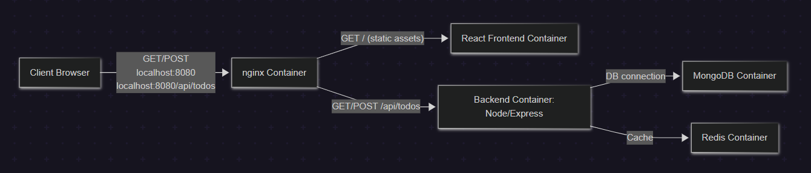
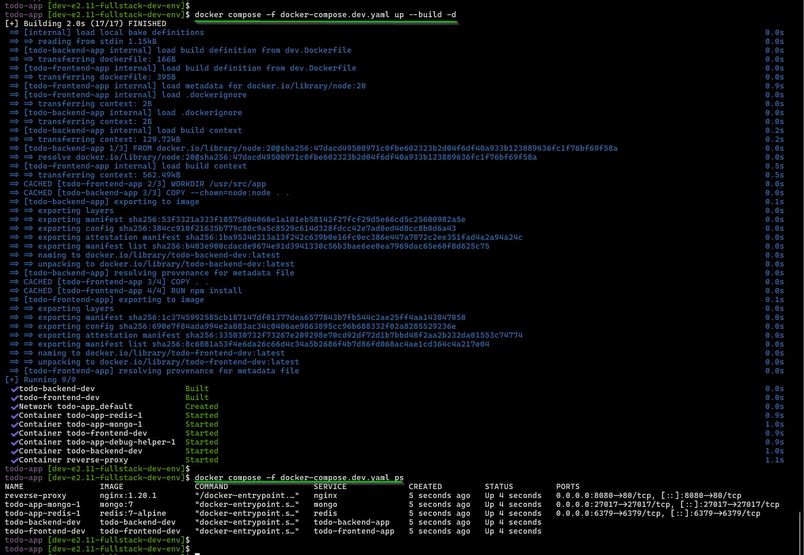
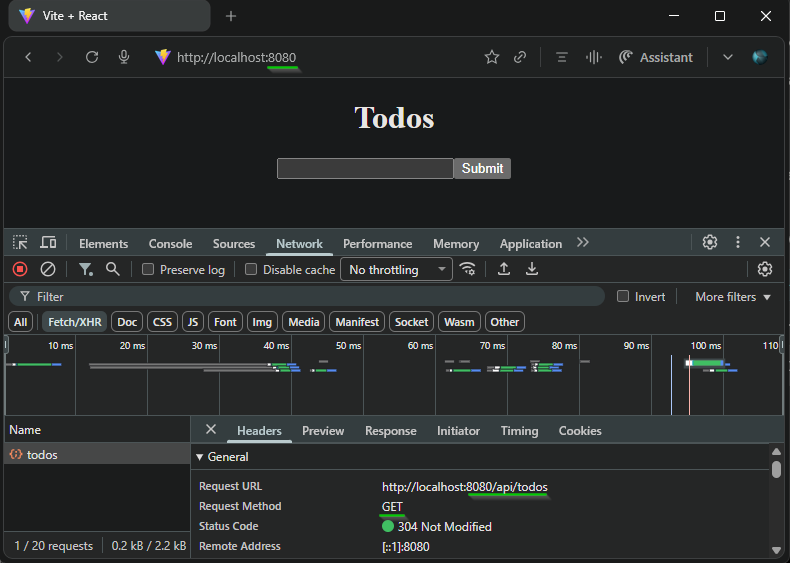
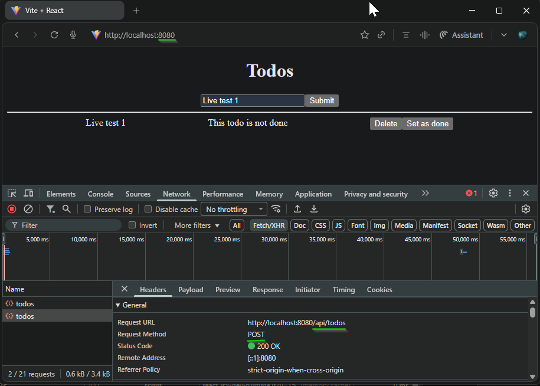
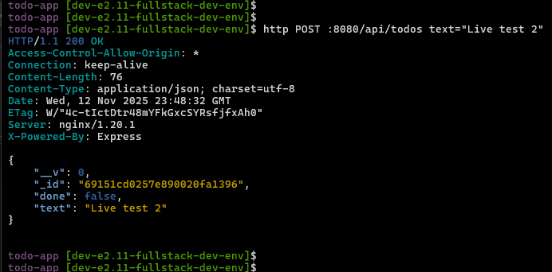
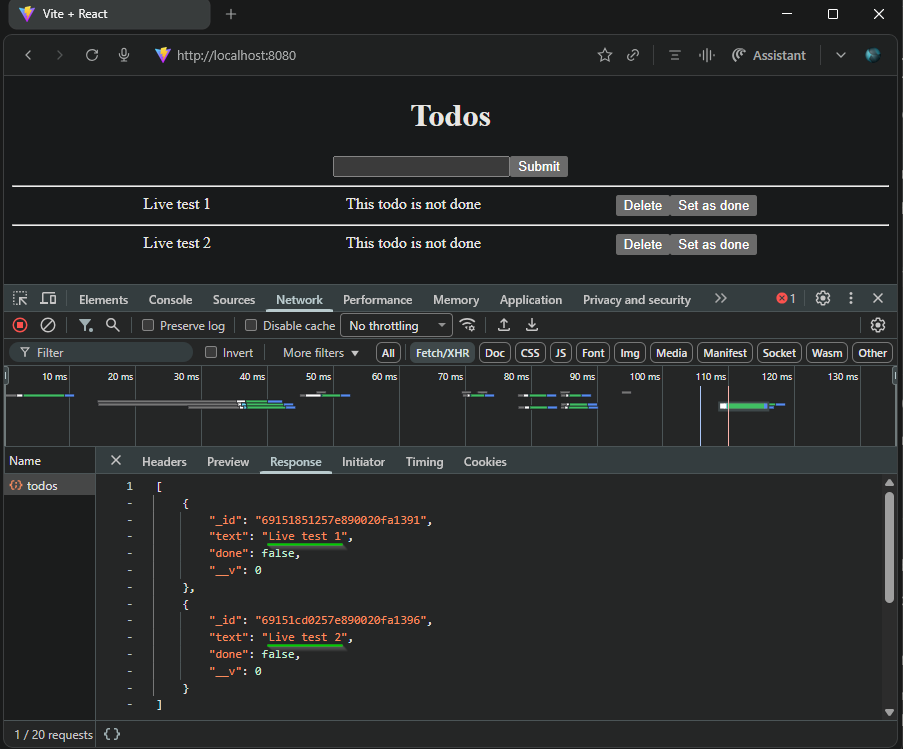
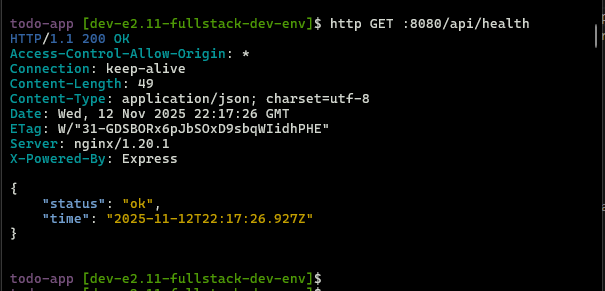
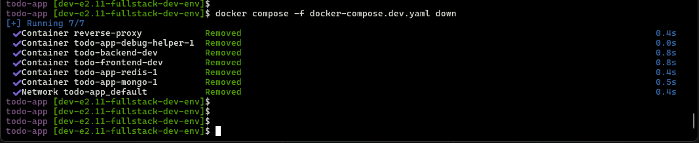

# Containerized Development Environment for React/Node

## Overview

- **Goal:** Implement a fully containerized development workflow for a modern single-page web app (React frontend + Node/Express backend).
- **Exercise Reference:** [development-in-containers (Fullstack Open)](https://fullstackopen.com/en/part12/basics_of_orchestration#development-in-containers)

## Architecture
This project consists of the following services, orchestrated together:
  - React frontend  
  - Node/Express backend  
  - MongoDB & Redis databases  
  - Nginx as a reverse proxy  
  - Orchestrated via Docker Compose

  

## Key Features

- Multi-service container orchestration (Docker Compose)
- Live code reload in development (frontend: Vite, backend: nodemon)
- Backend persistence with MongoDB and Redis containers
- HTTP reverse proxy (nginx, proxying `/api/` requests to backend)
- No direct host-port exposure except through nginx
- API verification using httpie command line tool for unified proxy/API testing

## Project Structure

<pre>
todo-app/
├── todo-frontend                # React frontend code & Docker configs
├── todo-frontend/dev.Dockerfile # Frontend development Dockerfile
├── todo-backend                 # Node/Express backend code & Docker configs
├── todo-backend/dev.Dockerfile  # Backend development Dockerfile
├── nginx.dev.conf               # Nginx config for development proxy
├── docker-compose.dev.yaml      # Docker Compose file for dev environment
└── README.md                    # Project documentation
</pre>

***

## Local Development Workflow

#### 1. **Start All Services**

From the `todo-app` directory, launch the services in development mode:

  ```bash
  # Build images and start all services in the background (detached mode)
  docker compose -f docker-compose.dev.yaml up --build -d

  # Check running containers and their status
  docker compose -f docker-compose.dev.yaml ps

  ```

  - This builds images and starts **frontend**, **backend**, **nginx**, **MongoDB**, and **Redis**.
  - Source code directories are mounted as volumes into the containers, so file changes are immediately reflected.

  - Terminal view with bring up and ps command output  
  

  This enables frontend and backend API access through `nginx` proxy.

  - Frontend Access: [http://localhost:8080](http://localhost:8080)
  - Direct API access: [http://localhost:8080/api/api-name](http://localhost:8080/api/<api-name>)

  Nginx is configured to strip `/api` automatically for backend compatibility.
  > Refer: [nginx.dev.conf](./nginx.dev.conf)  

#### 2. **Test Services**

  - Access the frontend from browser at [http://localhost:8080](http://localhost:8080).  
  

- In the browser, add a todo record (e.g., `Live test 1`) and click `submit`. The frontend sends a POST request to `http://localhost:8080/api/todos`.
  


- For development testing, the API endpoint `http://localhost:8080/api/todos` can also be accessed from the terminal to add a todo record using the httpie command-line tool:
  ```bash
  http POST :8080/api/todos text="Live test 2"
  ```
  - Terminal view shows the command and output with 200 OK and added json record
  

  - Refresh the browser to view all todos. Both records added via browser and terminal now appear in the UI, confirming the unified proxy routing and reliable database persistence.
  

  > The todo data is persistently written to the MongoDB container, not stored in frontend memory. Even after restarting or rebuilding the frontend container, the todos remain available since they are managed by the backend service and database.

  > This setup demonstrates that all interactions—whether via the browser UI or command-line API requests—are consistently routed through the nginx proxy. This provides a unified entrypoint, reinforces modular orchestration, and enables development and testing with full stack data integrity.

#### 3. **Frontend hot-reload Demo**

- Open code editor, modify React frontend `todo-frontend/src/App.jsx` and Save changes. Vite dev server in the frontend container detects the change and hot-reloads the React app automatically.

  - Add code to `todo-frontend/src/App.jsx`:
    ```jsx
    function App() {
      const env = import.meta.env.MODE || 'development';

      return (
        <div className="App">
          <div style={{
            backgroundColor: "#ffecb3",
            color: "#222",
            padding: "2px 10px",
            fontSize: "0.9em"
          }}>
            Running in <strong>{env}</strong> mode (hot reload enabled)
          </div>
          <TodoView />
        </div>
      );
    }
    ```
  > The code adds a **debug banner** at the top of the React application. This banner, visible when running in development mode, shows which environment the frontend is running in (e.g., "development", "production").
  
  **Browser view shows page got updated with the banner**  
  

  ***

#### 4. **Backend hot-reload Demo**
- Open code editor, modify Node backend `todo-backend/routes/todos.js` and Save changes. Using nodemon in dev mode, backend reloads on file changes. No need to restart containers for code or route changes.
  
  - Add code to `todo-backend/routes/index.js`:
  ```js
  router.get('/health', (req, res) => {
    res.send({ status: "ok", time: new Date() });
  });
  ```

  > The code adds a Health Check Endpoint.

  **Terminal shows GET on the endpoint `/api/health`**  
  

***

#### 5. **Stop all services**

To gracefully stop and clean up all running containers, networks, and resources created by the dev Compose stack, run:
```bash
docker compose -f docker-compose.dev.yaml down
```

  **Terminal shows stopping services and cleanup**  
  

***

## **Utility Commands for Debugging and Maintenance**

```bash
# View live logs for all services
docker compose logs -f

# View logs for a specific container
docker logs <container-name>

# Restart a specific container
docker compose restart <service-name>

# Rebuild image and restart a service
docker compose up --build <service-name>

# Access MongoDB shell (inside container)
docker exec -it <mongo-container> mongosh

# Access Redis CLI (inside container)
docker exec -it <redis-container> redis-cli

# Inspect mount points
docker inspect <container-name> --format '{{ json .Mounts }}' | jq

# List running containers and status
docker compose ps

# Inspect network info for a container
docker inspect <container-name> --format '{{ json .NetworkSettings }}' | jq

# Clean up stopped containers
docker container prune

# Remove dangling images
docker image prune

# Clean slate: Stops containers, removes networks, volumes, and orphan containers
# This operation permanently deletes all data stored in named volumes (e.g., MongoDB/Redis records).
docker compose -f docker-compose.dev.yaml down --volumes --remove-orphans
```

***

## References

- [Fullstack Open: Development in Containers](https://fullstackopen.com/en/part12/basics_of_orchestration#development-in-containers)

***